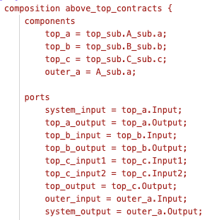
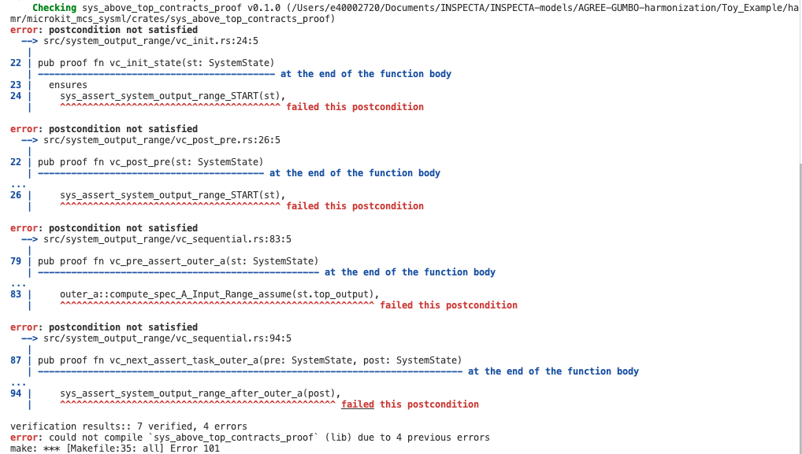
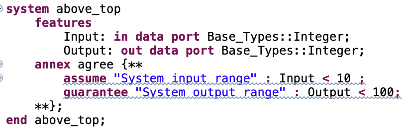
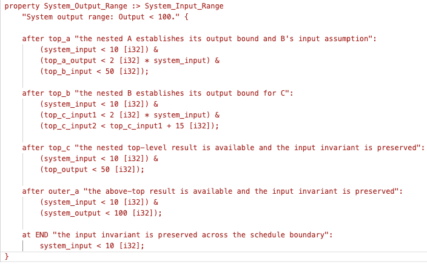
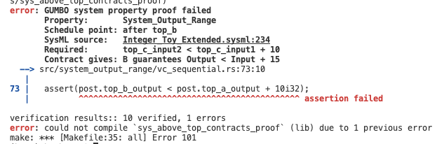

# AGREE vs. GUMBO Compositional Reasoning

## Comparison of AGREE and Current GUMBO

### AGREE and Current GUMBO side by side

| Dimension | AGREE | GUMBO system specifications | Advantage |
|---|---|---|---|
| Primary abstraction | Synchronous dataflow over logical ticks. | Contract transitions over explicitly named schedule places. | Depends: AGREE for logical behavior; GUMBO for scheduled execution. |
| Composition | Hierarchical assume-guarantee reasoning. | Generated Hoare-style VCs over flattened proof state. | **AGREE** — composition is more direct and requires fewer supporting assertions. |
| Order sensitivity | Standard AGREE does not model physical dispatch order. See the scheduled-AGREE note below. | Distinguishes component execution order using a declared schedule schema. | **GUMBO** — schedule order is part of the current system-property language. |
| Property declaration | Parent guarantees and assumption-discharge obligations. | Concrete property plus supporting place assertions. | **AGREE** — system properties are generally more concise. |
| Contract reuse | Child contracts are consumed through the hierarchy; `lift contract` supports wrappers. | Leaf contracts are copied into the proof crate and projected separately for each property. | **AGREE** — contracts are reused directly across architectural levels. |
| Temporal reasoning | Native temporal operators and k-induction. | Supports frame invariants through `START` and `END`, but not general temporal operators. | **AGREE** — it provides broader temporal reasoning. |
| Proof engine | Lustre/JKind model checking and induction. | HAMR-generated Verus/SMT verification conditions. | Depends: AGREE for model checking; GUMBO for integration with Rust verification. |
| Failure feedback | Model-level counterexample traces. | Reports failed generated VCs; mapping failures back to the model is currently more manual. | **AGREE** — its counterexamples provide better diagnostic feedback. |
| Implementation path | Conformance of the lowest-level implementation to its contract is external to AGREE. | Rust component implementations can be verified against their generated GUMBO contracts. | **GUMBO** — it connects the model contracts to implementation verification. |
| Environmental assumptions | A parent assumption is treated as a premise supplied by the parent environment. | An `at START` assertion is a proof obligation; initialization must establish it, and `END` must imply it for later frames. | **AGREE** — environmental assumptions can be stated directly at the system boundary. |
| Intermediate facts | Derived internally from the composed child contracts and dataflow equations. | Must be exposed explicitly as assertions at the schedule places where they are needed. | **AGREE** — less manual proof plumbing is required. |
| Contract activation | Direct-child contracts participate in proving the parent contract. | A component contract participates in a property only when the property binds one of the component’s `after` places. | **AGREE** — contract participation is more automatic and predictable. |
| Hierarchical closure | A verified parent contract becomes a reusable abstraction at the next level. | The system proof consumes component contracts but does not automatically produce a reusable verified system contract for the next level. | **AGREE** — it supports hierarchical compositional reasoning directly. |

***Scheduled AGREE:*** The statement that AGREE does not model dispatch order applies to standard synchronous AGREE. The scheduled-AGREE extension introduces explicit dispatch and completion events, input-freezing rules, and a declared component schedule. However, it retains AGREE’s hierarchical assume-guarantee composition: upstream guarantees are used to establish downstream assumptions, and a verified subsystem can be abstracted by its system contract at the next level. The paper is available here: https://loonwerks.com/publications/pdf/liu2022nfm.pdf

### What “compositional reasoning” means in each approach

Both AGREE and GUMBO use component contracts compositionally, but the composition occurs differently.

AGREE uses the assumptions and guarantees of a system’s direct subcomponents to prove the parent component’s assumptions and guarantees. Once the parent contract is proved, the internal subcomponents can be hidden and the parent contract can be reused at the next architectural level.

GUMBO applies a covered component’s contract locally at that component’s dispatch. The assertion immediately before the component must establish its compute assumptions, and the component’s guarantees, together with its write frame and the preceding assertion, must establish the assertion immediately after it. Facts needed later in the schedule must then be explicitly restated as place assertions.

Consequently, GUMBO’s system proof is compositional at individual schedule transitions, but the end-to-end reasoning is assertion-mediated: component contracts do not automatically form the direct hierarchical contract chain used by AGREE.

--- 

## SOLUTION 1: Make GUMBO more AGREE-like

### <u>Problems with GUMBO Compositional Reasoning:</u>

**NOTE:** GUMBO currently notes the following: [The current state of a the tool is a “usable prototype”. The approach currently has a number of manual features (like adding support system assertions to enable system properties to be proved) that we will automate in the future. Moreover, other then syntax highlighting and checking, there is no high-level model IDE support that, for example, reports failure of VCs to verify in terms of problem markers in model-level specifications. All of these features will be added later.](https://hamr.sireum.org/hamr-doc/gumbo-system-properties/)

 1. The schedule in the model is ill-defined as follows:
   
     a. The schedule generated by HAMR is defined by the `Domain` attribute set in the model in ascending order (i.e., smaller domains run before larger domains).

     - **RESTRICTION:** Each component can only be placed once in the schedule.
     - **RESTRICTION:** The schedule will not be regenerated after the first HAMR generation.

     b. The `composition` clause has a schedule redefined in the `schema` section.

     - **RESTRICTION:** The only check that this `schema` matches the schedule occurs if the `runtime-monitoring` feature is enabled.
 2. Each component, port, and state variable that is utilized in the GUMBO `composition` subclause MUST be assigned an alias.
     - **RESTRICTION:** Components, ports, and states cannot be referenced natively in a property, which can unnecessarily inflate the `composition` subclause. See the example below.
       

 3. The GUMBO system proof is generated as a Verus proof alongside all the other HAMR artifacts. To verify it, the user must verify a specific Rust crate within the generated code.
     - **RESTRICTION:** System verification is not currently available as a model-only action; users must generate HAMR artifacts and invoke the generated proof crate.
 4. The structure of the model must follow HAMR's expected structure, e.g., a single thread mapped to a single process.
     - **RESTRICTION:** GUMBO cannot be used to analyze models without HAMR targets.
 5. No counterexamples or guidance are produced when VCs fail. See the image below for an example.

     

 6. GUMBO does not directly chain component contracts to prove a system property; each contract is used only to prove the assertions immediately before and after that component (using `before` and `after` assertions), and those assertions are then used to continue the proof through the schedule. (This restriction is even noted here: https://hamr.sireum.org/hamr-doc/gumbo-system-properties/)
     - **RESTRICTION:** Facts derived from component contracts must often be restated in intermediate place assertions. See the side-by-side comparison of AGREE and GUMBO system properties below.
<table>
  <tr>
    <td></td>
    <td></td>
  </tr>
</table>

 7. GUMBO does not allow first-class system properties like `assume`, `guarantee`, and `invariant`. (See the image above for GUMBO's alternative.)
    - **RESTRICTION:** System-level properties are difficult for human users to compose. LLMs do not appear to struggle with the current structure, but humans do.
 8. GUMBO system proofs do not provide hierarchical closure. A composition is verified over a flattened state containing its leaf components, but the verified result is not emitted as a reusable boundary contract for the enclosing subsystem. 
     - **RESTRICTION:** A parent proof must therefore flatten those internals again or restate the result instead of relying only on the verified subsystem contract. This requires more lines of code because it does not promote reusability.
 9. GUMBO's `In(x)` refers only to a state variable's value at the beginning of the current component dispatch. It does not provide general temporal operators for referring to earlier system cycles, expressing historical conditions, or stating bounded response properties across multiple dispatches.
     - **RESTRICTION:** Temporal properties are difficult to encode in the current GUMBO grammar.
 10. GUMBO does not provide realizability checking; GUMBO treats each guarantee as a premise for proving compositional validity.
     - **RESTRICTION:** There could be contradictory GUMBO guarantees that are not identified as contradictory until the code is implemented and verified and/or tested.

### <u>Solutions to Problems Above:</u>

 1. Define the schedule in SysMLv2, and use it for HAMR code generation and the schedule in the proof.
 2. Make aliases optional by allowing direct references to SysML components, ports, and state variables.
 3. Enable true model-level GUMBO analysis (while retaining what has already been done) by:
   
    a. Create a command such as `hamr sysml verify` that performs system verification without generating or building the application.
    b. Hide the system proof by default to avoid confusing users.
    c. Create a VS Code plugin that simply verifies the model.
 4. For system-proof-only generation from the HAMR CLI, allow models that do not conform to HAMR's deployment structure.
 5. ***OPEN ISSUE:*** Verus does not directly produce model-level counterexample traces. We can definitely add more details to the error message with Verus `assert` statements and `proof_note` comments. See image below for an example.
 

 6. Automatically chain component contracts by automatically deriving intermediate place assertions through the schedule.
 7. Add first-class system `assume`, `guarantee`, and `invariant` clauses.
 8. Add hierarchical closure. After verifying a subsystem, HAMR should generate a reusable boundary-level transition relation and a proved theorem stating that the subsystem assumptions imply its guarantees. A parent proof should import and use that theorem for the direct child rather than flattening the child's internal components. The summary must be regenerated or invalidated whenever the subsystem model, contracts, or schedule changes.
 9. Add temporal constructs to GUMBO and lower them to Verus ghost state and history. HAMR can generate the initialization, transition, and loop-closure obligations needed for historical and bounded-time safety properties. Verus can discharge these inductive obligations, but it does not provide temporal model checking automatically; some properties may require user-supplied invariants or deeper induction, and unbounded liveness should be treated as a separate capability.  
 10. ***OPEN ISSUE:*** Verus does not directly provide realizability checking.
---

## SOLUTION 2: Support AGREE in SysMLv2

This appears to be the less desirable solution, so additional details are not currently provided.
