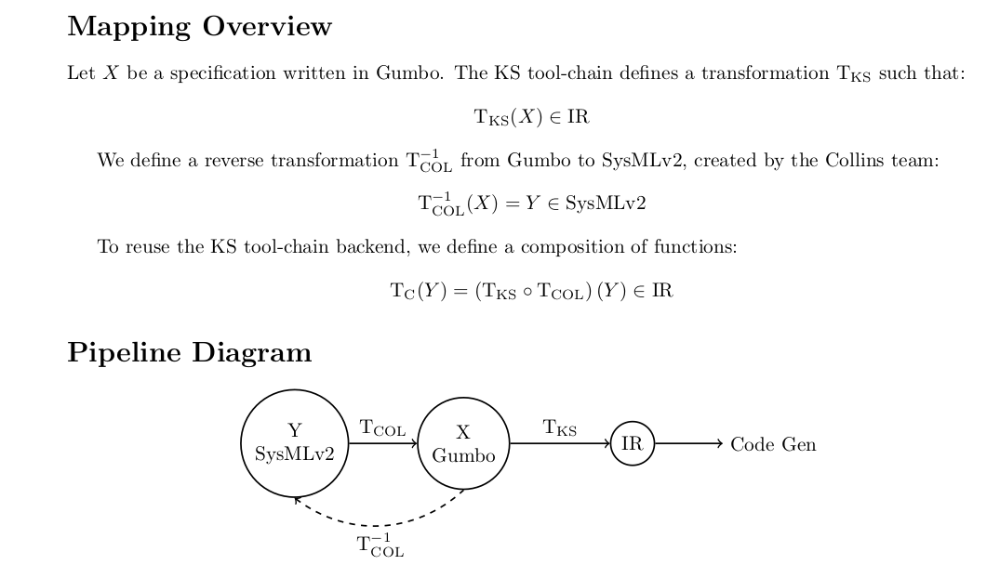
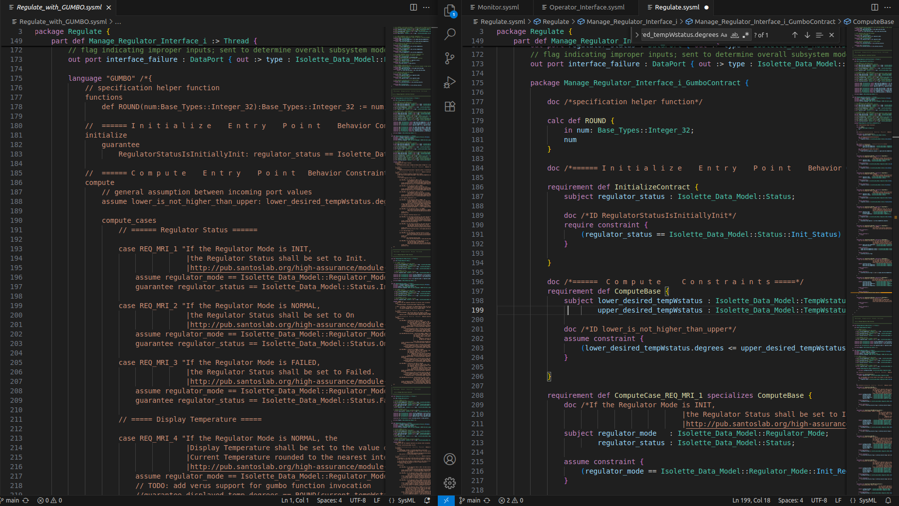

# GUMBO → GUMBO‑Contract Mapping (Illustrative)  
**Example source:** `regulate.sysml` (GUMBO blocks) → translated `*_GumboContract` packages (contracts)

---

## 1) Purpose
The goal is to provide a **front‑end SysML v2 model** that can be **fully translated to GUMBO** and then verified in the **Sireum** workflow. By doing so, both the original GUMBO and the translated model map to the **same intermediate representation** without invasive changes to the code generator or to the existing KS verification pipeline. This plan aligns with the **CLOVER** approach: keep the verification flow stable, translate deterministically, and cross‑check semantics.



This document summarizes the translation **rules** from GUMBO language blocks to the **contract style** used in `*_GumboContract` packages, and shows a concrete example after each rule using fragments from `regulate.sysml`.

---
---
> **Note:** 
Before opening the project in SysIDE (VS Code/VSCodium), complete the following steps:

- Clone this repo and change into sysml. 
- Clone the SysML v2 AADL libraries into the sysml/ directory of this repo:

```
cd sysml
git clone https://github.com/santoslab/sysml-aadl-libraries.git
```

Then you should be able to veiw the files like this: 




Watch the full demo here:

[](https://youtu.be/l5UzNUD4ZeE)


## 2) Front-end conventions

### 2.1 Package placement & naming
- **Source:** `part def <Component> :> Thread/Process { ... language "GUMBO" { ... } }`
- **Target:** Nested package `package <Component>_GumboContract { ... }` under the **same component** in a **relative location** as shown below.

**Example (Operator Interface thread):**
```sysml
// target
package Manage_Regulator_Interface_i_GumboContract { ... }
```

### 2.2 Functions → `calc`
- **Source:** GUMBO `functions` with `def`.
- **Target:** Contract package `calc def` with `in` parameters; body returns the expression.

**Example**
```text
// source
functions
  def ROUND(num: Base_Types::Integer_32): Base_Types::Integer_32 := num;

// target 
calc def ROUND {
  in num: Base_Types::Integer_32;
  num // ToDo check sematic so we may replace with a call to the SysML v2 equivalent of ROUND when available; placeholder returns input unchanged.
}
```

### 2.3 State variables → `attribute`
- **Source:** GUMBO `state` block variables.
- **Target:** Contract package‐level `attribute` of the same type.

**Example (Heat Source)**
```text
// source
state lastCmd: Isolette_Data_Model::On_Off;

// target
attribute lastCmd: Isolette_Data_Model::On_Off;
```

### 2.4 Initialization guarantees → `InitializeContract`
- **Source:** GUMBO `initialize` → `guarantee` clauses.
- **Target:** `requirement def InitializeContract { ... require constraint { … } }`.
- **Subjects:** Declare any ports/variables referenced via `subject ...` to pass the linker checks.

**Example (MRI initial status)**
```text
// source
initialize
  guarantee RegulatorStatusIsInitiallyInit:
    regulator_status == Isolette_Data_Model::Status.Init_Status;

// target
	requirement def InitializeContract {
		subject regulator_status : Isolette_Data_Model::Status;

		doc /*ID RegulatorStatusIsInitiallyInit*/
		require constraint {
			(regulator_status == Isolette_Data_Model::Status::Init_Status)
		}
```

### 2.5 Compute block (global assumptions/invariants) → `ComputeBase`
- **Source:** GUMBO `compute`‐level `assume`/invariants that apply to all cases.
- **Target:** `requirement def ComputeBase { ... assume constraint { ... } }` with the needed `subject`s.

**Example (range coherence)**
```text
// source
assume lower_is_not_higher_than_upper:
  lower_desired_tempWstatus.degrees <= upper_desired_tempWstatus.degrees;

// target
requirement def ComputeBase {
  subject lower_desired_tempWstatus : Isolette_Data_Model::TempWstatus_i;
          upper_desired_tempWstatus : Isolette_Data_Model::TempWstatus_i;
  assume constraint {
    lower_desired_tempWstatus.degrees <= upper_desired_tempWstatus.degrees
  }
}
```

### 2.6 Compute cases → specialized `requirement`s
- **Source:** GUMBO `compute_cases` with `case <ID> [text]: assume ...; guarantee ...;`
- **Target:** `requirement def ComputeCase_<ID> specializes ComputeBase { assume constraint { ... } require constraint { ... } }`

**Example (MRI: NORMAL ⇒ On_Status)**
```text
//source
compute
                // general assumption between incoming port values    
                assume lower_is_not_higher_than_upper: lower_desired_tempWstatus.degrees <= upper_desired_tempWstatus.degrees;
            
                compute_cases
//target
requirement def ComputeBase {
		subject lower_desired_tempWstatus : Isolette_Data_Model::TempWstatus_i;
		        upper_desired_tempWstatus : Isolette_Data_Model::TempWstatus_i;

	doc /*ID lower_is_not_higher_than_upper*/
		assume constraint {
			(lower_desired_tempWstatus.degrees <= upper_desired_tempWstatus.degrees)
		}
	}

// source
case REQ_MRI_2 "...":
  assume regulator_mode == Isolette_Data_Model::Regulator_Mode.Normal_Regulator_Mode;
  guarantee regulator_status == Isolette_Data_Model::Status.On_Status;

// target
requirement def ComputeCase_REQ_MRI_2 specializes ComputeBase {
  subject regulator_mode   : Isolette_Data_Model::Regulator_Mode;
          regulator_status : Isolette_Data_Model::Status;
  assume constraint {
    regulator_mode == Isolette_Data_Model::Regulator_Mode::Normal_Regulator_Mode
  }
  require constraint {
    regulator_status == Isolette_Data_Model::Status::On_Status
  }
}
```

### 2.7 Historical value operator `In(x)` → `pre_x`
- **Source:** GUMBO uses `In(x)` for the **previous value** of a state/output.
- **Target:** Introduce a `subject pre_x : <Type>` and use it in the `require constraint`.

**Example (MHS: hold heat control in range)**
```text
// source
guarantee heat_control == In(lastCmd);

// target
subject pre_lastCmd : Isolette_Data_Model::On_Off;
require constraint { heat_control == pre_lastCmd }
```

### 2.8 Implication & unspecified values
- **Source:** GUMBO implication form like `'->:' (cond, expr)` and “unspecified” modeled as tautologies.
- **Target:** Use standard `implies` (e.g., `(not interface_failure.flag) implies (...)`) and represent unspecified as `assume true; require true;`.

**Example (MRI: pass through when no interface failure)**
```text
// source
case REQ_MRI_8 "If the Regulator Interface Failure is False,
                                   |the Desired Range shall be set to the Desired Temperature Range.
                                   |http://pub.santoslab.org/high-assurance/module-requirements/reading/FAA-DoT-Requirements-AR-08-32.pdf#page=108 ":
                        assume true;
                        guarantee 
                            '->:' (not interface_failure.flag,
                                  (lower_desired_temp.degrees == lower_desired_tempWstatus.degrees) & (upper_desired_temp.degrees == upper_desired_tempWstatus.degrees));

//target 
assume constraint {
                    (true)
	           }
	           
require constraint {
  (not interface_failure.flag) implies
    ((lower_desired_temp.degrees == lower_desired_tempWstatus.degrees) and
     (upper_desired_temp.degrees == upper_desired_tempWstatus.degrees))
}
```

### 2.9 Comment & metadata preservation
- **Source:** Textual comments alongside cases/guarantees (often containing requirement rationale or links).
- **Target:** Preserve as `doc /* ... */` blocks. Preserve typed literal metadata when available for later validation.

---

## 3) Worked mappings by component

### 3.1 Manage_Regulator_Interface_i (MRI)
- **Functions → calc:** 
- **Initialize:** `regulator_status` initially `Init_Status` → `InitializeContract` with a single `require constraint`.
- **ComputeBase:** Range coherence assumption moved intact.
- **Cases:** `REQ_MRI_1..9` are each translated into `ComputeCase_REQ_MRI_k` requirements specializing `ComputeBase` with appropriate `subject`s, `assume` conditions, and `require` clauses.
- **Rounding note:** Source text calls for rounding in REQ_MRI_4; current target uses equality without rounding (TODO: re‑introduce rounded equality once the ROUND invocation is supported - requires importing a formal_GUMBO_library).


### 3.2 Manage_Regulator_Mode_i (MRM)
- **State → attribute:** `lastRegulatorMode` carried as package `attribute`.
- **Initialize:** `regulator_mode` initially `Init_Regulator_Mode` in `InitializeContract`.
- **Cases:** Each transition case (`REQ_MRM_2`, `REQ_MRM_Maintain_Normal`, `REQ_MRM_3`, `REQ_MRM_4`, `REQ_MRM_MaintainFailed`) is a separate requirement; the previous mode condition appears as an `assume` on (previous) mode, and the post‑state is enforced in the `require` clause.

**Example pair (REQ_MRM_2, Init → Normal)**
```text
// source
assume lastRegulatorMode == Init_Regulator_Mode;

guarantee (not(interface_failure.flag or internal_failure.flag)) and
          current_tempWstatus.status == ValueStatus.Valid
          implies (regulator_mode == Normal_Regulator_Mode and lastRegulatorMode == Normal_Regulator_Mode);

// target
assume constraint { lastRegulatorMode == Isolette_Data_Model::Regulator_Mode::Init_Regulator_Mode }

require constraint {
  (((not (interface_failure.flag or internal_failure.flag)) and
    (current_tempWstatus.status == Isolette_Data_Model::ValueStatus::Valid)))
  implies
  ((regulator_mode == Isolette_Data_Model::Regulator_Mode::Normal_Regulator_Mode) and
   (lastRegulatorMode == Isolette_Data_Model::Regulator_Mode::Normal_Regulator_Mode))
}
```

### 3.3 Manage_Heat_Source_i (MHS)
- **State → attribute:** `lastCmd` preserved; `ComputeBase` ties `lastCmd == heat_control` as an invariant.
- **Initialize:** `heat_control` Off in Init; `lastCmd` initialized Off.
- **Cases:** Temperature/Mode‑conditioned switching (`Onn`/`Off`) translated to per‑case requirements; the hysteresis/“hold” case uses `pre_lastCmd` for the historical value mapping of `In(lastCmd)`.

**Example pair (REQ_MHS_4, hold within range)**
```text
// source
assume regulator_mode == Normal_Regulator_Mode
   & current_tempWstatus.degrees in [lower, upper];
guarantee heat_control == In(lastCmd);

// target
assume constraint {
  (regulator_mode == Isolette_Data_Model::Regulator_Mode::Normal_Regulator_Mode) and
  (current_tempWstatus.degrees >= lower_desired_temp.degrees) and
  (current_tempWstatus.degrees <= upper_desired_temp.degrees)
}
subject pre_lastCmd : Isolette_Data_Model::On_Off;
require constraint { heat_control == pre_lastCmd }
```

---

## 4) Quick mapping table (cheat sheet)

| Source (GUMBO)                                   | Target (`*_GumboContract`)                                       |
|---|---|
| `language "GUMBO" { functions def ... }`         | `calc def ... { in ...; body }`                                  |
| `state x : T;`                                   | `attribute x: T;`                                                |
| `initialize { guarantee … }`                     | `requirement def InitializeContract { subject …; require … }`    |
| `compute { assume … }`                           | `requirement def ComputeBase { subject …; assume … }`            |
| `compute_cases { case ID: assume …; guarantee …}`| `requirement def ComputeCase_ID specializes ComputeBase { assume …; require … }` |
| `In(x)` (previous value)                         | `pre_x` subject, then use in `require`                           |
| `->:` implication, `cond ⇒ expr`                 | `(cond) implies (expr)`                                          |
| “unspecified” output semantics                   | `assume true; require true;`                                     |
| Comments/doc strings                             | `doc /* ... */`                                                  |

---


---

## 6) Minimal end‑to‑end recipe (authoring checklist)

1. For each SysML **Thread/Process** with `language "GUMBO"`: create a sibling **contract package** named `<Component>_GumboContract` in the same scope.
2. Lift `functions` → `calc`, `state` → `attribute`. 
3. Create `InitializeContract` with all `initialize` guarantees; add `subject`s as needed. 
4. Create `ComputeBase` and move global `compute` assumptions/invariants there. 
5. For each `compute_cases` case: create `ComputeCase_<ID>` specializing `ComputeBase`; add `assume` and `require` clauses. 
6. Map `In(x)` to `pre_x` subjects; use `implies` for conditional guarantees; use `true`/`true` for unspecified outputs. 
7. Preserve comments/links using `doc /* … */`. 
8. Run parser/linker checks, then CLOVER‑based semantics checks.

---

*Status:* Parser & linker checks pass on the frontend packages discussed here; **CLOVER**‑based final semantic validation is pending.
