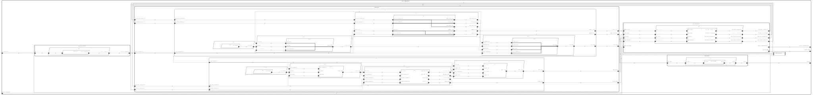

# Isolette::Isolette.Single_Sensor

## AADL Architecture

|System: [Isolette::Isolette.Single_Sensor]()|
|:--|

|Thread: Regulate::Manage_Regulator_Interface.i |
|:--|
|Type: [Manage_Regulator_Interface](../../aadl/aadl/packages/Regulate.aadl#L153) Implementation: [Manage_Regulator_Interface.i](../../aadl/aadl/packages/Regulate.aadl#L301) GUMBO: [Subclause](../../aadl/aadl/packages/Regulate.aadl#L210)|
|Periodic : 60 ms|

|Thread: Regulate::Manage_Heat_Source.i |
|:--|
|Type: [Manage_Heat_Source](../../aadl/aadl/packages/Regulate.aadl#L500) Implementation: [Manage_Heat_Source.i](../../aadl/aadl/packages/Regulate.aadl#L580) GUMBO: [Subclause](../../aadl/aadl/packages/Regulate.aadl#L516)|
|Periodic : 60 ms|

|Thread: Regulate::Manage_Regulator_Mode.i |
|:--|
|Type: [Manage_Regulator_Mode](../../aadl/aadl/packages/Regulate.aadl#L344) Implementation: [Manage_Regulator_Mode.i](../../aadl/aadl/packages/Regulate.aadl#L453) GUMBO: [Subclause](../../aadl/aadl/packages/Regulate.aadl#L366)|
|Periodic : 60 ms|

|Thread: Regulate::Detect_Regulator_Failure.i |
|:--|
|Type: [Detect_Regulator_Failure](../../aadl/aadl/packages/Regulate.aadl#L615) Implementation: [Detect_Regulator_Failure.i](../../aadl/aadl/packages/Regulate.aadl#L623)|
|Periodic : 60 ms|

|Thread: Monitor::Manage_Monitor_Interface.i |
|:--|
|Type: [Manage_Monitor_Interface](../../aadl/aadl/packages/Monitor.aadl#L142) Implementation: [Manage_Monitor_Interface.i](../../aadl/aadl/packages/Monitor.aadl#L165) 
GUMBO: [Subclause](../../aadl/aadl/packages/Monitor.aadl#L172)|
|Periodic : 60 ms|

|Thread: Monitor::Manage_Alarm.i |
|:--|
|Type: [Manage_Alarm](../../aadl/aadl/packages/Monitor.aadl#L447) Implementation: [Manage_Alarm.i](../../aadl/aadl/packages/Monitor.aadl#L464) 
GUMBO: [Subclause](../../aadl/aadl/packages/Monitor.aadl#L466)|
|Periodic : 60 ms|

|Thread: Monitor::Manage_Monitor_Mode.i |
|:--|
|Type: [Manage_Monitor_Mode](../../aadl/aadl/packages/Monitor.aadl#L304) Implementation: [Manage_Monitor_Mode.i](../../aadl/aadl/packages/Monitor.aadl#L319) 
GUMBO: [Subclause](../../aadl/aadl/packages/Monitor.aadl#L321)|
|Periodic : 60 ms|

|Thread: Monitor::Detect_Monitor_Failure.i |
|:--|
|Type: [Detect_Monitor_Failure](../../aadl/aadl/packages/Monitor.aadl#L590) Implementation: [Detect_Monitor_Failure.i](../../aadl/aadl/packages/Monitor.aadl#L597)|
|Periodic : 60 ms|

|Thread: Operator_Interface::Operator_Interface_Thread.i |
|:--|
|Type: [Operator_Interface_Thread](../../aadl/aadl/packages/Operator_Interface.aadl#L95) Implementation: [Operator_Interface_Thread.i](../../aadl/aadl/packages/Operator_Interface.aadl#L156) GUMBO: [Subclause](../../aadl/aadl/packages/Operator_Interface.aadl#L109)|
|Periodic : 60 ms|

|Thread: Devices::Temperature_Sensor.i |
|:--|
|Type: [Temperature_Sensor](../../aadl/aadl/packages/Devices.aadl#L85) Implementation: [Temperature_Sensor.i](../../aadl/aadl/packages/Devices.aadl#L91)|
|Periodic : 60 ms|

|Thread: Devices::Heat_Source.i |
|:--|
|Type: [Heat_Source](../../aadl/aadl/packages/Devices.aadl#L129) Implementation: [Heat_Source.i](../../aadl/aadl/packages/Devices.aadl#L135)|
|Periodic : 60 ms|

## Rust Code

### Behavior Code
#### mri: Regulate::Manage_Regulator_Interface.i

 - **Entry Points**

    Initialize: [Rust](crates/thermostat_rt_mri_mri/src/component/thermostat_rt_mri_mri_app.rs#L20)

    TimeTriggered: [Rust](crates/thermostat_rt_mri_mri/src/component/thermostat_rt_mri_mri_app.rs#L49)

- **APIs**

    <table>
    <tr><th>Port Name</th><th>Direction</th><th>Kind</th><th>Payload</th><th>Realizations</th></tr>
    <tr><td><a title='Model' href='../../aadl/aadl/packages/Regulate.aadl#L158'>upper_desired_tempWstatus</a></td>
        <td>In</td><td>Data</td>
        <td>Isolette_Data_Model::TempWstatus.i</td><td><a title='Memory Map: Lines 46-50' href='microkit.system#L46'>Memory Map</a> → <a title='C Shared Memory Variable: Line 18' href='components/thermostat_rt_mri_mri/src/thermostat_rt_mri_mri.c#L18'>C var_addr</a> → <a title='C Interface: Lines 83-92' href='components/thermostat_rt_mri_mri/src/thermostat_rt_mri_mri.c#L83'>C Interface</a> → <a title='C Extern: Line 14' href='crates/thermostat_rt_mri_mri/src/bridge/extern_c_api.rs#L14'>C Extern</a> → <a title='Rust/C Interface: Lines 25-32' href='crates/thermostat_rt_mri_mri/src/bridge/extern_c_api.rs#L25'>Rust/C Interface</a> → <a title='Unverified Rust Interface: Lines 55-62' href='crates/thermostat_rt_mri_mri/src/bridge/thermostat_rt_mri_mri_api.rs#L55'>Unverified Rust Interface</a> → <a title='Rust/Verus API: Lines 200-214' href='crates/thermostat_rt_mri_mri/src/bridge/thermostat_rt_mri_mri_api.rs#L200'>Rust/Verus API</a></td></tr>
    <tr><td><a title='Model' href='../../aadl/aadl/packages/Regulate.aadl#L159'>lower_desired_tempWstatus</a></td>
        <td>In</td><td>Data</td>
        <td>Isolette_Data_Model::TempWstatus.i</td><td><a title='Memory Map: Lines 41-45' href='microkit.system#L41'>Memory Map</a> → <a title='C Shared Memory Variable: Line 16' href='components/thermostat_rt_mri_mri/src/thermostat_rt_mri_mri.c#L16'>C var_addr</a> → <a title='C Interface: Lines 70-79' href='components/thermostat_rt_mri_mri/src/thermostat_rt_mri_mri.c#L70'>C Interface</a> → <a title='C Extern: Line 15' href='crates/thermostat_rt_mri_mri/src/bridge/extern_c_api.rs#L15'>C Extern</a> → <a title='Rust/C Interface: Lines 34-41' href='crates/thermostat_rt_mri_mri/src/bridge/extern_c_api.rs#L34'>Rust/C Interface</a> → <a title='Unverified Rust Interface: Lines 65-72' href='crates/thermostat_rt_mri_mri/src/bridge/thermostat_rt_mri_mri_api.rs#L65'>Unverified Rust Interface</a> → <a title='Rust/Verus API: Lines 215-229' href='crates/thermostat_rt_mri_mri/src/bridge/thermostat_rt_mri_mri_api.rs#L215'>Rust/Verus API</a></td></tr>
    <tr><td><a title='Model' href='../../aadl/aadl/packages/Regulate.aadl#L161'>current_tempWstatus</a></td>
        <td>In</td><td>Data</td>
        <td>Isolette_Data_Model::TempWstatus.i</td><td><a title='Memory Map: Lines 51-55' href='microkit.system#L51'>Memory Map</a> → <a title='C Shared Memory Variable: Line 20' href='components/thermostat_rt_mri_mri/src/thermostat_rt_mri_mri.c#L20'>C var_addr</a> → <a title='C Interface: Lines 96-105' href='components/thermostat_rt_mri_mri/src/thermostat_rt_mri_mri.c#L96'>C Interface</a> → <a title='C Extern: Line 16' href='crates/thermostat_rt_mri_mri/src/bridge/extern_c_api.rs#L16'>C Extern</a> → <a title='Rust/C Interface: Lines 43-50' href='crates/thermostat_rt_mri_mri/src/bridge/extern_c_api.rs#L43'>Rust/C Interface</a> → <a title='Unverified Rust Interface: Lines 75-82' href='crates/thermostat_rt_mri_mri/src/bridge/thermostat_rt_mri_mri_api.rs#L75'>Unverified Rust Interface</a> → <a title='Rust/Verus API: Lines 230-244' href='crates/thermostat_rt_mri_mri/src/bridge/thermostat_rt_mri_mri_api.rs#L230'>Rust/Verus API</a></td></tr>
    <tr><td><a title='Model' href='../../aadl/aadl/packages/Regulate.aadl#L163'>regulator_mode</a></td>
        <td>In</td><td>Data</td>
        <td>Isolette_Data_Model::Regulator_Mode</td><td><a title='Memory Map: Lines 36-40' href='microkit.system#L36'>Memory Map</a> → <a title='C Shared Memory Variable: Line 14' href='components/thermostat_rt_mri_mri/src/thermostat_rt_mri_mri.c#L14'>C var_addr</a> → <a title='C Interface: Lines 57-66' href='components/thermostat_rt_mri_mri/src/thermostat_rt_mri_mri.c#L57'>C Interface</a> → <a title='C Extern: Line 17' href='crates/thermostat_rt_mri_mri/src/bridge/extern_c_api.rs#L17'>C Extern</a> → <a title='Rust/C Interface: Lines 52-59' href='crates/thermostat_rt_mri_mri/src/bridge/extern_c_api.rs#L52'>Rust/C Interface</a> → <a title='Unverified Rust Interface: Lines 85-92' href='crates/thermostat_rt_mri_mri/src/bridge/thermostat_rt_mri_mri_api.rs#L85'>Unverified Rust Interface</a> → <a title='Rust/Verus API: Lines 245-259' href='crates/thermostat_rt_mri_mri/src/bridge/thermostat_rt_mri_mri_api.rs#L245'>Rust/Verus API</a></td></tr>
    <tr><td><a title='Model' href='../../aadl/aadl/packages/Regulate.aadl#L167'>upper_desired_temp</a></td>
        <td>Out</td><td>Data</td>
        <td>Isolette_Data_Model::Temp.i</td><td><a title='Rust/Verus API: Lines 112-128' href='crates/thermostat_rt_mri_mri/src/bridge/thermostat_rt_mri_mri_api.rs#L112'>Rust/Verus API</a> → <a title='Unverified Rust Interface: Lines 13-18' href='crates/thermostat_rt_mri_mri/src/bridge/thermostat_rt_mri_mri_api.rs#L13'>Unverified Rust Interface</a> → <a title='Rust/C Interface: Lines 61-66' href='crates/thermostat_rt_mri_mri/src/bridge/extern_c_api.rs#L61'>Rust/C Interface</a> → <a title='C Extern: Line 18' href='crates/thermostat_rt_mri_mri/src/bridge/extern_c_api.rs#L18'>C Extern</a> → <a title='C Interface: Lines 25-29' href='components/thermostat_rt_mri_mri/src/thermostat_rt_mri_mri.c#L25'>C Interface</a> → <a title='C Shared Memory Variable: Line 9' href='components/thermostat_rt_mri_mri/src/thermostat_rt_mri_mri.c#L9'>C var_addr</a> → <a title='Memory Map: Lines 11-15' href='microkit.system#L11'>Memory Map</a></td></tr>
    <tr><td><a title='Model' href='../../aadl/aadl/packages/Regulate.aadl#L168'>lower_desired_temp</a></td>
        <td>Out</td><td>Data</td>
        <td>Isolette_Data_Model::Temp.i</td><td><a title='Rust/Verus API: Lines 129-145' href='crates/thermostat_rt_mri_mri/src/bridge/thermostat_rt_mri_mri_api.rs#L129'>Rust/Verus API</a> → <a title='Unverified Rust Interface: Lines 21-26' href='crates/thermostat_rt_mri_mri/src/bridge/thermostat_rt_mri_mri_api.rs#L21'>Unverified Rust Interface</a> → <a title='Rust/C Interface: Lines 68-73' href='crates/thermostat_rt_mri_mri/src/bridge/extern_c_api.rs#L68'>Rust/C Interface</a> → <a title='C Extern: Line 19' href='crates/thermostat_rt_mri_mri/src/bridge/extern_c_api.rs#L19'>C Extern</a> → <a title='C Interface: Lines 31-35' href='components/thermostat_rt_mri_mri/src/thermostat_rt_mri_mri.c#L31'>C Interface</a> → <a title='C Shared Memory Variable: Line 10' href='components/thermostat_rt_mri_mri/src/thermostat_rt_mri_mri.c#L10'>C var_addr</a> → <a title='Memory Map: Lines 16-20' href='microkit.system#L16'>Memory Map</a></td></tr>
    <tr><td><a title='Model' href='../../aadl/aadl/packages/Regulate.aadl#L170'>displayed_temp</a></td>
        <td>Out</td><td>Data</td>
        <td>Isolette_Data_Model::Temp.i</td><td><a title='Rust/Verus API: Lines 146-162' href='crates/thermostat_rt_mri_mri/src/bridge/thermostat_rt_mri_mri_api.rs#L146'>Rust/Verus API</a> → <a title='Unverified Rust Interface: Lines 29-34' href='crates/thermostat_rt_mri_mri/src/bridge/thermostat_rt_mri_mri_api.rs#L29'>Unverified Rust Interface</a> → <a title='Rust/C Interface: Lines 75-80' href='crates/thermostat_rt_mri_mri/src/bridge/extern_c_api.rs#L75'>Rust/C Interface</a> → <a title='C Extern: Line 20' href='crates/thermostat_rt_mri_mri/src/bridge/extern_c_api.rs#L20'>C Extern</a> → <a title='C Interface: Lines 37-41' href='components/thermostat_rt_mri_mri/src/thermostat_rt_mri_mri.c#L37'>C Interface</a> → <a title='C Shared Memory Variable: Line 11' href='components/thermostat_rt_mri_mri/src/thermostat_rt_mri_mri.c#L11'>C var_addr</a> → <a title='Memory Map: Lines 21-25' href='microkit.system#L21'>Memory Map</a></td></tr>
    <tr><td><a title='Model' href='../../aadl/aadl/packages/Regulate.aadl#L172'>regulator_status</a></td>
        <td>Out</td><td>Data</td>
        <td>Isolette_Data_Model::Status</td><td><a title='Rust/Verus API: Lines 163-179' href='crates/thermostat_rt_mri_mri/src/bridge/thermostat_rt_mri_mri_api.rs#L163'>Rust/Verus API</a> → <a title='Unverified Rust Interface: Lines 37-42' href='crates/thermostat_rt_mri_mri/src/bridge/thermostat_rt_mri_mri_api.rs#L37'>Unverified Rust Interface</a> → <a title='Rust/C Interface: Lines 82-87' href='crates/thermostat_rt_mri_mri/src/bridge/extern_c_api.rs#L82'>Rust/C Interface</a> → <a title='C Extern: Line 21' href='crates/thermostat_rt_mri_mri/src/bridge/extern_c_api.rs#L21'>C Extern</a> → <a title='C Interface: Lines 43-47' href='components/thermostat_rt_mri_mri/src/thermostat_rt_mri_mri.c#L43'>C Interface</a> → <a title='C Shared Memory Variable: Line 12' href='components/thermostat_rt_mri_mri/src/thermostat_rt_mri_mri.c#L12'>C var_addr</a> → <a title='Memory Map: Lines 26-30' href='microkit.system#L26'>Memory Map</a></td></tr>
    <tr><td><a title='Model' href='../../aadl/aadl/packages/Regulate.aadl#L174'>interface_failure</a></td>
        <td>Out</td><td>Data</td>
        <td>Isolette_Data_Model::Failure_Flag.i</td><td><a title='Rust/Verus API: Lines 180-196' href='crates/thermostat_rt_mri_mri/src/bridge/thermostat_rt_mri_mri_api.rs#L180'>Rust/Verus API</a> → <a title='Unverified Rust Interface: Lines 45-50' href='crates/thermostat_rt_mri_mri/src/bridge/thermostat_rt_mri_mri_api.rs#L45'>Unverified Rust Interface</a> → <a title='Rust/C Interface: Lines 89-94' href='crates/thermostat_rt_mri_mri/src/bridge/extern_c_api.rs#L89'>Rust/C Interface</a> → <a title='C Extern: Line 22' href='crates/thermostat_rt_mri_mri/src/bridge/extern_c_api.rs#L22'>C Extern</a> → <a title='C Interface: Lines 49-53' href='components/thermostat_rt_mri_mri/src/thermostat_rt_mri_mri.c#L49'>C Interface</a> → <a title='C Shared Memory Variable: Line 13' href='components/thermostat_rt_mri_mri/src/thermostat_rt_mri_mri.c#L13'>C var_addr</a> → <a title='Memory Map: Lines 31-35' href='microkit.system#L31'>Memory Map</a></td></tr>
    </table>
- **GUMBO**

    <table>
    <tr><th colspan=4>Initialize</th></tr>
    <tr><td>guarantee RegulatorStatusIsInitiallyInit</td>
    <td><a href=../../aadl/aadl/packages/Regulate.aadl#L217>GUMBO</a></td>
    <td><a href=crates/thermostat_rt_mri_mri/src/component/thermostat_rt_mri_mri_app.rs#L25>Verus</a></td>
    <td><a href=crates/thermostat_rt_mri_mri/src/bridge/thermostat_rt_mri_mri_GUMBOX.rs#L27>GUMBOX</a></td>
    </tr></table>
    <table>
    <tr><th colspan=4>Compute</th></tr>
    <tr><td>assume lower_is_not_higher_than_upper</td>
    <td><a href=../../aadl/aadl/packages/Regulate.aadl#L223>GUMBO</a></td>
    <td><a href=crates/thermostat_rt_mri_mri/src/component/thermostat_rt_mri_mri_app.rs#L54>Verus</a></td>
    <td><a href=crates/thermostat_rt_mri_mri/src/bridge/thermostat_rt_mri_mri_GUMBOX.rs#L76>GUMBOX</a></td>
    </tr>
    <tr><td>guarantee lower_is_lower_temp</td>
    <td><a href=../../aadl/aadl/packages/Regulate.aadl#L230>GUMBO</a></td>
    <td><a href=crates/thermostat_rt_mri_mri/src/component/thermostat_rt_mri_mri_app.rs#L63>Verus</a></td>
    <td><a href=crates/thermostat_rt_mri_mri/src/bridge/thermostat_rt_mri_mri_GUMBOX.rs#L127>GUMBOX</a></td>
    </tr>
    <tr><td>case REQ_MRI_1</td>
    <td><a href=../../aadl/aadl/packages/Regulate.aadl#L237>GUMBO</a></td>
    <td><a href=crates/thermostat_rt_mri_mri/src/component/thermostat_rt_mri_mri_app.rs#L67>Verus</a></td>
    <td><a href=crates/thermostat_rt_mri_mri/src/bridge/thermostat_rt_mri_mri_GUMBOX.rs#L155>GUMBOX</a></td>
    </tr>
    <tr><td>case REQ_MRI_2</td>
    <td><a href=../../aadl/aadl/packages/Regulate.aadl#L243>GUMBO</a></td>
    <td><a href=crates/thermostat_rt_mri_mri/src/component/thermostat_rt_mri_mri_app.rs#L73>Verus</a></td>
    <td><a href=crates/thermostat_rt_mri_mri/src/bridge/thermostat_rt_mri_mri_GUMBOX.rs#L171>GUMBOX</a></td>
    </tr>
    <tr><td>case REQ_MRI_3</td>
    <td><a href=../../aadl/aadl/packages/Regulate.aadl#L249>GUMBO</a></td>
    <td><a href=crates/thermostat_rt_mri_mri/src/component/thermostat_rt_mri_mri_app.rs#L79>Verus</a></td>
    <td><a href=crates/thermostat_rt_mri_mri/src/bridge/thermostat_rt_mri_mri_GUMBOX.rs#L187>GUMBOX</a></td>
    </tr>
    <tr><td>case REQ_MRI_4</td>
    <td><a href=../../aadl/aadl/packages/Regulate.aadl#L257>GUMBO</a></td>
    <td><a href=crates/thermostat_rt_mri_mri/src/component/thermostat_rt_mri_mri_app.rs#L85>Verus</a></td>
    <td><a href=crates/thermostat_rt_mri_mri/src/bridge/thermostat_rt_mri_mri_GUMBOX.rs#L205>GUMBOX</a></td>
    </tr>
    <tr><td>case REQ_MRI_5</td>
    <td><a href=../../aadl/aadl/packages/Regulate.aadl#L264>GUMBO</a></td>
    <td><a href=crates/thermostat_rt_mri_mri/src/component/thermostat_rt_mri_mri_app.rs#L92>Verus</a></td>
    <td><a href=crates/thermostat_rt_mri_mri/src/bridge/thermostat_rt_mri_mri_GUMBOX.rs#L220>GUMBOX</a></td>
    </tr>
    <tr><td>case REQ_MRI_6</td>
    <td><a href=../../aadl/aadl/packages/Regulate.aadl#L271>GUMBO</a></td>
    <td><a href=crates/thermostat_rt_mri_mri/src/component/thermostat_rt_mri_mri_app.rs#L97>Verus</a></td>
    <td><a href=crates/thermostat_rt_mri_mri/src/bridge/thermostat_rt_mri_mri_GUMBOX.rs#L233>GUMBOX</a></td>
    </tr>
    <tr><td>case REQ_MRI_7</td>
    <td><a href=../../aadl/aadl/packages/Regulate.aadl#L278>GUMBO</a></td>
    <td><a href=crates/thermostat_rt_mri_mri/src/component/thermostat_rt_mri_mri_app.rs#L105>Verus</a></td>
    <td><a href=crates/thermostat_rt_mri_mri/src/bridge/thermostat_rt_mri_mri_GUMBOX.rs#L252>GUMBOX</a></td>
    </tr>
    <tr><td>case REQ_MRI_8</td>
    <td><a href=../../aadl/aadl/packages/Regulate.aadl#L286>GUMBO</a></td>
    <td><a href=crates/thermostat_rt_mri_mri/src/component/thermostat_rt_mri_mri_app.rs#L112>Verus</a></td>
    <td><a href=crates/thermostat_rt_mri_mri/src/bridge/thermostat_rt_mri_mri_GUMBOX.rs#L271>GUMBOX</a></td>
    </tr>
    <tr><td>case REQ_MRI_9</td>
    <td><a href=../../aadl/aadl/packages/Regulate.aadl#L293>GUMBO</a></td>
    <td><a href=crates/thermostat_rt_mri_mri/src/component/thermostat_rt_mri_mri_app.rs#L119>Verus</a></td>
    <td><a href=crates/thermostat_rt_mri_mri/src/bridge/thermostat_rt_mri_mri_GUMBOX.rs#L290>GUMBOX</a></td>
    </tr></table>
    <table>
    <tr><th colspan=4>GUMBO Methods</th></tr>
    <tr><td>ROUND</td>
    <td><a href=../../aadl/aadl/packages/Regulate.aadl#L213>GUMBO</a></td>
    <td><a href=crates/thermostat_rt_mri_mri/src/component/thermostat_rt_mri_mri_app.rs#L278>Verus</a></td>
    <td><a href=crates/thermostat_rt_mri_mri/src/bridge/thermostat_rt_mri_mri_GUMBOX.rs#L17>GUMBOX</a></td>
    </tr></table>

#### mhs: Regulate::Manage_Heat_Source.i

 - **Entry Points**

    Initialize: [Rust](crates/thermostat_rt_mhs_mhs/src/component/thermostat_rt_mhs_mhs_app.rs#L28)

    TimeTriggered: [Rust](crates/thermostat_rt_mhs_mhs/src/component/thermostat_rt_mhs_mhs_app.rs#L51)

- **APIs**

    <table>
    <tr><th>Port Name</th><th>Direction</th><th>Kind</th><th>Payload</th><th>Realizations</th></tr>
    <tr><td><a title='Model' href='../../aadl/aadl/packages/Regulate.aadl#L505'>current_tempWstatus</a></td>
        <td>In</td><td>Data</td>
        <td>Isolette_Data_Model::TempWstatus.i</td><td><a title='Memory Map: Lines 89-93' href='microkit.system#L89'>Memory Map</a> → <a title='C Shared Memory Variable: Line 16' href='components/thermostat_rt_mhs_mhs/src/thermostat_rt_mhs_mhs.c#L16'>C var_addr</a> → <a title='C Interface: Lines 68-77' href='components/thermostat_rt_mhs_mhs/src/thermostat_rt_mhs_mhs.c#L68'>C Interface</a> → <a title='C Extern: Line 14' href='crates/thermostat_rt_mhs_mhs/src/bridge/extern_c_api.rs#L14'>C Extern</a> → <a title='Rust/C Interface: Lines 21-28' href='crates/thermostat_rt_mhs_mhs/src/bridge/extern_c_api.rs#L21'>Rust/C Interface</a> → <a title='Unverified Rust Interface: Lines 23-30' href='crates/thermostat_rt_mhs_mhs/src/bridge/thermostat_rt_mhs_mhs_api.rs#L23'>Unverified Rust Interface</a> → <a title='Rust/Verus API: Lines 92-102' href='crates/thermostat_rt_mhs_mhs/src/bridge/thermostat_rt_mhs_mhs_api.rs#L92'>Rust/Verus API</a></td></tr>
    <tr><td><a title='Model' href='../../aadl/aadl/packages/Regulate.aadl#L507'>lower_desired_temp</a></td>
        <td>In</td><td>Data</td>
        <td>Isolette_Data_Model::Temp.i</td><td><a title='Memory Map: Lines 74-78' href='microkit.system#L74'>Memory Map</a> → <a title='C Shared Memory Variable: Line 11' href='components/thermostat_rt_mhs_mhs/src/thermostat_rt_mhs_mhs.c#L11'>C var_addr</a> → <a title='C Interface: Lines 36-45' href='components/thermostat_rt_mhs_mhs/src/thermostat_rt_mhs_mhs.c#L36'>C Interface</a> → <a title='C Extern: Line 15' href='crates/thermostat_rt_mhs_mhs/src/bridge/extern_c_api.rs#L15'>C Extern</a> → <a title='Rust/C Interface: Lines 30-37' href='crates/thermostat_rt_mhs_mhs/src/bridge/extern_c_api.rs#L30'>Rust/C Interface</a> → <a title='Unverified Rust Interface: Lines 33-40' href='crates/thermostat_rt_mhs_mhs/src/bridge/thermostat_rt_mhs_mhs_api.rs#L33'>Unverified Rust Interface</a> → <a title='Rust/Verus API: Lines 103-113' href='crates/thermostat_rt_mhs_mhs/src/bridge/thermostat_rt_mhs_mhs_api.rs#L103'>Rust/Verus API</a></td></tr>
    <tr><td><a title='Model' href='../../aadl/aadl/packages/Regulate.aadl#L508'>upper_desired_temp</a></td>
        <td>In</td><td>Data</td>
        <td>Isolette_Data_Model::Temp.i</td><td><a title='Memory Map: Lines 69-73' href='microkit.system#L69'>Memory Map</a> → <a title='C Shared Memory Variable: Line 9' href='components/thermostat_rt_mhs_mhs/src/thermostat_rt_mhs_mhs.c#L9'>C var_addr</a> → <a title='C Interface: Lines 23-32' href='components/thermostat_rt_mhs_mhs/src/thermostat_rt_mhs_mhs.c#L23'>C Interface</a> → <a title='C Extern: Line 16' href='crates/thermostat_rt_mhs_mhs/src/bridge/extern_c_api.rs#L16'>C Extern</a> → <a title='Rust/C Interface: Lines 39-46' href='crates/thermostat_rt_mhs_mhs/src/bridge/extern_c_api.rs#L39'>Rust/C Interface</a> → <a title='Unverified Rust Interface: Lines 43-50' href='crates/thermostat_rt_mhs_mhs/src/bridge/thermostat_rt_mhs_mhs_api.rs#L43'>Unverified Rust Interface</a> → <a title='Rust/Verus API: Lines 114-124' href='crates/thermostat_rt_mhs_mhs/src/bridge/thermostat_rt_mhs_mhs_api.rs#L114'>Rust/Verus API</a></td></tr>
    <tr><td><a title='Model' href='../../aadl/aadl/packages/Regulate.aadl#L510'>regulator_mode</a></td>
        <td>In</td><td>Data</td>
        <td>Isolette_Data_Model::Regulator_Mode</td><td><a title='Memory Map: Lines 84-88' href='microkit.system#L84'>Memory Map</a> → <a title='C Shared Memory Variable: Line 14' href='components/thermostat_rt_mhs_mhs/src/thermostat_rt_mhs_mhs.c#L14'>C var_addr</a> → <a title='C Interface: Lines 55-64' href='components/thermostat_rt_mhs_mhs/src/thermostat_rt_mhs_mhs.c#L55'>C Interface</a> → <a title='C Extern: Line 17' href='crates/thermostat_rt_mhs_mhs/src/bridge/extern_c_api.rs#L17'>C Extern</a> → <a title='Rust/C Interface: Lines 48-55' href='crates/thermostat_rt_mhs_mhs/src/bridge/extern_c_api.rs#L48'>Rust/C Interface</a> → <a title='Unverified Rust Interface: Lines 53-60' href='crates/thermostat_rt_mhs_mhs/src/bridge/thermostat_rt_mhs_mhs_api.rs#L53'>Unverified Rust Interface</a> → <a title='Rust/Verus API: Lines 125-135' href='crates/thermostat_rt_mhs_mhs/src/bridge/thermostat_rt_mhs_mhs_api.rs#L125'>Rust/Verus API</a></td></tr>
    <tr><td><a title='Model' href='../../aadl/aadl/packages/Regulate.aadl#L514'>heat_control</a></td>
        <td>Out</td><td>Data</td>
        <td>Isolette_Data_Model::On_Off</td><td><a title='Rust/Verus API: Lines 76-88' href='crates/thermostat_rt_mhs_mhs/src/bridge/thermostat_rt_mhs_mhs_api.rs#L76'>Rust/Verus API</a> → <a title='Unverified Rust Interface: Lines 13-18' href='crates/thermostat_rt_mhs_mhs/src/bridge/thermostat_rt_mhs_mhs_api.rs#L13'>Unverified Rust Interface</a> → <a title='Rust/C Interface: Lines 57-62' href='crates/thermostat_rt_mhs_mhs/src/bridge/extern_c_api.rs#L57'>Rust/C Interface</a> → <a title='C Extern: Line 18' href='crates/thermostat_rt_mhs_mhs/src/bridge/extern_c_api.rs#L18'>C Extern</a> → <a title='C Interface: Lines 47-51' href='components/thermostat_rt_mhs_mhs/src/thermostat_rt_mhs_mhs.c#L47'>C Interface</a> → <a title='C Shared Memory Variable: Line 13' href='components/thermostat_rt_mhs_mhs/src/thermostat_rt_mhs_mhs.c#L13'>C var_addr</a> → <a title='Memory Map: Lines 79-83' href='microkit.system#L79'>Memory Map</a></td></tr>
    </table>
- **GUMBO**

    <table>
    <tr><th colspan=3>State Variables</th></tr>
    <tr><td>lastCmd</td>
    <td><a href=../../aadl/aadl/packages/Regulate.aadl#L520>GUMBO</a></td>
    <td><a href=crates/thermostat_rt_mhs_mhs/src/component/thermostat_rt_mhs_mhs_app.rs#L14>Verus</a></td></tr></table>
    <table>
    <tr><th colspan=4>Initialize</th></tr>
    <tr><td>guarantee initlastCmd</td>
    <td><a href=../../aadl/aadl/packages/Regulate.aadl#L524>GUMBO</a></td>
    <td><a href=crates/thermostat_rt_mhs_mhs/src/component/thermostat_rt_mhs_mhs_app.rs#L33>Verus</a></td>
    <td><a href=crates/thermostat_rt_mhs_mhs/src/bridge/thermostat_rt_mhs_mhs_GUMBOX.rs#L22>GUMBOX</a></td>
    </tr>
    <tr><td>guarantee REQ_MHS_1</td>
    <td><a href=../../aadl/aadl/packages/Regulate.aadl#L527>GUMBO</a></td>
    <td><a href=crates/thermostat_rt_mhs_mhs/src/component/thermostat_rt_mhs_mhs_app.rs#L35>Verus</a></td>
    <td><a href=crates/thermostat_rt_mhs_mhs/src/bridge/thermostat_rt_mhs_mhs_GUMBOX.rs#L35>GUMBOX</a></td>
    </tr></table>
    <table>
    <tr><th colspan=4>Compute</th></tr>
    <tr><td>assume lower_is_lower_temp</td>
    <td><a href=../../aadl/aadl/packages/Regulate.aadl#L535>GUMBO</a></td>
    <td><a href=crates/thermostat_rt_mhs_mhs/src/component/thermostat_rt_mhs_mhs_app.rs#L56>Verus</a></td>
    <td><a href=crates/thermostat_rt_mhs_mhs/src/bridge/thermostat_rt_mhs_mhs_GUMBOX.rs#L71>GUMBOX</a></td>
    </tr>
    <tr><td>guarantee lastCmd</td>
    <td><a href=../../aadl/aadl/packages/Regulate.aadl#L538>GUMBO</a></td>
    <td><a href=crates/thermostat_rt_mhs_mhs/src/component/thermostat_rt_mhs_mhs_app.rs#L61>Verus</a></td>
    <td><a href=crates/thermostat_rt_mhs_mhs/src/bridge/thermostat_rt_mhs_mhs_GUMBOX.rs#L120>GUMBOX</a></td>
    </tr>
    <tr><td>case REQ_MHS_1</td>
    <td><a href=../../aadl/aadl/packages/Regulate.aadl#L543>GUMBO</a></td>
    <td><a href=crates/thermostat_rt_mhs_mhs/src/component/thermostat_rt_mhs_mhs_app.rs#L64>Verus</a></td>
    <td><a href=crates/thermostat_rt_mhs_mhs/src/bridge/thermostat_rt_mhs_mhs_GUMBOX.rs#L148>GUMBOX</a></td>
    </tr>
    <tr><td>case REQ_MHS_2</td>
    <td><a href=../../aadl/aadl/packages/Regulate.aadl#L549>GUMBO</a></td>
    <td><a href=crates/thermostat_rt_mhs_mhs/src/component/thermostat_rt_mhs_mhs_app.rs#L70>Verus</a></td>
    <td><a href=crates/thermostat_rt_mhs_mhs/src/bridge/thermostat_rt_mhs_mhs_GUMBOX.rs#L166>GUMBOX</a></td>
    </tr>
    <tr><td>case REQ_MHS_3</td>
    <td><a href=../../aadl/aadl/packages/Regulate.aadl#L556>GUMBO</a></td>
    <td><a href=crates/thermostat_rt_mhs_mhs/src/component/thermostat_rt_mhs_mhs_app.rs#L77>Verus</a></td>
    <td><a href=crates/thermostat_rt_mhs_mhs/src/bridge/thermostat_rt_mhs_mhs_GUMBOX.rs#L187>GUMBOX</a></td>
    </tr>
    <tr><td>case REQ_MHS_4</td>
    <td><a href=../../aadl/aadl/packages/Regulate.aadl#L563>GUMBO</a></td>
    <td><a href=crates/thermostat_rt_mhs_mhs/src/component/thermostat_rt_mhs_mhs_app.rs#L84>Verus</a></td>
    <td><a href=crates/thermostat_rt_mhs_mhs/src/bridge/thermostat_rt_mhs_mhs_GUMBOX.rs#L212>GUMBOX</a></td>
    </tr>
    <tr><td>case REQ_MHS_5</td>
    <td><a href=../../aadl/aadl/packages/Regulate.aadl#L573>GUMBO</a></td>
    <td><a href=crates/thermostat_rt_mhs_mhs/src/component/thermostat_rt_mhs_mhs_app.rs#L94>Verus</a></td>
    <td><a href=crates/thermostat_rt_mhs_mhs/src/bridge/thermostat_rt_mhs_mhs_GUMBOX.rs#L234>GUMBOX</a></td>
    </tr></table>

#### mrm: Regulate::Manage_Regulator_Mode.i

 - **Entry Points**

    Initialize: [Rust](crates/thermostat_rt_mrm_mrm/src/component/thermostat_rt_mrm_mrm_app.rs#L26)

    TimeTriggered: [Rust](crates/thermostat_rt_mrm_mrm/src/component/thermostat_rt_mrm_mrm_app.rs#L43)

- **APIs**

    <table>
    <tr><th>Port Name</th><th>Direction</th><th>Kind</th><th>Payload</th><th>Realizations</th></tr>
    <tr><td><a title='Model' href='../../aadl/aadl/packages/Regulate.aadl#L349'>current_tempWstatus</a></td>
        <td>In</td><td>Data</td>
        <td>Isolette_Data_Model::TempWstatus.i</td><td><a title='Memory Map: Lines 122-126' href='microkit.system#L122'>Memory Map</a> → <a title='C Shared Memory Variable: Line 14' href='components/thermostat_rt_mrm_mrm/src/thermostat_rt_mrm_mrm.c#L14'>C var_addr</a> → <a title='C Interface: Lines 53-62' href='components/thermostat_rt_mrm_mrm/src/thermostat_rt_mrm_mrm.c#L53'>C Interface</a> → <a title='C Extern: Line 14' href='crates/thermostat_rt_mrm_mrm/src/bridge/extern_c_api.rs#L14'>C Extern</a> → <a title='Rust/C Interface: Lines 20-27' href='crates/thermostat_rt_mrm_mrm/src/bridge/extern_c_api.rs#L20'>Rust/C Interface</a> → <a title='Unverified Rust Interface: Lines 23-30' href='crates/thermostat_rt_mrm_mrm/src/bridge/thermostat_rt_mrm_mrm_api.rs#L23'>Unverified Rust Interface</a> → <a title='Rust/Verus API: Lines 80-89' href='crates/thermostat_rt_mrm_mrm/src/bridge/thermostat_rt_mrm_mrm_api.rs#L80'>Rust/Verus API</a></td></tr>
    <tr><td><a title='Model' href='../../aadl/aadl/packages/Regulate.aadl#L351'>interface_failure</a></td>
        <td>In</td><td>Data</td>
        <td>Isolette_Data_Model::Failure_Flag.i</td><td><a title='Memory Map: Lines 107-111' href='microkit.system#L107'>Memory Map</a> → <a title='C Shared Memory Variable: Line 9' href='components/thermostat_rt_mrm_mrm/src/thermostat_rt_mrm_mrm.c#L9'>C var_addr</a> → <a title='C Interface: Lines 21-30' href='components/thermostat_rt_mrm_mrm/src/thermostat_rt_mrm_mrm.c#L21'>C Interface</a> → <a title='C Extern: Line 15' href='crates/thermostat_rt_mrm_mrm/src/bridge/extern_c_api.rs#L15'>C Extern</a> → <a title='Rust/C Interface: Lines 29-36' href='crates/thermostat_rt_mrm_mrm/src/bridge/extern_c_api.rs#L29'>Rust/C Interface</a> → <a title='Unverified Rust Interface: Lines 33-40' href='crates/thermostat_rt_mrm_mrm/src/bridge/thermostat_rt_mrm_mrm_api.rs#L33'>Unverified Rust Interface</a> → <a title='Rust/Verus API: Lines 90-99' href='crates/thermostat_rt_mrm_mrm/src/bridge/thermostat_rt_mrm_mrm_api.rs#L90'>Rust/Verus API</a></td></tr>
    <tr><td><a title='Model' href='../../aadl/aadl/packages/Regulate.aadl#L353'>internal_failure</a></td>
        <td>In</td><td>Data</td>
        <td>Isolette_Data_Model::Failure_Flag.i</td><td><a title='Memory Map: Lines 117-121' href='microkit.system#L117'>Memory Map</a> → <a title='C Shared Memory Variable: Line 12' href='components/thermostat_rt_mrm_mrm/src/thermostat_rt_mrm_mrm.c#L12'>C var_addr</a> → <a title='C Interface: Lines 40-49' href='components/thermostat_rt_mrm_mrm/src/thermostat_rt_mrm_mrm.c#L40'>C Interface</a> → <a title='C Extern: Line 16' href='crates/thermostat_rt_mrm_mrm/src/bridge/extern_c_api.rs#L16'>C Extern</a> → <a title='Rust/C Interface: Lines 38-45' href='crates/thermostat_rt_mrm_mrm/src/bridge/extern_c_api.rs#L38'>Rust/C Interface</a> → <a title='Unverified Rust Interface: Lines 43-50' href='crates/thermostat_rt_mrm_mrm/src/bridge/thermostat_rt_mrm_mrm_api.rs#L43'>Unverified Rust Interface</a> → <a title='Rust/Verus API: Lines 100-109' href='crates/thermostat_rt_mrm_mrm/src/bridge/thermostat_rt_mrm_mrm_api.rs#L100'>Rust/Verus API</a></td></tr>
    <tr><td><a title='Model' href='../../aadl/aadl/packages/Regulate.aadl#L357'>regulator_mode</a></td>
        <td>Out</td><td>Data</td>
        <td>Isolette_Data_Model::Regulator_Mode</td><td><a title='Rust/Verus API: Lines 65-76' href='crates/thermostat_rt_mrm_mrm/src/bridge/thermostat_rt_mrm_mrm_api.rs#L65'>Rust/Verus API</a> → <a title='Unverified Rust Interface: Lines 13-18' href='crates/thermostat_rt_mrm_mrm/src/bridge/thermostat_rt_mrm_mrm_api.rs#L13'>Unverified Rust Interface</a> → <a title='Rust/C Interface: Lines 47-52' href='crates/thermostat_rt_mrm_mrm/src/bridge/extern_c_api.rs#L47'>Rust/C Interface</a> → <a title='C Extern: Line 17' href='crates/thermostat_rt_mrm_mrm/src/bridge/extern_c_api.rs#L17'>C Extern</a> → <a title='C Interface: Lines 32-36' href='components/thermostat_rt_mrm_mrm/src/thermostat_rt_mrm_mrm.c#L32'>C Interface</a> → <a title='C Shared Memory Variable: Line 11' href='components/thermostat_rt_mrm_mrm/src/thermostat_rt_mrm_mrm.c#L11'>C var_addr</a> → <a title='Memory Map: Lines 112-116' href='microkit.system#L112'>Memory Map</a></td></tr>
    </table>
- **GUMBO**

    <table>
    <tr><th colspan=3>State Variables</th></tr>
    <tr><td>lastRegulatorMode</td>
    <td><a href=../../aadl/aadl/packages/Regulate.aadl#L369>GUMBO</a></td>
    <td><a href=crates/thermostat_rt_mrm_mrm/src/component/thermostat_rt_mrm_mrm_app.rs#L12>Verus</a></td></tr></table>
    <table>
    <tr><th colspan=4>Initialize</th></tr>
    <tr><td>guarantee REQ_MRM_1</td>
    <td><a href=../../aadl/aadl/packages/Regulate.aadl#L388>GUMBO</a></td>
    <td><a href=crates/thermostat_rt_mrm_mrm/src/component/thermostat_rt_mrm_mrm_app.rs#L31>Verus</a></td>
    <td><a href=crates/thermostat_rt_mrm_mrm/src/bridge/thermostat_rt_mrm_mrm_GUMBOX.rs#L38>GUMBOX</a></td>
    </tr></table>
    <table>
    <tr><th colspan=4>Compute</th></tr>
    <tr><td>guarantee update_lastRegulatorMode</td>
    <td><a href=../../aadl/aadl/packages/Regulate.aadl#L394>GUMBO</a></td>
    <td><a href=crates/thermostat_rt_mrm_mrm/src/component/thermostat_rt_mrm_mrm_app.rs#L48>Verus</a></td>
    <td><a href=crates/thermostat_rt_mrm_mrm/src/bridge/thermostat_rt_mrm_mrm_GUMBOX.rs#L73>GUMBOX</a></td>
    </tr>
    <tr><td>case REQ_MRM_2</td>
    <td><a href=../../aadl/aadl/packages/Regulate.aadl#L399>GUMBO</a></td>
    <td><a href=crates/thermostat_rt_mrm_mrm/src/component/thermostat_rt_mrm_mrm_app.rs#L50>Verus</a></td>
    <td><a href=crates/thermostat_rt_mrm_mrm/src/bridge/thermostat_rt_mrm_mrm_GUMBOX.rs#L107>GUMBOX</a></td>
    </tr>
    <tr><td>case REQ_MRM_Maintain_Normal</td>
    <td><a href=../../aadl/aadl/packages/Regulate.aadl#L410>GUMBO</a></td>
    <td><a href=crates/thermostat_rt_mrm_mrm/src/component/thermostat_rt_mrm_mrm_app.rs#L59>Verus</a></td>
    <td><a href=crates/thermostat_rt_mrm_mrm/src/bridge/thermostat_rt_mrm_mrm_GUMBOX.rs#L135>GUMBOX</a></td>
    </tr>
    <tr><td>case REQ_MRM_3</td>
    <td><a href=../../aadl/aadl/packages/Regulate.aadl#L423>GUMBO</a></td>
    <td><a href=crates/thermostat_rt_mrm_mrm/src/component/thermostat_rt_mrm_mrm_app.rs#L72>Verus</a></td>
    <td><a href=crates/thermostat_rt_mrm_mrm/src/bridge/thermostat_rt_mrm_mrm_GUMBOX.rs#L162>GUMBOX</a></td>
    </tr>
    <tr><td>case REQ_MRM_4</td>
    <td><a href=../../aadl/aadl/packages/Regulate.aadl#L435>GUMBO</a></td>
    <td><a href=crates/thermostat_rt_mrm_mrm/src/component/thermostat_rt_mrm_mrm_app.rs#L82>Verus</a></td>
    <td><a href=crates/thermostat_rt_mrm_mrm/src/bridge/thermostat_rt_mrm_mrm_GUMBOX.rs#L183>GUMBOX</a></td>
    </tr>
    <tr><td>case REQ_MRM_MaintainFailed</td>
    <td><a href=../../aadl/aadl/packages/Regulate.aadl#L444>GUMBO</a></td>
    <td><a href=crates/thermostat_rt_mrm_mrm/src/component/thermostat_rt_mrm_mrm_app.rs#L90>Verus</a></td>
    <td><a href=crates/thermostat_rt_mrm_mrm/src/bridge/thermostat_rt_mrm_mrm_GUMBOX.rs#L200>GUMBOX</a></td>
    </tr></table>
    <table>
    <tr><th colspan=4>GUMBO Methods</th></tr>
    <tr><td>regulator_status</td>
    <td><a href=../../aadl/aadl/packages/Regulate.aadl#L372>GUMBO</a></td>
    <td><a href=crates/thermostat_rt_mrm_mrm/src/component/thermostat_rt_mrm_mrm_app.rs#L177>Verus</a></td>
    <td><a href=crates/thermostat_rt_mrm_mrm/src/bridge/thermostat_rt_mrm_mrm_GUMBOX.rs#L17>GUMBOX</a></td>
    </tr>
    <tr><td>timeout_condition_satisfied</td>
    <td><a href=../../aadl/aadl/packages/Regulate.aadl#L380>GUMBO</a></td>
    <td><a href=crates/thermostat_rt_mrm_mrm/src/component/thermostat_rt_mrm_mrm_app.rs#L186>Verus</a></td>
    <td><a href=crates/thermostat_rt_mrm_mrm/src/bridge/thermostat_rt_mrm_mrm_GUMBOX.rs#L26>GUMBOX</a></td>
    </tr></table>

#### drf: Regulate::Detect_Regulator_Failure.i

 - **Entry Points**

    Initialize: [Rust](crates/thermostat_rt_drf_drf/src/component/thermostat_rt_drf_drf_app.rs#L21)

    TimeTriggered: [Rust](crates/thermostat_rt_drf_drf/src/component/thermostat_rt_drf_drf_app.rs#L30)

- **APIs**

    <table>
    <tr><th>Port Name</th><th>Direction</th><th>Kind</th><th>Payload</th><th>Realizations</th></tr>
    <tr><td><a title='Model' href='../../aadl/aadl/packages/Regulate.aadl#L620'>internal_failure</a></td>
        <td>Out</td><td>Data</td>
        <td>Isolette_Data_Model::Failure_Flag.i</td><td><a title='Rust/Verus API: Lines 33-41' href='crates/thermostat_rt_drf_drf/src/bridge/thermostat_rt_drf_drf_api.rs#L33'>Rust/Verus API</a> → <a title='Unverified Rust Interface: Lines 13-18' href='crates/thermostat_rt_drf_drf/src/bridge/thermostat_rt_drf_drf_api.rs#L13'>Unverified Rust Interface</a> → <a title='Rust/C Interface: Lines 17-22' href='crates/thermostat_rt_drf_drf/src/bridge/extern_c_api.rs#L17'>Rust/C Interface</a> → <a title='C Extern: Line 14' href='crates/thermostat_rt_drf_drf/src/bridge/extern_c_api.rs#L14'>C Extern</a> → <a title='C Interface: Lines 13-17' href='components/thermostat_rt_drf_drf/src/thermostat_rt_drf_drf.c#L13'>C Interface</a> → <a title='C Shared Memory Variable: Line 9' href='components/thermostat_rt_drf_drf/src/thermostat_rt_drf_drf.c#L9'>C var_addr</a> → <a title='Memory Map: Lines 140-144' href='microkit.system#L140'>Memory Map</a></td></tr>
    </table>

#### mmi: Monitor::Manage_Monitor_Interface.i

 - **Entry Points**

    Initialize: [Rust](crates/thermostat_mt_mmi_mmi/src/component/thermostat_mt_mmi_mmi_app.rs#L26)

    TimeTriggered: [Rust](crates/thermostat_mt_mmi_mmi/src/component/thermostat_mt_mmi_mmi_app.rs#L53)

- **APIs**

    <table>
    <tr><th>Port Name</th><th>Direction</th><th>Kind</th><th>Payload</th><th>Realizations</th></tr>
    <tr><td><a title='Model' href='../../aadl/aadl/packages/Monitor.aadl#L147'>upper_alarm_tempWstatus</a></td>
        <td>In</td><td>Data</td>
        <td>Isolette_Data_Model::TempWstatus.i</td><td><a title='Memory Map: Lines 188-192' href='microkit.system#L188'>Memory Map</a> → <a title='C Shared Memory Variable: Line 17' href='components/thermostat_mt_mmi_mmi/src/thermostat_mt_mmi_mmi.c#L17'>C var_addr</a> → <a title='C Interface: Lines 76-85' href='components/thermostat_mt_mmi_mmi/src/thermostat_mt_mmi_mmi.c#L76'>C Interface</a> → <a title='C Extern: Line 14' href='crates/thermostat_mt_mmi_mmi/src/bridge/extern_c_api.rs#L14'>C Extern</a> → <a title='Rust/C Interface: Lines 24-31' href='crates/thermostat_mt_mmi_mmi/src/bridge/extern_c_api.rs#L24'>Rust/C Interface</a> → <a title='Unverified Rust Interface: Lines 47-56' href='crates/thermostat_mt_mmi_mmi/src/bridge/thermostat_mt_mmi_mmi_api.rs#L47'>Unverified Rust Interface</a> → <a title='Rust/Verus API: Lines 174-189' href='crates/thermostat_mt_mmi_mmi/src/bridge/thermostat_mt_mmi_mmi_api.rs#L174'>Rust/Verus API</a></td></tr>
    <tr><td><a title='Model' href='../../aadl/aadl/packages/Monitor.aadl#L149'>lower_alarm_tempWstatus</a></td>
        <td>In</td><td>Data</td>
        <td>Isolette_Data_Model::TempWstatus.i</td><td><a title='Memory Map: Lines 183-187' href='microkit.system#L183'>Memory Map</a> → <a title='C Shared Memory Variable: Line 15' href='components/thermostat_mt_mmi_mmi/src/thermostat_mt_mmi_mmi.c#L15'>C var_addr</a> → <a title='C Interface: Lines 63-72' href='components/thermostat_mt_mmi_mmi/src/thermostat_mt_mmi_mmi.c#L63'>C Interface</a> → <a title='C Extern: Line 15' href='crates/thermostat_mt_mmi_mmi/src/bridge/extern_c_api.rs#L15'>C Extern</a> → <a title='Rust/C Interface: Lines 33-40' href='crates/thermostat_mt_mmi_mmi/src/bridge/extern_c_api.rs#L33'>Rust/C Interface</a> → <a title='Unverified Rust Interface: Lines 59-68' href='crates/thermostat_mt_mmi_mmi/src/bridge/thermostat_mt_mmi_mmi_api.rs#L59'>Unverified Rust Interface</a> → <a title='Rust/Verus API: Lines 190-205' href='crates/thermostat_mt_mmi_mmi/src/bridge/thermostat_mt_mmi_mmi_api.rs#L190'>Rust/Verus API</a></td></tr>
    <tr><td><a title='Model' href='../../aadl/aadl/packages/Monitor.aadl#L151'>current_tempWstatus</a></td>
        <td>In</td><td>Data</td>
        <td>Isolette_Data_Model::TempWstatus.i</td><td><a title='Memory Map: Lines 193-197' href='microkit.system#L193'>Memory Map</a> → <a title='C Shared Memory Variable: Line 19' href='components/thermostat_mt_mmi_mmi/src/thermostat_mt_mmi_mmi.c#L19'>C var_addr</a> → <a title='C Interface: Lines 89-98' href='components/thermostat_mt_mmi_mmi/src/thermostat_mt_mmi_mmi.c#L89'>C Interface</a> → <a title='C Extern: Line 16' href='crates/thermostat_mt_mmi_mmi/src/bridge/extern_c_api.rs#L16'>C Extern</a> → <a title='Rust/C Interface: Lines 42-49' href='crates/thermostat_mt_mmi_mmi/src/bridge/extern_c_api.rs#L42'>Rust/C Interface</a> → <a title='Unverified Rust Interface: Lines 71-78' href='crates/thermostat_mt_mmi_mmi/src/bridge/thermostat_mt_mmi_mmi_api.rs#L71'>Unverified Rust Interface</a> → <a title='Rust/Verus API: Lines 206-219' href='crates/thermostat_mt_mmi_mmi/src/bridge/thermostat_mt_mmi_mmi_api.rs#L206'>Rust/Verus API</a></td></tr>
    <tr><td><a title='Model' href='../../aadl/aadl/packages/Monitor.aadl#L153'>monitor_mode</a></td>
        <td>In</td><td>Data</td>
        <td>Isolette_Data_Model::Monitor_Mode</td><td><a title='Memory Map: Lines 178-182' href='microkit.system#L178'>Memory Map</a> → <a title='C Shared Memory Variable: Line 13' href='components/thermostat_mt_mmi_mmi/src/thermostat_mt_mmi_mmi.c#L13'>C var_addr</a> → <a title='C Interface: Lines 50-59' href='components/thermostat_mt_mmi_mmi/src/thermostat_mt_mmi_mmi.c#L50'>C Interface</a> → <a title='C Extern: Line 17' href='crates/thermostat_mt_mmi_mmi/src/bridge/extern_c_api.rs#L17'>C Extern</a> → <a title='Rust/C Interface: Lines 51-58' href='crates/thermostat_mt_mmi_mmi/src/bridge/extern_c_api.rs#L51'>Rust/C Interface</a> → <a title='Unverified Rust Interface: Lines 81-88' href='crates/thermostat_mt_mmi_mmi/src/bridge/thermostat_mt_mmi_mmi_api.rs#L81'>Unverified Rust Interface</a> → <a title='Rust/Verus API: Lines 220-233' href='crates/thermostat_mt_mmi_mmi/src/bridge/thermostat_mt_mmi_mmi_api.rs#L220'>Rust/Verus API</a></td></tr>
    <tr><td><a title='Model' href='../../aadl/aadl/packages/Monitor.aadl#L157'>upper_alarm_temp</a></td>
        <td>Out</td><td>Data</td>
        <td>Isolette_Data_Model::Temp.i</td><td><a title='Rust/Verus API: Lines 107-122' href='crates/thermostat_mt_mmi_mmi/src/bridge/thermostat_mt_mmi_mmi_api.rs#L107'>Rust/Verus API</a> → <a title='Unverified Rust Interface: Lines 13-18' href='crates/thermostat_mt_mmi_mmi/src/bridge/thermostat_mt_mmi_mmi_api.rs#L13'>Unverified Rust Interface</a> → <a title='Rust/C Interface: Lines 60-65' href='crates/thermostat_mt_mmi_mmi/src/bridge/extern_c_api.rs#L60'>Rust/C Interface</a> → <a title='C Extern: Line 18' href='crates/thermostat_mt_mmi_mmi/src/bridge/extern_c_api.rs#L18'>C Extern</a> → <a title='C Interface: Lines 24-28' href='components/thermostat_mt_mmi_mmi/src/thermostat_mt_mmi_mmi.c#L24'>C Interface</a> → <a title='C Shared Memory Variable: Line 9' href='components/thermostat_mt_mmi_mmi/src/thermostat_mt_mmi_mmi.c#L9'>C var_addr</a> → <a title='Memory Map: Lines 158-162' href='microkit.system#L158'>Memory Map</a></td></tr>
    <tr><td><a title='Model' href='../../aadl/aadl/packages/Monitor.aadl#L159'>lower_alarm_temp</a></td>
        <td>Out</td><td>Data</td>
        <td>Isolette_Data_Model::Temp.i</td><td><a title='Rust/Verus API: Lines 123-138' href='crates/thermostat_mt_mmi_mmi/src/bridge/thermostat_mt_mmi_mmi_api.rs#L123'>Rust/Verus API</a> → <a title='Unverified Rust Interface: Lines 21-26' href='crates/thermostat_mt_mmi_mmi/src/bridge/thermostat_mt_mmi_mmi_api.rs#L21'>Unverified Rust Interface</a> → <a title='Rust/C Interface: Lines 67-72' href='crates/thermostat_mt_mmi_mmi/src/bridge/extern_c_api.rs#L67'>Rust/C Interface</a> → <a title='C Extern: Line 19' href='crates/thermostat_mt_mmi_mmi/src/bridge/extern_c_api.rs#L19'>C Extern</a> → <a title='C Interface: Lines 30-34' href='components/thermostat_mt_mmi_mmi/src/thermostat_mt_mmi_mmi.c#L30'>C Interface</a> → <a title='C Shared Memory Variable: Line 10' href='components/thermostat_mt_mmi_mmi/src/thermostat_mt_mmi_mmi.c#L10'>C var_addr</a> → <a title='Memory Map: Lines 163-167' href='microkit.system#L163'>Memory Map</a></td></tr>
    <tr><td><a title='Model' href='../../aadl/aadl/packages/Monitor.aadl#L161'>monitor_status</a></td>
        <td>Out</td><td>Data</td>
        <td>Isolette_Data_Model::Status</td><td><a title='Rust/Verus API: Lines 139-154' href='crates/thermostat_mt_mmi_mmi/src/bridge/thermostat_mt_mmi_mmi_api.rs#L139'>Rust/Verus API</a> → <a title='Unverified Rust Interface: Lines 29-34' href='crates/thermostat_mt_mmi_mmi/src/bridge/thermostat_mt_mmi_mmi_api.rs#L29'>Unverified Rust Interface</a> → <a title='Rust/C Interface: Lines 74-79' href='crates/thermostat_mt_mmi_mmi/src/bridge/extern_c_api.rs#L74'>Rust/C Interface</a> → <a title='C Extern: Line 20' href='crates/thermostat_mt_mmi_mmi/src/bridge/extern_c_api.rs#L20'>C Extern</a> → <a title='C Interface: Lines 36-40' href='components/thermostat_mt_mmi_mmi/src/thermostat_mt_mmi_mmi.c#L36'>C Interface</a> → <a title='C Shared Memory Variable: Line 11' href='components/thermostat_mt_mmi_mmi/src/thermostat_mt_mmi_mmi.c#L11'>C var_addr</a> → <a title='Memory Map: Lines 168-172' href='microkit.system#L168'>Memory Map</a></td></tr>
    <tr><td><a title='Model' href='../../aadl/aadl/packages/Monitor.aadl#L163'>interface_failure</a></td>
        <td>Out</td><td>Data</td>
        <td>Isolette_Data_Model::Failure_Flag.i</td><td><a title='Rust/Verus API: Lines 155-170' href='crates/thermostat_mt_mmi_mmi/src/bridge/thermostat_mt_mmi_mmi_api.rs#L155'>Rust/Verus API</a> → <a title='Unverified Rust Interface: Lines 37-42' href='crates/thermostat_mt_mmi_mmi/src/bridge/thermostat_mt_mmi_mmi_api.rs#L37'>Unverified Rust Interface</a> → <a title='Rust/C Interface: Lines 81-86' href='crates/thermostat_mt_mmi_mmi/src/bridge/extern_c_api.rs#L81'>Rust/C Interface</a> → <a title='C Extern: Line 21' href='crates/thermostat_mt_mmi_mmi/src/bridge/extern_c_api.rs#L21'>C Extern</a> → <a title='C Interface: Lines 42-46' href='components/thermostat_mt_mmi_mmi/src/thermostat_mt_mmi_mmi.c#L42'>C Interface</a> → <a title='C Shared Memory Variable: Line 12' href='components/thermostat_mt_mmi_mmi/src/thermostat_mt_mmi_mmi.c#L12'>C var_addr</a> → <a title='Memory Map: Lines 173-177' href='microkit.system#L173'>Memory Map</a></td></tr>
    </table>
- **GUMBO**

    <table>
    <tr><th colspan=3>State Variables</th></tr>
    <tr><td>lastCmd</td>
    <td><a href=../../aadl/aadl/packages/Monitor.aadl#L174>GUMBO</a></td>
    <td><a href=crates/thermostat_mt_mmi_mmi/src/component/thermostat_mt_mmi_mmi_app.rs#L12>Verus</a></td></tr></table>
    <table>
    <tr><th colspan=4>Integration</th></tr>
    <tr><td>assume Allowed_LowerAlarmTemp</td>
    <td><a href=../../aadl/aadl/packages/Monitor.aadl#L184>GUMBO</a></td>
    <td><a href=crates/thermostat_mt_mmi_mmi/src/bridge/thermostat_mt_mmi_mmi_api.rs#L201>Verus</a></td>
    <td><a href=crates/thermostat_mt_mmi_mmi/src/bridge/thermostat_mt_mmi_mmi_GUMBOX.rs#L35>GUMBOX</a></td>
    </tr>
    <tr><td>assume Allowed_UpperAlarmTemp</td>
    <td><a href=../../aadl/aadl/packages/Monitor.aadl#L187>GUMBO</a></td>
    <td><a href=crates/thermostat_mt_mmi_mmi/src/bridge/thermostat_mt_mmi_mmi_api.rs#L185>Verus</a></td>
    <td><a href=crates/thermostat_mt_mmi_mmi/src/bridge/thermostat_mt_mmi_mmi_GUMBOX.rs#L26>GUMBOX</a></td>
    </tr></table>
    <table>
    <tr><th colspan=4>Initialize</th></tr>
    <tr><td>guarantee monitorStatusInitiallyInit</td>
    <td><a href=../../aadl/aadl/packages/Monitor.aadl#L192>GUMBO</a></td>
    <td><a href=crates/thermostat_mt_mmi_mmi/src/component/thermostat_mt_mmi_mmi_app.rs#L31>Verus</a></td>
    <td><a href=crates/thermostat_mt_mmi_mmi/src/bridge/thermostat_mt_mmi_mmi_GUMBOX.rs#L45>GUMBOX</a></td>
    </tr></table>
    <table>
    <tr><th colspan=4>Compute</th></tr>
    <tr><td>assume Allowed_AlarmTempWstatus_Ranges</td>
    <td><a href=../../aadl/aadl/packages/Monitor.aadl#L198>GUMBO</a></td>
    <td><a href=crates/thermostat_mt_mmi_mmi/src/component/thermostat_mt_mmi_mmi_app.rs#L58>Verus</a></td>
    <td><a href=crates/thermostat_mt_mmi_mmi/src/bridge/thermostat_mt_mmi_mmi_GUMBOX.rs#L94>GUMBOX</a></td>
    </tr>
    <tr><td>case REQ_MMI_1</td>
    <td><a href=../../aadl/aadl/packages/Monitor.aadl#L206>GUMBO</a></td>
    <td><a href=crates/thermostat_mt_mmi_mmi/src/component/thermostat_mt_mmi_mmi_app.rs#L65>Verus</a></td>
    <td><a href=crates/thermostat_mt_mmi_mmi/src/bridge/thermostat_mt_mmi_mmi_GUMBOX.rs#L147>GUMBOX</a></td>
    </tr>
    <tr><td>case REQ_MMI_2</td>
    <td><a href=../../aadl/aadl/packages/Monitor.aadl#L212>GUMBO</a></td>
    <td><a href=crates/thermostat_mt_mmi_mmi/src/component/thermostat_mt_mmi_mmi_app.rs#L71>Verus</a></td>
    <td><a href=crates/thermostat_mt_mmi_mmi/src/bridge/thermostat_mt_mmi_mmi_GUMBOX.rs#L163>GUMBOX</a></td>
    </tr>
    <tr><td>case REQ_MMI_3</td>
    <td><a href=../../aadl/aadl/packages/Monitor.aadl#L218>GUMBO</a></td>
    <td><a href=crates/thermostat_mt_mmi_mmi/src/component/thermostat_mt_mmi_mmi_app.rs#L77>Verus</a></td>
    <td><a href=crates/thermostat_mt_mmi_mmi/src/bridge/thermostat_mt_mmi_mmi_GUMBOX.rs#L181>GUMBOX</a></td>
    </tr>
    <tr><td>case REQ_MMI_4</td>
    <td><a href=../../aadl/aadl/packages/Monitor.aadl#L227>GUMBO</a></td>
    <td><a href=crates/thermostat_mt_mmi_mmi/src/component/thermostat_mt_mmi_mmi_app.rs#L85>Verus</a></td>
    <td><a href=crates/thermostat_mt_mmi_mmi/src/bridge/thermostat_mt_mmi_mmi_GUMBOX.rs#L199>GUMBOX</a></td>
    </tr>
    <tr><td>case REQ_MMI_5</td>
    <td><a href=../../aadl/aadl/packages/Monitor.aadl#L235>GUMBO</a></td>
    <td><a href=crates/thermostat_mt_mmi_mmi/src/component/thermostat_mt_mmi_mmi_app.rs#L93>Verus</a></td>
    <td><a href=crates/thermostat_mt_mmi_mmi/src/bridge/thermostat_mt_mmi_mmi_GUMBOX.rs#L219>GUMBOX</a></td>
    </tr>
    <tr><td>case REQ_MMI_6</td>
    <td><a href=../../aadl/aadl/packages/Monitor.aadl#L246>GUMBO</a></td>
    <td><a href=crates/thermostat_mt_mmi_mmi/src/component/thermostat_mt_mmi_mmi_app.rs#L101>Verus</a></td>
    <td><a href=crates/thermostat_mt_mmi_mmi/src/bridge/thermostat_mt_mmi_mmi_GUMBOX.rs#L240>GUMBOX</a></td>
    </tr>
    <tr><td>case REQ_MMI_7</td>
    <td><a href=../../aadl/aadl/packages/Monitor.aadl#L255>GUMBO</a></td>
    <td><a href=crates/thermostat_mt_mmi_mmi/src/component/thermostat_mt_mmi_mmi_app.rs#L108>Verus</a></td>
    <td><a href=crates/thermostat_mt_mmi_mmi/src/bridge/thermostat_mt_mmi_mmi_GUMBOX.rs#L259>GUMBOX</a></td>
    </tr></table>
    <table>
    <tr><th colspan=4>GUMBO Methods</th></tr>
    <tr><td>timeout_condition_satisfied</td>
    <td><a href=../../aadl/aadl/packages/Monitor.aadl#L178>GUMBO</a></td>
    <td><a href=crates/thermostat_mt_mmi_mmi/src/component/thermostat_mt_mmi_mmi_app.rs#L239>Verus</a></td>
    <td><a href=crates/thermostat_mt_mmi_mmi/src/bridge/thermostat_mt_mmi_mmi_GUMBOX.rs#L17>GUMBOX</a></td>
    </tr></table>

#### ma: Monitor::Manage_Alarm.i

 - **Entry Points**

    Initialize: [Rust](crates/thermostat_mt_ma_ma/src/component/thermostat_mt_ma_ma_app.rs#L26)

    TimeTriggered: [Rust](crates/thermostat_mt_ma_ma/src/component/thermostat_mt_ma_ma_app.rs#L45)

- **APIs**

    <table>
    <tr><th>Port Name</th><th>Direction</th><th>Kind</th><th>Payload</th><th>Realizations</th></tr>
    <tr><td><a title='Model' href='../../aadl/aadl/packages/Monitor.aadl#L452'>current_tempWstatus</a></td>
        <td>In</td><td>Data</td>
        <td>Isolette_Data_Model::TempWstatus.i</td><td><a title='Memory Map: Lines 231-235' href='microkit.system#L231'>Memory Map</a> → <a title='C Shared Memory Variable: Line 16' href='components/thermostat_mt_ma_ma/src/thermostat_mt_ma_ma.c#L16'>C var_addr</a> → <a title='C Interface: Lines 68-77' href='components/thermostat_mt_ma_ma/src/thermostat_mt_ma_ma.c#L68'>C Interface</a> → <a title='C Extern: Line 14' href='crates/thermostat_mt_ma_ma/src/bridge/extern_c_api.rs#L14'>C Extern</a> → <a title='Rust/C Interface: Lines 21-28' href='crates/thermostat_mt_ma_ma/src/bridge/extern_c_api.rs#L21'>Rust/C Interface</a> → <a title='Unverified Rust Interface: Lines 23-30' href='crates/thermostat_mt_ma_ma/src/bridge/thermostat_mt_ma_ma_api.rs#L23'>Unverified Rust Interface</a> → <a title='Rust/Verus API: Lines 92-102' href='crates/thermostat_mt_ma_ma/src/bridge/thermostat_mt_ma_ma_api.rs#L92'>Rust/Verus API</a></td></tr>
    <tr><td><a title='Model' href='../../aadl/aadl/packages/Monitor.aadl#L454'>lower_alarm_temp</a></td>
        <td>In</td><td>Data</td>
        <td>Isolette_Data_Model::Temp.i</td><td><a title='Memory Map: Lines 216-220' href='microkit.system#L216'>Memory Map</a> → <a title='C Shared Memory Variable: Line 11' href='components/thermostat_mt_ma_ma/src/thermostat_mt_ma_ma.c#L11'>C var_addr</a> → <a title='C Interface: Lines 36-45' href='components/thermostat_mt_ma_ma/src/thermostat_mt_ma_ma.c#L36'>C Interface</a> → <a title='C Extern: Line 15' href='crates/thermostat_mt_ma_ma/src/bridge/extern_c_api.rs#L15'>C Extern</a> → <a title='Rust/C Interface: Lines 30-37' href='crates/thermostat_mt_ma_ma/src/bridge/extern_c_api.rs#L30'>Rust/C Interface</a> → <a title='Unverified Rust Interface: Lines 33-40' href='crates/thermostat_mt_ma_ma/src/bridge/thermostat_mt_ma_ma_api.rs#L33'>Unverified Rust Interface</a> → <a title='Rust/Verus API: Lines 103-113' href='crates/thermostat_mt_ma_ma/src/bridge/thermostat_mt_ma_ma_api.rs#L103'>Rust/Verus API</a></td></tr>
    <tr><td><a title='Model' href='../../aadl/aadl/packages/Monitor.aadl#L456'>upper_alarm_temp</a></td>
        <td>In</td><td>Data</td>
        <td>Isolette_Data_Model::Temp.i</td><td><a title='Memory Map: Lines 211-215' href='microkit.system#L211'>Memory Map</a> → <a title='C Shared Memory Variable: Line 9' href='components/thermostat_mt_ma_ma/src/thermostat_mt_ma_ma.c#L9'>C var_addr</a> → <a title='C Interface: Lines 23-32' href='components/thermostat_mt_ma_ma/src/thermostat_mt_ma_ma.c#L23'>C Interface</a> → <a title='C Extern: Line 16' href='crates/thermostat_mt_ma_ma/src/bridge/extern_c_api.rs#L16'>C Extern</a> → <a title='Rust/C Interface: Lines 39-46' href='crates/thermostat_mt_ma_ma/src/bridge/extern_c_api.rs#L39'>Rust/C Interface</a> → <a title='Unverified Rust Interface: Lines 43-50' href='crates/thermostat_mt_ma_ma/src/bridge/thermostat_mt_ma_ma_api.rs#L43'>Unverified Rust Interface</a> → <a title='Rust/Verus API: Lines 114-124' href='crates/thermostat_mt_ma_ma/src/bridge/thermostat_mt_ma_ma_api.rs#L114'>Rust/Verus API</a></td></tr>
    <tr><td><a title='Model' href='../../aadl/aadl/packages/Monitor.aadl#L458'>monitor_mode</a></td>
        <td>In</td><td>Data</td>
        <td>Isolette_Data_Model::Monitor_Mode</td><td><a title='Memory Map: Lines 226-230' href='microkit.system#L226'>Memory Map</a> → <a title='C Shared Memory Variable: Line 14' href='components/thermostat_mt_ma_ma/src/thermostat_mt_ma_ma.c#L14'>C var_addr</a> → <a title='C Interface: Lines 55-64' href='components/thermostat_mt_ma_ma/src/thermostat_mt_ma_ma.c#L55'>C Interface</a> → <a title='C Extern: Line 17' href='crates/thermostat_mt_ma_ma/src/bridge/extern_c_api.rs#L17'>C Extern</a> → <a title='Rust/C Interface: Lines 48-55' href='crates/thermostat_mt_ma_ma/src/bridge/extern_c_api.rs#L48'>Rust/C Interface</a> → <a title='Unverified Rust Interface: Lines 53-60' href='crates/thermostat_mt_ma_ma/src/bridge/thermostat_mt_ma_ma_api.rs#L53'>Unverified Rust Interface</a> → <a title='Rust/Verus API: Lines 125-135' href='crates/thermostat_mt_ma_ma/src/bridge/thermostat_mt_ma_ma_api.rs#L125'>Rust/Verus API</a></td></tr>
    <tr><td><a title='Model' href='../../aadl/aadl/packages/Monitor.aadl#L462'>alarm_control</a></td>
        <td>Out</td><td>Data</td>
        <td>Isolette_Data_Model::On_Off</td><td><a title='Rust/Verus API: Lines 76-88' href='crates/thermostat_mt_ma_ma/src/bridge/thermostat_mt_ma_ma_api.rs#L76'>Rust/Verus API</a> → <a title='Unverified Rust Interface: Lines 13-18' href='crates/thermostat_mt_ma_ma/src/bridge/thermostat_mt_ma_ma_api.rs#L13'>Unverified Rust Interface</a> → <a title='Rust/C Interface: Lines 57-62' href='crates/thermostat_mt_ma_ma/src/bridge/extern_c_api.rs#L57'>Rust/C Interface</a> → <a title='C Extern: Line 18' href='crates/thermostat_mt_ma_ma/src/bridge/extern_c_api.rs#L18'>C Extern</a> → <a title='C Interface: Lines 47-51' href='components/thermostat_mt_ma_ma/src/thermostat_mt_ma_ma.c#L47'>C Interface</a> → <a title='C Shared Memory Variable: Line 13' href='components/thermostat_mt_ma_ma/src/thermostat_mt_ma_ma.c#L13'>C var_addr</a> → <a title='Memory Map: Lines 221-225' href='microkit.system#L221'>Memory Map</a></td></tr>
    </table>
- **GUMBO**

    <table>
    <tr><th colspan=3>State Variables</th></tr>
    <tr><td>lastCmd</td>
    <td><a href=../../aadl/aadl/packages/Monitor.aadl#L468>GUMBO</a></td>
    <td><a href=crates/thermostat_mt_ma_ma/src/component/thermostat_mt_ma_ma_app.rs#L12>Verus</a></td></tr></table>
    <table>
    <tr><th colspan=4>Initialize</th></tr>
    <tr><td>guarantee REQ_MA_1</td>
    <td><a href=../../aadl/aadl/packages/Monitor.aadl#L475>GUMBO</a></td>
    <td><a href=crates/thermostat_mt_ma_ma/src/component/thermostat_mt_ma_ma_app.rs#L31>Verus</a></td>
    <td><a href=crates/thermostat_mt_ma_ma/src/bridge/thermostat_mt_ma_ma_GUMBOX.rs#L31>GUMBOX</a></td>
    </tr></table>
    <table>
    <tr><th colspan=4>Compute</th></tr>
    <tr><td>assume Figure_A_7</td>
    <td><a href=../../aadl/aadl/packages/Monitor.aadl#L484>GUMBO</a></td>
    <td><a href=crates/thermostat_mt_ma_ma/src/component/thermostat_mt_ma_ma_app.rs#L50>Verus</a></td>
    <td><a href=crates/thermostat_mt_ma_ma/src/bridge/thermostat_mt_ma_ma_GUMBOX.rs#L72>GUMBOX</a></td>
    </tr>
    <tr><td>assume Table_A_12_LowerAlarmTemp</td>
    <td><a href=../../aadl/aadl/packages/Monitor.aadl#L489>GUMBO</a></td>
    <td><a href=crates/thermostat_mt_ma_ma/src/component/thermostat_mt_ma_ma_app.rs#L55>Verus</a></td>
    <td><a href=crates/thermostat_mt_ma_ma/src/bridge/thermostat_mt_ma_ma_GUMBOX.rs#L90>GUMBOX</a></td>
    </tr>
    <tr><td>assume Table_A_12_UpperAlarmTemp</td>
    <td><a href=../../aadl/aadl/packages/Monitor.aadl#L494>GUMBO</a></td>
    <td><a href=crates/thermostat_mt_ma_ma/src/component/thermostat_mt_ma_ma_app.rs#L60>Verus</a></td>
    <td><a href=crates/thermostat_mt_ma_ma/src/bridge/thermostat_mt_ma_ma_GUMBOX.rs#L107>GUMBOX</a></td>
    </tr>
    <tr><td>case REQ_MA_1</td>
    <td><a href=../../aadl/aadl/packages/Monitor.aadl#L501>GUMBO</a></td>
    <td><a href=crates/thermostat_mt_ma_ma/src/component/thermostat_mt_ma_ma_app.rs#L68>Verus</a></td>
    <td><a href=crates/thermostat_mt_ma_ma/src/bridge/thermostat_mt_ma_ma_GUMBOX.rs#L163>GUMBOX</a></td>
    </tr>
    <tr><td>case REQ_MA_2</td>
    <td><a href=../../aadl/aadl/packages/Monitor.aadl#L509>GUMBO</a></td>
    <td><a href=crates/thermostat_mt_ma_ma/src/component/thermostat_mt_ma_ma_app.rs#L75>Verus</a></td>
    <td><a href=crates/thermostat_mt_ma_ma/src/bridge/thermostat_mt_ma_ma_GUMBOX.rs#L186>GUMBOX</a></td>
    </tr>
    <tr><td>case REQ_MA_3</td>
    <td><a href=../../aadl/aadl/packages/Monitor.aadl#L520>GUMBO</a></td>
    <td><a href=crates/thermostat_mt_ma_ma/src/component/thermostat_mt_ma_ma_app.rs#L85>Verus</a></td>
    <td><a href=crates/thermostat_mt_ma_ma/src/bridge/thermostat_mt_ma_ma_GUMBOX.rs#L218>GUMBOX</a></td>
    </tr>
    <tr><td>case REQ_MA_4</td>
    <td><a href=../../aadl/aadl/packages/Monitor.aadl#L537>GUMBO</a></td>
    <td><a href=crates/thermostat_mt_ma_ma/src/component/thermostat_mt_ma_ma_app.rs#L100>Verus</a></td>
    <td><a href=crates/thermostat_mt_ma_ma/src/bridge/thermostat_mt_ma_ma_GUMBOX.rs#L250>GUMBOX</a></td>
    </tr>
    <tr><td>case REQ_MA_5</td>
    <td><a href=../../aadl/aadl/packages/Monitor.aadl#L550>GUMBO</a></td>
    <td><a href=crates/thermostat_mt_ma_ma/src/component/thermostat_mt_ma_ma_app.rs#L111>Verus</a></td>
    <td><a href=crates/thermostat_mt_ma_ma/src/bridge/thermostat_mt_ma_ma_GUMBOX.rs#L274>GUMBOX</a></td>
    </tr></table>
    <table>
    <tr><th colspan=4>GUMBO Methods</th></tr>
    <tr><td>timeout_condition_satisfied</td>
    <td><a href=../../aadl/aadl/packages/Monitor.aadl#L471>GUMBO</a></td>
    <td><a href=crates/thermostat_mt_ma_ma/src/component/thermostat_mt_ma_ma_app.rs#L185>Verus</a></td>
    <td><a href=crates/thermostat_mt_ma_ma/src/bridge/thermostat_mt_ma_ma_GUMBOX.rs#L17>GUMBOX</a></td>
    </tr></table>

#### mmm: Monitor::Manage_Monitor_Mode.i

 - **Entry Points**

    Initialize: [Rust](crates/thermostat_mt_mmm_mmm/src/component/thermostat_mt_mmm_mmm_app.rs#L26)

    TimeTriggered: [Rust](crates/thermostat_mt_mmm_mmm/src/component/thermostat_mt_mmm_mmm_app.rs#L44)

- **APIs**

    <table>
    <tr><th>Port Name</th><th>Direction</th><th>Kind</th><th>Payload</th><th>Realizations</th></tr>
    <tr><td><a title='Model' href='../../aadl/aadl/packages/Monitor.aadl#L309'>current_tempWstatus</a></td>
        <td>In</td><td>Data</td>
        <td>Isolette_Data_Model::TempWstatus.i</td><td><a title='Memory Map: Lines 264-268' href='microkit.system#L264'>Memory Map</a> → <a title='C Shared Memory Variable: Line 14' href='components/thermostat_mt_mmm_mmm/src/thermostat_mt_mmm_mmm.c#L14'>C var_addr</a> → <a title='C Interface: Lines 53-62' href='components/thermostat_mt_mmm_mmm/src/thermostat_mt_mmm_mmm.c#L53'>C Interface</a> → <a title='C Extern: Line 14' href='crates/thermostat_mt_mmm_mmm/src/bridge/extern_c_api.rs#L14'>C Extern</a> → <a title='Rust/C Interface: Lines 20-27' href='crates/thermostat_mt_mmm_mmm/src/bridge/extern_c_api.rs#L20'>Rust/C Interface</a> → <a title='Unverified Rust Interface: Lines 23-30' href='crates/thermostat_mt_mmm_mmm/src/bridge/thermostat_mt_mmm_mmm_api.rs#L23'>Unverified Rust Interface</a> → <a title='Rust/Verus API: Lines 80-89' href='crates/thermostat_mt_mmm_mmm/src/bridge/thermostat_mt_mmm_mmm_api.rs#L80'>Rust/Verus API</a></td></tr>
    <tr><td><a title='Model' href='../../aadl/aadl/packages/Monitor.aadl#L311'>interface_failure</a></td>
        <td>In</td><td>Data</td>
        <td>Isolette_Data_Model::Failure_Flag.i</td><td><a title='Memory Map: Lines 249-253' href='microkit.system#L249'>Memory Map</a> → <a title='C Shared Memory Variable: Line 9' href='components/thermostat_mt_mmm_mmm/src/thermostat_mt_mmm_mmm.c#L9'>C var_addr</a> → <a title='C Interface: Lines 21-30' href='components/thermostat_mt_mmm_mmm/src/thermostat_mt_mmm_mmm.c#L21'>C Interface</a> → <a title='C Extern: Line 15' href='crates/thermostat_mt_mmm_mmm/src/bridge/extern_c_api.rs#L15'>C Extern</a> → <a title='Rust/C Interface: Lines 29-36' href='crates/thermostat_mt_mmm_mmm/src/bridge/extern_c_api.rs#L29'>Rust/C Interface</a> → <a title='Unverified Rust Interface: Lines 33-40' href='crates/thermostat_mt_mmm_mmm/src/bridge/thermostat_mt_mmm_mmm_api.rs#L33'>Unverified Rust Interface</a> → <a title='Rust/Verus API: Lines 90-99' href='crates/thermostat_mt_mmm_mmm/src/bridge/thermostat_mt_mmm_mmm_api.rs#L90'>Rust/Verus API</a></td></tr>
    <tr><td><a title='Model' href='../../aadl/aadl/packages/Monitor.aadl#L313'>internal_failure</a></td>
        <td>In</td><td>Data</td>
        <td>Isolette_Data_Model::Failure_Flag.i</td><td><a title='Memory Map: Lines 259-263' href='microkit.system#L259'>Memory Map</a> → <a title='C Shared Memory Variable: Line 12' href='components/thermostat_mt_mmm_mmm/src/thermostat_mt_mmm_mmm.c#L12'>C var_addr</a> → <a title='C Interface: Lines 40-49' href='components/thermostat_mt_mmm_mmm/src/thermostat_mt_mmm_mmm.c#L40'>C Interface</a> → <a title='C Extern: Line 16' href='crates/thermostat_mt_mmm_mmm/src/bridge/extern_c_api.rs#L16'>C Extern</a> → <a title='Rust/C Interface: Lines 38-45' href='crates/thermostat_mt_mmm_mmm/src/bridge/extern_c_api.rs#L38'>Rust/C Interface</a> → <a title='Unverified Rust Interface: Lines 43-50' href='crates/thermostat_mt_mmm_mmm/src/bridge/thermostat_mt_mmm_mmm_api.rs#L43'>Unverified Rust Interface</a> → <a title='Rust/Verus API: Lines 100-109' href='crates/thermostat_mt_mmm_mmm/src/bridge/thermostat_mt_mmm_mmm_api.rs#L100'>Rust/Verus API</a></td></tr>
    <tr><td><a title='Model' href='../../aadl/aadl/packages/Monitor.aadl#L317'>monitor_mode</a></td>
        <td>Out</td><td>Data</td>
        <td>Isolette_Data_Model::Monitor_Mode</td><td><a title='Rust/Verus API: Lines 65-76' href='crates/thermostat_mt_mmm_mmm/src/bridge/thermostat_mt_mmm_mmm_api.rs#L65'>Rust/Verus API</a> → <a title='Unverified Rust Interface: Lines 13-18' href='crates/thermostat_mt_mmm_mmm/src/bridge/thermostat_mt_mmm_mmm_api.rs#L13'>Unverified Rust Interface</a> → <a title='Rust/C Interface: Lines 47-52' href='crates/thermostat_mt_mmm_mmm/src/bridge/extern_c_api.rs#L47'>Rust/C Interface</a> → <a title='C Extern: Line 17' href='crates/thermostat_mt_mmm_mmm/src/bridge/extern_c_api.rs#L17'>C Extern</a> → <a title='C Interface: Lines 32-36' href='components/thermostat_mt_mmm_mmm/src/thermostat_mt_mmm_mmm.c#L32'>C Interface</a> → <a title='C Shared Memory Variable: Line 11' href='components/thermostat_mt_mmm_mmm/src/thermostat_mt_mmm_mmm.c#L11'>C var_addr</a> → <a title='Memory Map: Lines 254-258' href='microkit.system#L254'>Memory Map</a></td></tr>
    </table>
- **GUMBO**

    <table>
    <tr><th colspan=3>State Variables</th></tr>
    <tr><td>lastMonitorMode</td>
    <td><a href=../../aadl/aadl/packages/Monitor.aadl#L323>GUMBO</a></td>
    <td><a href=crates/thermostat_mt_mmm_mmm/src/component/thermostat_mt_mmm_mmm_app.rs#L12>Verus</a></td></tr></table>
    <table>
    <tr><th colspan=4>Initialize</th></tr>
    <tr><td>guarantee REQ_MMM_1</td>
    <td><a href=../../aadl/aadl/packages/Monitor.aadl#L336>GUMBO</a></td>
    <td><a href=crates/thermostat_mt_mmm_mmm/src/component/thermostat_mt_mmm_mmm_app.rs#L31>Verus</a></td>
    <td><a href=crates/thermostat_mt_mmm_mmm/src/bridge/thermostat_mt_mmm_mmm_GUMBOX.rs#L38>GUMBOX</a></td>
    </tr>
    <tr><td>guarantee update_lastMonitorMode</td>
    <td><a href=../../aadl/aadl/packages/Monitor.aadl#L340>GUMBO</a></td>
    <td><a href=crates/thermostat_mt_mmm_mmm/src/component/thermostat_mt_mmm_mmm_app.rs#L35>Verus</a></td>
    <td><a href=crates/thermostat_mt_mmm_mmm/src/bridge/thermostat_mt_mmm_mmm_GUMBOX.rs#L49>GUMBOX</a></td>
    </tr></table>
    <table>
    <tr><th colspan=4>Compute</th></tr>
    <tr><td>case REQ_MMM_2</td>
    <td><a href=../../aadl/aadl/packages/Monitor.aadl#L346>GUMBO</a></td>
    <td><a href=crates/thermostat_mt_mmm_mmm/src/component/thermostat_mt_mmm_mmm_app.rs#L49>Verus</a></td>
    <td><a href=crates/thermostat_mt_mmm_mmm/src/bridge/thermostat_mt_mmm_mmm_GUMBOX.rs#L97>GUMBOX</a></td>
    </tr>
    <tr><td>case REQ_MMM_Maintain_Normal</td>
    <td><a href=../../aadl/aadl/packages/Monitor.aadl#L360>GUMBO</a></td>
    <td><a href=crates/thermostat_mt_mmm_mmm/src/component/thermostat_mt_mmm_mmm_app.rs#L61>Verus</a></td>
    <td><a href=crates/thermostat_mt_mmm_mmm/src/bridge/thermostat_mt_mmm_mmm_GUMBOX.rs#L121>GUMBOX</a></td>
    </tr>
    <tr><td>case REQ_MMM_3</td>
    <td><a href=../../aadl/aadl/packages/Monitor.aadl#L369>GUMBO</a></td>
    <td><a href=crates/thermostat_mt_mmm_mmm/src/component/thermostat_mt_mmm_mmm_app.rs#L70>Verus</a></td>
    <td><a href=crates/thermostat_mt_mmm_mmm/src/bridge/thermostat_mt_mmm_mmm_GUMBOX.rs#L147>GUMBOX</a></td>
    </tr>
    <tr><td>case REQ_MMM_4</td>
    <td><a href=../../aadl/aadl/packages/Monitor.aadl#L380>GUMBO</a></td>
    <td><a href=crates/thermostat_mt_mmm_mmm/src/component/thermostat_mt_mmm_mmm_app.rs#L79>Verus</a></td>
    <td><a href=crates/thermostat_mt_mmm_mmm/src/bridge/thermostat_mt_mmm_mmm_GUMBOX.rs#L168>GUMBOX</a></td>
    </tr>
    <tr><td>case Failed_Mode_Absorbing</td>
    <td><a href=../../aadl/aadl/packages/Monitor.aadl#L389>GUMBO</a></td>
    <td><a href=crates/thermostat_mt_mmm_mmm/src/component/thermostat_mt_mmm_mmm_app.rs#L87>Verus</a></td>
    <td><a href=crates/thermostat_mt_mmm_mmm/src/bridge/thermostat_mt_mmm_mmm_GUMBOX.rs#L191>GUMBOX</a></td>
    </tr></table>
    <table>
    <tr><th colspan=4>GUMBO Methods</th></tr>
    <tr><td>monitor_status</td>
    <td><a href=../../aadl/aadl/packages/Monitor.aadl#L326>GUMBO</a></td>
    <td><a href=crates/thermostat_mt_mmm_mmm/src/component/thermostat_mt_mmm_mmm_app.rs#L187>Verus</a></td>
    <td><a href=crates/thermostat_mt_mmm_mmm/src/bridge/thermostat_mt_mmm_mmm_GUMBOX.rs#L17>GUMBOX</a></td>
    </tr>
    <tr><td>timeout_condition_satisfied</td>
    <td><a href=../../aadl/aadl/packages/Monitor.aadl#L332>GUMBO</a></td>
    <td><a href=crates/thermostat_mt_mmm_mmm/src/component/thermostat_mt_mmm_mmm_app.rs#L196>Verus</a></td>
    <td><a href=crates/thermostat_mt_mmm_mmm/src/bridge/thermostat_mt_mmm_mmm_GUMBOX.rs#L26>GUMBOX</a></td>
    </tr></table>

#### dmf: Monitor::Detect_Monitor_Failure.i

 - **Entry Points**

    Initialize: [Rust](crates/thermostat_mt_dmf_dmf/src/component/thermostat_mt_dmf_dmf_app.rs#L21)

    TimeTriggered: [Rust](crates/thermostat_mt_dmf_dmf/src/component/thermostat_mt_dmf_dmf_app.rs#L30)

- **APIs**

    <table>
    <tr><th>Port Name</th><th>Direction</th><th>Kind</th><th>Payload</th><th>Realizations</th></tr>
    <tr><td><a title='Model' href='../../aadl/aadl/packages/Monitor.aadl#L595'>internal_failure</a></td>
        <td>Out</td><td>Data</td>
        <td>Isolette_Data_Model::Failure_Flag.i</td><td><a title='Rust/Verus API: Lines 33-41' href='crates/thermostat_mt_dmf_dmf/src/bridge/thermostat_mt_dmf_dmf_api.rs#L33'>Rust/Verus API</a> → <a title='Unverified Rust Interface: Lines 13-18' href='crates/thermostat_mt_dmf_dmf/src/bridge/thermostat_mt_dmf_dmf_api.rs#L13'>Unverified Rust Interface</a> → <a title='Rust/C Interface: Lines 17-22' href='crates/thermostat_mt_dmf_dmf/src/bridge/extern_c_api.rs#L17'>Rust/C Interface</a> → <a title='C Extern: Line 14' href='crates/thermostat_mt_dmf_dmf/src/bridge/extern_c_api.rs#L14'>C Extern</a> → <a title='C Interface: Lines 13-17' href='components/thermostat_mt_dmf_dmf/src/thermostat_mt_dmf_dmf.c#L13'>C Interface</a> → <a title='C Shared Memory Variable: Line 9' href='components/thermostat_mt_dmf_dmf/src/thermostat_mt_dmf_dmf.c#L9'>C var_addr</a> → <a title='Memory Map: Lines 282-286' href='microkit.system#L282'>Memory Map</a></td></tr>
    </table>

#### oit: Operator_Interface::Operator_Interface_Thread.i

 - **Entry Points**

    Initialize: [Rust](crates/operator_interface_oip_oit/src/component/operator_interface_oip_oit_app.rs#L37)

    TimeTriggered: [Rust](crates/operator_interface_oip_oit/src/component/operator_interface_oip_oit_app.rs#L50)

- **APIs**

    <table>
    <tr><th>Port Name</th><th>Direction</th><th>Kind</th><th>Payload</th><th>Realizations</th></tr>
    <tr><td><a title='Model' href='../../aadl/aadl/packages/Operator_Interface.aadl#L99'>regulator_status</a></td>
        <td>In</td><td>Data</td>
        <td>Isolette_Data_Model::Status</td><td><a title='Memory Map: Lines 305-309' href='microkit.system#L305'>Memory Map</a> → <a title='C Shared Memory Variable: Line 11' href='components/operator_interface_oip_oit/src/operator_interface_oip_oit.c#L11'>C var_addr</a> → <a title='C Interface: Lines 39-48' href='components/operator_interface_oip_oit/src/operator_interface_oip_oit.c#L39'>C Interface</a> → <a title='C Extern: Line 14' href='crates/operator_interface_oip_oit/src/bridge/extern_c_api.rs#L14'>C Extern</a> → <a title='Rust/C Interface: Lines 24-31' href='crates/operator_interface_oip_oit/src/bridge/extern_c_api.rs#L24'>Rust/C Interface</a> → <a title='Unverified Rust Interface: Lines 47-54' href='crates/operator_interface_oip_oit/src/bridge/operator_interface_oip_oit_api.rs#L47'>Unverified Rust Interface</a> → <a title='Rust/Verus API: Lines 182-195' href='crates/operator_interface_oip_oit/src/bridge/operator_interface_oip_oit_api.rs#L182'>Rust/Verus API</a></td></tr>
    <tr><td><a title='Model' href='../../aadl/aadl/packages/Operator_Interface.aadl#L100'>monitor_status</a></td>
        <td>In</td><td>Data</td>
        <td>Isolette_Data_Model::Status</td><td><a title='Memory Map: Lines 310-314' href='microkit.system#L310'>Memory Map</a> → <a title='C Shared Memory Variable: Line 13' href='components/operator_interface_oip_oit/src/operator_interface_oip_oit.c#L13'>C var_addr</a> → <a title='C Interface: Lines 52-61' href='components/operator_interface_oip_oit/src/operator_interface_oip_oit.c#L52'>C Interface</a> → <a title='C Extern: Line 15' href='crates/operator_interface_oip_oit/src/bridge/extern_c_api.rs#L15'>C Extern</a> → <a title='Rust/C Interface: Lines 33-40' href='crates/operator_interface_oip_oit/src/bridge/extern_c_api.rs#L33'>Rust/C Interface</a> → <a title='Unverified Rust Interface: Lines 57-64' href='crates/operator_interface_oip_oit/src/bridge/operator_interface_oip_oit_api.rs#L57'>Unverified Rust Interface</a> → <a title='Rust/Verus API: Lines 196-209' href='crates/operator_interface_oip_oit/src/bridge/operator_interface_oip_oit_api.rs#L196'>Rust/Verus API</a></td></tr>
    <tr><td><a title='Model' href='../../aadl/aadl/packages/Operator_Interface.aadl#L101'>display_temperature</a></td>
        <td>In</td><td>Data</td>
        <td>Isolette_Data_Model::Temp.i</td><td><a title='Memory Map: Lines 300-304' href='microkit.system#L300'>Memory Map</a> → <a title='C Shared Memory Variable: Line 9' href='components/operator_interface_oip_oit/src/operator_interface_oip_oit.c#L9'>C var_addr</a> → <a title='C Interface: Lines 26-35' href='components/operator_interface_oip_oit/src/operator_interface_oip_oit.c#L26'>C Interface</a> → <a title='C Extern: Line 16' href='crates/operator_interface_oip_oit/src/bridge/extern_c_api.rs#L16'>C Extern</a> → <a title='Rust/C Interface: Lines 42-49' href='crates/operator_interface_oip_oit/src/bridge/extern_c_api.rs#L42'>Rust/C Interface</a> → <a title='Unverified Rust Interface: Lines 67-74' href='crates/operator_interface_oip_oit/src/bridge/operator_interface_oip_oit_api.rs#L67'>Unverified Rust Interface</a> → <a title='Rust/Verus API: Lines 210-223' href='crates/operator_interface_oip_oit/src/bridge/operator_interface_oip_oit_api.rs#L210'>Rust/Verus API</a></td></tr>
    <tr><td><a title='Model' href='../../aadl/aadl/packages/Operator_Interface.aadl#L102'>alarm_control</a></td>
        <td>In</td><td>Data</td>
        <td>Isolette_Data_Model::On_Off</td><td><a title='Memory Map: Lines 315-319' href='microkit.system#L315'>Memory Map</a> → <a title='C Shared Memory Variable: Line 15' href='components/operator_interface_oip_oit/src/operator_interface_oip_oit.c#L15'>C var_addr</a> → <a title='C Interface: Lines 65-74' href='components/operator_interface_oip_oit/src/operator_interface_oip_oit.c#L65'>C Interface</a> → <a title='C Extern: Line 17' href='crates/operator_interface_oip_oit/src/bridge/extern_c_api.rs#L17'>C Extern</a> → <a title='Rust/C Interface: Lines 51-58' href='crates/operator_interface_oip_oit/src/bridge/extern_c_api.rs#L51'>Rust/C Interface</a> → <a title='Unverified Rust Interface: Lines 77-84' href='crates/operator_interface_oip_oit/src/bridge/operator_interface_oip_oit_api.rs#L77'>Unverified Rust Interface</a> → <a title='Rust/Verus API: Lines 224-237' href='crates/operator_interface_oip_oit/src/bridge/operator_interface_oip_oit_api.rs#L224'>Rust/Verus API</a></td></tr>
    <tr><td><a title='Model' href='../../aadl/aadl/packages/Operator_Interface.aadl#L105'>lower_desired_tempWstatus</a></td>
        <td>Out</td><td>Data</td>
        <td>Isolette_Data_Model::TempWstatus.i</td><td><a title='Rust/Verus API: Lines 103-118' href='crates/operator_interface_oip_oit/src/bridge/operator_interface_oip_oit_api.rs#L103'>Rust/Verus API</a> → <a title='Unverified Rust Interface: Lines 13-18' href='crates/operator_interface_oip_oit/src/bridge/operator_interface_oip_oit_api.rs#L13'>Unverified Rust Interface</a> → <a title='Rust/C Interface: Lines 60-65' href='crates/operator_interface_oip_oit/src/bridge/extern_c_api.rs#L60'>Rust/C Interface</a> → <a title='C Extern: Line 18' href='crates/operator_interface_oip_oit/src/bridge/extern_c_api.rs#L18'>C Extern</a> → <a title='C Interface: Lines 76-80' href='components/operator_interface_oip_oit/src/operator_interface_oip_oit.c#L76'>C Interface</a> → <a title='C Shared Memory Variable: Line 17' href='components/operator_interface_oip_oit/src/operator_interface_oip_oit.c#L17'>C var_addr</a> → <a title='Memory Map: Lines 320-324' href='microkit.system#L320'>Memory Map</a></td></tr>
    <tr><td><a title='Model' href='../../aadl/aadl/packages/Operator_Interface.aadl#L106'>upper_desired_tempWstatus</a></td>
        <td>Out</td><td>Data</td>
        <td>Isolette_Data_Model::TempWstatus.i</td><td><a title='Rust/Verus API: Lines 119-134' href='crates/operator_interface_oip_oit/src/bridge/operator_interface_oip_oit_api.rs#L119'>Rust/Verus API</a> → <a title='Unverified Rust Interface: Lines 21-26' href='crates/operator_interface_oip_oit/src/bridge/operator_interface_oip_oit_api.rs#L21'>Unverified Rust Interface</a> → <a title='Rust/C Interface: Lines 67-72' href='crates/operator_interface_oip_oit/src/bridge/extern_c_api.rs#L67'>Rust/C Interface</a> → <a title='C Extern: Line 19' href='crates/operator_interface_oip_oit/src/bridge/extern_c_api.rs#L19'>C Extern</a> → <a title='C Interface: Lines 82-86' href='components/operator_interface_oip_oit/src/operator_interface_oip_oit.c#L82'>C Interface</a> → <a title='C Shared Memory Variable: Line 18' href='components/operator_interface_oip_oit/src/operator_interface_oip_oit.c#L18'>C var_addr</a> → <a title='Memory Map: Lines 325-329' href='microkit.system#L325'>Memory Map</a></td></tr>
    <tr><td><a title='Model' href='../../aadl/aadl/packages/Operator_Interface.aadl#L107'>lower_alarm_tempWstatus</a></td>
        <td>Out</td><td>Data</td>
        <td>Isolette_Data_Model::TempWstatus.i</td><td><a title='Rust/Verus API: Lines 135-157' href='crates/operator_interface_oip_oit/src/bridge/operator_interface_oip_oit_api.rs#L135'>Rust/Verus API</a> → <a title='Unverified Rust Interface: Lines 29-34' href='crates/operator_interface_oip_oit/src/bridge/operator_interface_oip_oit_api.rs#L29'>Unverified Rust Interface</a> → <a title='Rust/C Interface: Lines 74-79' href='crates/operator_interface_oip_oit/src/bridge/extern_c_api.rs#L74'>Rust/C Interface</a> → <a title='C Extern: Line 20' href='crates/operator_interface_oip_oit/src/bridge/extern_c_api.rs#L20'>C Extern</a> → <a title='C Interface: Lines 88-92' href='components/operator_interface_oip_oit/src/operator_interface_oip_oit.c#L88'>C Interface</a> → <a title='C Shared Memory Variable: Line 19' href='components/operator_interface_oip_oit/src/operator_interface_oip_oit.c#L19'>C var_addr</a> → <a title='Memory Map: Lines 330-334' href='microkit.system#L330'>Memory Map</a></td></tr>
    <tr><td><a title='Model' href='../../aadl/aadl/packages/Operator_Interface.aadl#L108'>upper_alarm_tempWstatus</a></td>
        <td>Out</td><td>Data</td>
        <td>Isolette_Data_Model::TempWstatus.i</td><td><a title='Rust/Verus API: Lines 158-178' href='crates/operator_interface_oip_oit/src/bridge/operator_interface_oip_oit_api.rs#L158'>Rust/Verus API</a> → <a title='Unverified Rust Interface: Lines 37-42' href='crates/operator_interface_oip_oit/src/bridge/operator_interface_oip_oit_api.rs#L37'>Unverified Rust Interface</a> → <a title='Rust/C Interface: Lines 81-86' href='crates/operator_interface_oip_oit/src/bridge/extern_c_api.rs#L81'>Rust/C Interface</a> → <a title='C Extern: Line 21' href='crates/operator_interface_oip_oit/src/bridge/extern_c_api.rs#L21'>C Extern</a> → <a title='C Interface: Lines 94-98' href='components/operator_interface_oip_oit/src/operator_interface_oip_oit.c#L94'>C Interface</a> → <a title='C Shared Memory Variable: Line 20' href='components/operator_interface_oip_oit/src/operator_interface_oip_oit.c#L20'>C var_addr</a> → <a title='Memory Map: Lines 335-339' href='microkit.system#L335'>Memory Map</a></td></tr>
    </table>
- **GUMBO**

    <table>
    <tr><th colspan=4>Integration</th></tr>
    <tr><td>guarantee Allowed_LowerAlarmTempWstatus</td>
    <td><a href=../../aadl/aadl/packages/Operator_Interface.aadl#L121>GUMBO</a></td>
    <td><a href=crates/operator_interface_oip_oit/src/bridge/operator_interface_oip_oit_api.rs#L139>Verus</a></td>
    <td><a href=crates/operator_interface_oip_oit/src/bridge/operator_interface_oip_oit_GUMBOX.rs#L28>GUMBOX</a></td>
    </tr>
    <tr><td>guarantee Allowed_UpperAlarmTempWstatus</td>
    <td><a href=../../aadl/aadl/packages/Operator_Interface.aadl#L128>GUMBO</a></td>
    <td><a href=crates/operator_interface_oip_oit/src/bridge/operator_interface_oip_oit_api.rs#L162>Verus</a></td>
    <td><a href=crates/operator_interface_oip_oit/src/bridge/operator_interface_oip_oit_GUMBOX.rs#L42>GUMBOX</a></td>
    </tr></table>
    <table>
    <tr><th colspan=4>Compute</th></tr>
    <tr><td>guarantee Allowed_AlarmTempWStatus_Ranges</td>
    <td><a href=../../aadl/aadl/packages/Operator_Interface.aadl#L135>GUMBO</a></td>
    <td><a href=crates/operator_interface_oip_oit/src/component/operator_interface_oip_oit_app.rs#L55>Verus</a></td>
    <td><a href=crates/operator_interface_oip_oit/src/bridge/operator_interface_oip_oit_GUMBOX.rs#L73>GUMBOX</a></td>
    </tr>
    <tr><td>guarantee Desired_Temps_Ordered</td>
    <td><a href=../../aadl/aadl/packages/Operator_Interface.aadl#L146>GUMBO</a></td>
    <td><a href=crates/operator_interface_oip_oit/src/component/operator_interface_oip_oit_app.rs#L59>Verus</a></td>
    <td><a href=crates/operator_interface_oip_oit/src/bridge/operator_interface_oip_oit_GUMBOX.rs#L89>GUMBOX</a></td>
    </tr></table>
    <table>
    <tr><th colspan=4>GUMBO Methods</th></tr>
    <tr><td>Allowed_UpperAlarmTempWStatus</td>
    <td><a href=../../aadl/aadl/packages/Operator_Interface.aadl#L113>GUMBO</a></td>
    <td><a href=crates/operator_interface_oip_oit/src/component/operator_interface_oip_oit_app.rs#L109>Verus</a></td>
    <td><a href=crates/operator_interface_oip_oit/src/bridge/operator_interface_oip_oit_GUMBOX.rs#L17>GUMBOX</a></td>
    </tr></table>

#### thermostat: Devices::Temperature_Sensor.i

 - **Entry Points**

- **APIs**

    <table>
    <tr><th>Port Name</th><th>Direction</th><th>Kind</th><th>Payload</th><th>Realizations</th></tr>
    <tr><td><a title='Model' href='../../aadl/aadl/packages/Devices.aadl#L88'>air</a></td>
        <td>In</td><td>Data</td>
        <td>Isolette_Data_Model::PhysicalTemp.i</td><td><a title='Memory Map: Lines 358-362' href='microkit.system#L358'>Memory Map</a> → <a title='C Shared Memory Variable: Line 10' href='components/temperature_sensor_cpi_thermostat/src/temperature_sensor_cpi_thermostat.c#L10'>C var_addr</a> → <a title='C Interface: Lines 23-32' href='components/temperature_sensor_cpi_thermostat/src/temperature_sensor_cpi_thermostat.c#L23'>C Interface</a></td></tr>
    <tr><td><a title='Model' href='../../aadl/aadl/packages/Devices.aadl#L89'>current_tempWstatus</a></td>
        <td>Out</td><td>Data</td>
        <td>Isolette_Data_Model::TempWstatus.i</td><td><a title='C Interface: Lines 15-19' href='components/temperature_sensor_cpi_thermostat/src/temperature_sensor_cpi_thermostat.c#L15'>C Interface</a> → <a title='C Shared Memory Variable: Line 9' href='components/temperature_sensor_cpi_thermostat/src/temperature_sensor_cpi_thermostat.c#L9'>C var_addr</a> → <a title='Memory Map: Lines 353-357' href='microkit.system#L353'>Memory Map</a></td></tr>
    </table>

#### heat_controller: Devices::Heat_Source.i

 - **Entry Points**

- **APIs**

    <table>
    <tr><th>Port Name</th><th>Direction</th><th>Kind</th><th>Payload</th><th>Realizations</th></tr>
    <tr><td><a title='Model' href='../../aadl/aadl/packages/Devices.aadl#L132'>heat_control</a></td>
        <td>In</td><td>Data</td>
        <td>Isolette_Data_Model::On_Off</td><td><a title='Memory Map: Lines 376-380' href='microkit.system#L376'>Memory Map</a> → <a title='C Shared Memory Variable: Line 9' href='components/heat_source_cpi_heat_controller/src/heat_source_cpi_heat_controller.c#L9'>C var_addr</a> → <a title='C Interface: Lines 17-26' href='components/heat_source_cpi_heat_controller/src/heat_source_cpi_heat_controller.c#L17'>C Interface</a></td></tr>
    <tr><td><a title='Model' href='../../aadl/aadl/packages/Devices.aadl#L133'>heat_out</a></td>
        <td>Out</td><td>Data</td>
        <td>Isolette_Environment::Heat</td><td><a title='C Interface: Lines 28-32' href='components/heat_source_cpi_heat_controller/src/heat_source_cpi_heat_controller.c#L28'>C Interface</a> → <a title='C Shared Memory Variable: Line 11' href='components/heat_source_cpi_heat_controller/src/heat_source_cpi_heat_controller.c#L11'>C var_addr</a> → <a title='Memory Map: Lines 381-385' href='microkit.system#L381'>Memory Map</a></td></tr>
    </table>

