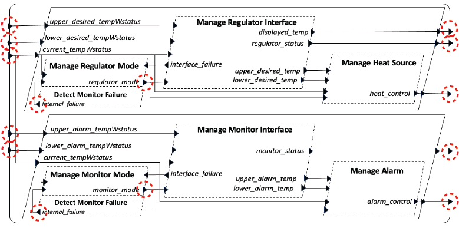
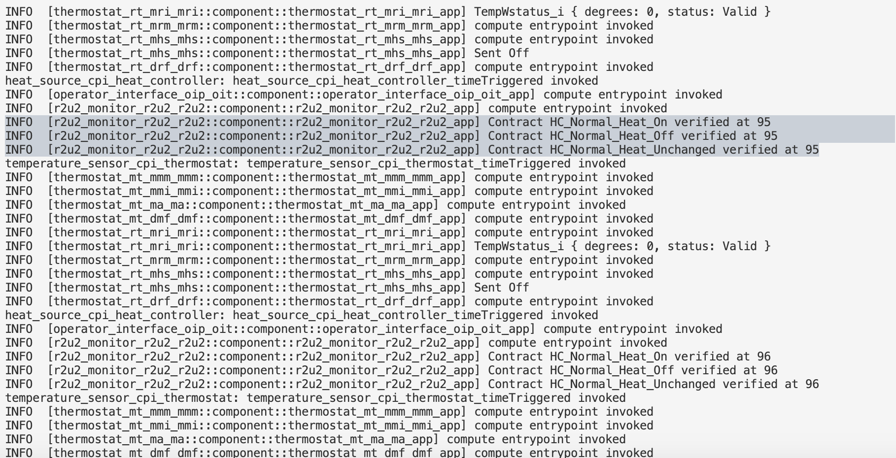

# Status of Integrating Runtime Monitoring (Powered by R2U2) into HAMR-generated Rust/seL4 Systems

This file provides the current status of integrating R2U2 into HAMR-generated Rust/seL4 systems. 

- Please refer to [system-properties.md](https://github.com/loonwerks/INSPECTA-models/tree/main/isolette/system-properties.md) for more information on the specification/properties being monitored.

## Manual Insertion of R2U2 in SysML

The Isolette example has two very similar subsystems -- the Regulate (actuation) and Monitor (safety monitor - not runtime monitor) subsystems. An R2U2 component was added in SysML [R2U2.sysml](https://github.com/loonwerks/INSPECTA-models/blob/runtime_monitoring/isolette/sysml/R2U2.sysml), and these are the current ports being sent directly to R2U2 for monitoring:

 * Current Temperature (w status)

 * Upper Desired Temperature (w status)
 * Lower Desired Temperature (w status)
 * Heat Control
 * Display Temperature
 * Regulator Status
 * Regulator Internal Failure
 * Regulator Mode

 * Upper Alarm Temperature (w status)
 * Lower Alarm Temperature (w status)
 * Alarm Control
 * Monitor Status
 * Monitor Internal Failure
 * Monitor Mode



## Configuring R2U2

1. Utilizing [CodeIVE](https://github.com/loonwerks/INSPECTA-models/blob/main/isolette/verus.md), the HAMR SysML Codegen to Rust/Microkit was performed. 


2. In `r2u2_monitor_r2u2_r2u2`'s `Cargo.toml` file, the following [dependency](https://github.com/loonwerks/INSPECTA-models/blob/208226bd130de57e00714e4b5296101627c57a7e/isolette/hamr/microkit/crates/r2u2_monitor_r2u2_r2u2/Cargo.toml#L15C1-L15C65) was manually added:

    ```
      r2u2_core = {version = "0.2.4", features = ["aux_string_specs"]}
    ```

3. In [`microkit.system`](https://github.com/loonwerks/INSPECTA-models/blob/208226bd130de57e00714e4b5296101627c57a7e/isolette/hamr/microkit/microkit.system#L355C80-L355C102), the attribute `stack_size="0x40_000"` was manually added to the R2U2 protection domain.

4. To prototype some monitored specifications, the following specifications from [system-properties.md](https://github.com/loonwerks/INSPECTA-models/tree/main/isolette/system-properties.md) where considered:

    * [Normal mode, Heat control on] When the mode is normal (and there are no error conditions),
      if the current temperature is less than the lower desired temperature,
      then the heat control shall be on.

    * [Normal mode, Heat control off] When the mode is normal (and there are no error conditions),
      if the current temperature is greater than the upper desired temperature,
      then the heat control shall be off.

    * [Normal mode, Heat control unchanged] When the mode is normal (and there are no error conditions),
      if the current temperature is greater than or equal to the lower desired temperature,
      and the current temperature is less than or equal to the lower desired temperature,
      then the heater state is unchanged.

    The following [C2PO specification file](https://github.com/loonwerks/INSPECTA-models/blob/runtime_monitoring/isolette/hamr/microkit/crates/r2u2_monitor_r2u2_r2u2/src/component/specification.c2po) was created: 
    ```
    STRUCT
      tempWstatus: { degrees, status: int; };
        
    INPUT
      ct_d, ct_s: int;
      udt_d, udt_s: int;
      ldt_d, ldt_s: int;
      monitor_mode: int;
      heat_control: int;
        
    DEFINE
      current_tempWstatus := tempWstatus(ct_d, ct_s);
      upper_desired_tempWstatus := tempWstatus(udt_d, udt_s);
      lower_desired_tempWstatus := tempWstatus(ldt_d, ldt_s);
      Valid_Status := 0;
      Invalid_Status := 1;
      Init_Monitor_Mode := 0;
      Normal_Monitor_Mode := 1;
      Failed_Monitor_Mode := 2;
      On := 0;
      Off := 1;
      No_Error_Conditions := (current_tempWstatus.status == Valid_Status) &&
        (upper_desired_tempWstatus.status == Valid_Status) && (lower_desired_tempWstatus.status == Valid_Status);

    FTSPEC
      HC_Normal_Heat_On: ((monitor_mode == Normal_Monitor_Mode) && No_Error_Conditions) => ((current_tempWstatus.degrees < lower_desired_tempWstatus.degrees) -> (heat_control == On));
      HC_Normal_Heat_Off: ((monitor_mode == Normal_Monitor_Mode) && No_Error_Conditions) => ((current_tempWstatus.degrees > upper_desired_tempWstatus.degrees) -> (heat_control == Off));
      HC_Normal_Heat_Unchanged: ((monitor_mode == Normal_Monitor_Mode) && No_Error_Conditions) => (((current_tempWstatus.degrees >= lower_desired_tempWstatus.degrees) && (current_tempWstatus.degrees <= upper_desired_tempWstatus.degrees)) -> (rate(heat_control) == 0));
    ```

    To map the input signals into R2U2, the following [`trace.csv`](https://github.com/loonwerks/INSPECTA-models/blob/runtime_monitoring/isolette/hamr/microkit/crates/r2u2_monitor_r2u2_r2u2/src/component/trace.csv) file was created:
    ```
    # ct_d, ct_s, udt_d, udt_s, ldt_d, ldt_s, monitor_mode, heat_control
    ```

    - The order in this header signifies the input signal mapping (e.g., ct_d maps to input signal index 0, ct_s maps to input signal index 1, etc.)

5. Once the C2PO file and csv header were specified, the [R2U2 Playground](https://r2u2.temporallogic.org/playground/) was utilized (Compile >> Download byte array in Rust) to create [`spec.rs`](https://github.com/loonwerks/INSPECTA-models/blob/runtime_monitoring/isolette/hamr/microkit/crates/r2u2_monitor_r2u2_r2u2/src/component/spec.rs). This file was then added to [`mod.rs`](https://github.com/loonwerks/INSPECTA-models/blob/208226bd130de57e00714e4b5296101627c57a7e/isolette/hamr/microkit/crates/r2u2_monitor_r2u2_r2u2/src/component/mod.rs#L4).

6. R2U2's internal memory structure is resized in [`.cargo/config.toml`](https://github.com/loonwerks/INSPECTA-models/blob/runtime_monitoring/isolette/hamr/microkit/crates/r2u2_monitor_r2u2_r2u2/.cargo/config.toml) as such:

    ```
    # Set the static memory allocated for R2U2 (run `$ cargo clean` if these values are changed)
    [env]
    R2U2_MAX_OUTPUT_VERDICTS = { value = "64", force = true }
    R2U2_MAX_SPECS = { value = "32", force = true}
    R2U2_MAX_SIGNALS = { value = "64", force = true }
    R2U2_MAX_ATOMICS = { value = "64", force = true }
    R2U2_MAX_BZ_INSTRUCTIONS = { value = "64", force = true }
    R2U2_MAX_TL_INSTRUCTIONS = { value = "64", force = true }
    R2U2_TOTAL_QUEUE_SLOTS = { value = "64", force = true }
    ```

7. Lastly, r2u2_core's API was added to the skeleton code produced by HAMR as follows:

    a. A monitor was added as a member of `r2u2_monitor_r2u2_r2u2`:
    ```
    pub struct r2u2_monitor_r2u2_r2u2 {
      pub monitor : r2u2_core::Monitor
    }
    ```
    b. Each instance has a default monitor:
    ```
    pub fn new() -> Self 
      {
        Self {
          monitor: r2u2_core::Monitor::default()
        }
      }
    ```
    c. At the initialize entry point, R2U2 is configured with the configuration in [`spec.rs`](https://github.com/loonwerks/INSPECTA-models/blob/runtime_monitoring/isolette/hamr/microkit/crates/r2u2_monitor_r2u2_r2u2/src/component/spec.rs):
    ```
    pub fn initialize<API: r2u2_monitor_r2u2_r2u2_Put_Api>(
        &mut self,
        api: &mut r2u2_monitor_r2u2_r2u2_Application_Api<API>) 
      {
        r2u2_core::update_binary_file(&SPEC, &mut self.monitor);
        #[cfg(feature = "sel4")]
        info!("initialized R2U2");
      }
    ```
    d. The time-triggered function maps the signals into R2U2, calls R2U2 to make a step, and prints the outputted Assume-Guarantee Contract status:
    ```
    pub fn timeTriggered<API: r2u2_monitor_r2u2_r2u2_Full_Api>(
        &mut self,
        api: &mut r2u2_monitor_r2u2_r2u2_Application_Api<API>) 
      {
        #[cfg(feature = "sel4")]
        info!("compute entrypoint invoked");
        r2u2_core::load_int_signal(&mut self.monitor, 0, api.get_current_tempWstatus().degrees);
        r2u2_core::load_int_signal(&mut self.monitor, 1, api.get_current_tempWstatus().status as i32);
        r2u2_core::load_int_signal(&mut self.monitor, 2, api.get_upper_desired_tempWstatus().degrees);
        r2u2_core::load_int_signal(&mut self.monitor, 3, api.get_upper_desired_tempWstatus().status as i32);
        r2u2_core::load_int_signal(&mut self.monitor, 4, api.get_lower_desired_tempWstatus().degrees);
        r2u2_core::load_int_signal(&mut self.monitor, 5, api.get_lower_desired_tempWstatus().status as i32);
        r2u2_core::load_int_signal(&mut self.monitor, 6, api.get_monitor_mode() as i32);
        r2u2_core::load_int_signal(&mut self.monitor, 7, api.get_heat_control() as i32);
        
        if r2u2_core::monitor_step(&mut self.monitor){
          // for out in r2u2_core::get_output_buffer(&self.monitor) {
          //     #[cfg(feature = "sel4")]
          //     info!("{}:{},{}", out.spec_str, out.verdict.time, if out.verdict.truth {"T"} else {"F"} );
          // }
          for out in r2u2_core::get_contract_buffer(&self.monitor) {
              #[cfg(feature = "sel4")]
              info!("Contract {} {} at {}", out.spec_str, if out.status == r2u2_core::AGC_VERIFIED {"verified"} else if out.status == r2u2_core::AGC_INVALID {"invalid"} else {"inactive"}, out.time);
          }
        } else {
          #[cfg(feature = "sel4")]
          error!("Unexpected R2U2 error!")
        }
      }
    ```

## R2U2 Output




## Discussion

There are a lot of pieces that will need to be automated:
  * Composing R2U2/Runtime Monitoring Component with proper connections to applicable ports
  * Composing appropriate C2PO specification file
  * Compile C2PO specification to byte array (with input signal mapping)
  * Increase the stack_size for the monitor
  * Configure the internal memory of R2U2 in .cargo/config.toml correctly
  * Correctly call R2U2 with appropriate input mapping

The determination of what to do with the output of R2U2 should also be considered (e.g., signal an alarm if a specification is violated).
