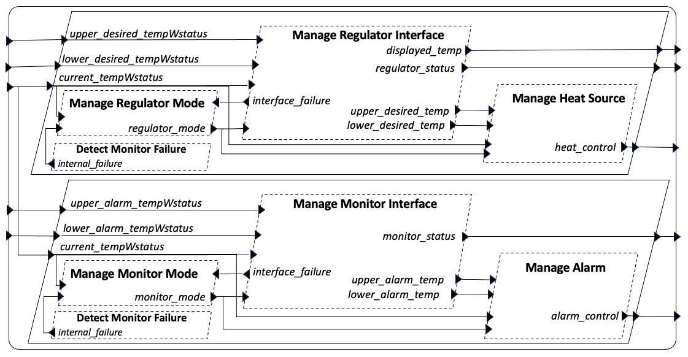
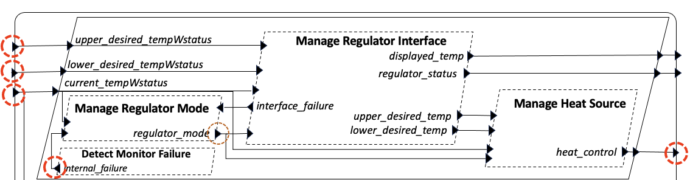
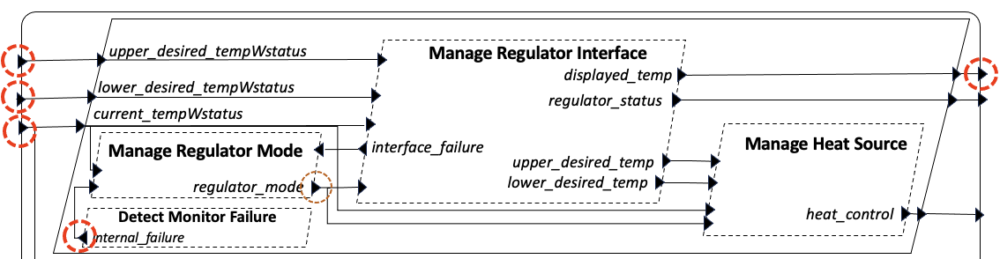
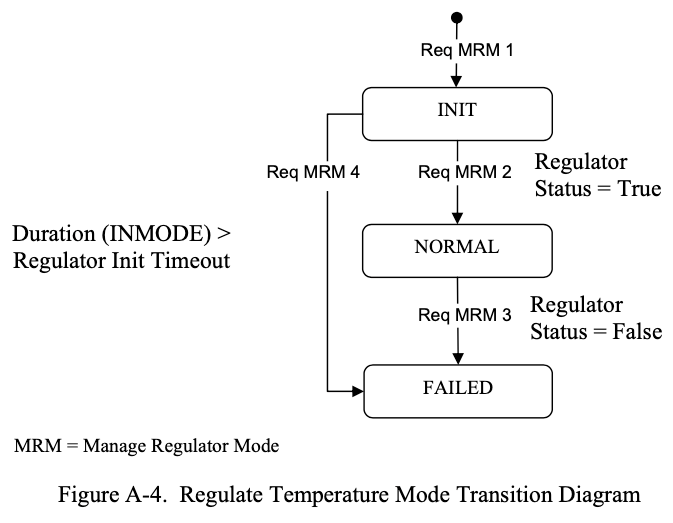

# Concepts / Examples for System Testing and Runtime Monitoring of HAMR-generated Systems

This file provides background and guidance for investigating system property specification, system testing and runtime monitoring for HAMR-generated systems.  HAMR-generated systems align with the AADL model of computation, in which system steps are associated, in part, with thread dispatch initiation and completion.   This means the system states observable to the system testing and run-time monitoring should focus the state visible at the thread dispatch steps mentioned above.

For example, here is a quote from the NASA FM 2024 paper on HAMR system testing, "The framework also provides support for making observa- tions about a portion of the system’s state. The engineer can declare different observations, where an observation specification includes a named set of ports whose queues/values are to be acquired in a “snapshot”. A common example is the set of all output ports for a particular subsystem. For each such decla- ration, HAMR generates infrastructure for representing a vector of port values along with infrastructure for acquiring an observation vector."

Aligning on concepts such as these will enable us to have
- a clean semantics that allows synergestic combinations of system testing, run-time monitoring, component testing/verification, and system verification
- traceability from model-level observation points (e.g., inputs and outputs of components) down to the actually executable code and associated states for deployed systems, across different HAMR supported platforms.

With the above concepts in mind, we need to work through a number of examples of system properties (also to be considered in run-time monitoring).

We worked out a number of interesting system properties for the Isolette example in the NASA FM 2024 paper, and background on those is given below.

# Isolette Computational Structure and Semantic Concepts 

The Isolette example has two very similar subsystems -- the Regulate (actuation) and Monitor (safety monitor) subsystems.  In general, if one states properties and performs verification on one subsystem, the specifications and verification strategies carry over with only minor adaptation to the other subsystem.   We will tend to focus discussion on the Regulate subsystem.

The original Isolette description doesn't indicate any specific scheduling approaches.   Following the existing Collins CASE/PROVERS approach, we have implemented a static scheduling approach for the Isolette threads.

**In general, Isolette system properties can be organized around the start and end of the major frame (the complete cycle) of the static schedule**.  Or, the start and end of the thread sequence within the major frame for the components of a particular subsystem.

The main idea is that each major frame moves the system through a single sense/compute/actuate step.  The specifics of a step is mode-dependent, and each step also must determine an appropriate mode.   Therefore, the computation of a system cycle (major frame) has the following abstract structure

* consider as inputs: sensed values, operator settings, current mode (and also some internal failure signals)
* determine mode
* perform control laws
* set outputs: actuation settings (e.g. for heater and alarm) (and updated mode)

For almost all basic system properties, the property is verified over a single major frame cycle, though for a few, two cycles are required to give certain values time to propagate through the system.

For timing related issues, one wants to establish that the overall latency of this system level input/control/output is within certain bounds.

All properties about a system need to be understood in terms of observations of the system and its environment.  There are two dimensions to an *observation*:
- the point in time in which an observation is acquired (for the current static scheduling approach, this can be understood as making a system observation at a certain point in the domain schedule, e.g., before or after a thread has completed its execution).
- the state that can be observed at an observation.  We believe that this should almost always correspond to the values in a threads input or output ports.  In some cases, one may desire to observe the initial and final local state for a thread.  However, focusing on the thread input and output ports as the observable state enables one to more easily set up implementation infrastructure or acquiring observations that is independent to HAMR backend and component implementation language.

Thus, **a key feature of the implementation for system testing and runtime monitoring is to design and implement an observation framework (including both specification of observations and autogenerated libraries for observations) that is synchronized across HAMR formal semantics, component verification, component testing, system testing, system verification, run-time time monitoring**.   We have a good start on that framework from the NASA FM 2024 paper and all the GUMBO contract work.

Note that the run-time monitoring framework would use the observations declared above as its propositions in the mission-time temporal logic formulas.

A further concept is that AADL execution is broken done into
- initialization phase
- compute phase

We are ignoring a finalization phase for the moment.

Therefore, key ideas also include 
- defining properties that should hold at the end of the initialization phase (these characterize the initial state of the compute phase)
- defining the properties of the compute phase (in general, as outlined above).

Foundationally, system verification proceeds inductively over system traces, with the initialization properties establishing the base case, and the properties for each major frame being inductive properties (assume something holds at the beginning of major frame, show that they hold at the end of frame).

# Discussion of Input/Output Observations in Isolette System Properties

In general, almost all system properties will need to be stated in terms of the inputs and outputs listed below (along with internal state holding the modes of each subsystem).

 ## Inputs 

 These represent candidate values for observation for system properties and run-time monitoring (or state values to set to certain values in system testing)

 * Current Temperature (w status)

 * Upper Desired Temperature (w status)
 * Lower Desired Temperature (w status)
 * Regulator Internal Failure

 * Upper Alarm Temperature (w status)
 * Lower Alarm Temperature (w status)
 * Monitor Internal Failure

## Outputs 

 * Heat Control
 * Display Temperature
 * Regulator Status

 * Alarm Control
 * Monitor Status

# Temporal Architecture

* Discuss transition from AADL init to compute phase
* Discuss sensing / actuation temporal points
* Discuss mode transition temporal points

# Initialization Properties

Given as an example:

* Outputs for Manage Heat Source are appropriately initialized

* Outputs for Manage Regulator Interface are appropriately initialized

* Outputs for Manage Regulator Mode are appropriately initialized

Intuitively, component-level initialization properties are specified as guarantee statements in GUMBO initialize contracts.  System-level initialization properties should in general be inferrable from these.  We likely want some verification redundancy, i.e., concepts that are component level initialization properties can also be verified via run-time monitoring after the initialization phase executes.

# Compute Phase Properties

## Output: Heat Control

These are property concepts related to approach control of the heat control output.

### Informally-stated Normal Mode w no Error Condition Properties

See corresponding implementations in [HAMR system testing](https://github.com/santoslab/hamr-system-testing-case-studies/tree/main/isolette#configurations-for-regulate_subsystem_test_wslangcheck_dsc_test_harness) HC__Normal_____Heat_On, 
HC__Normal_____Heat_Off

* [Normal mode, Heat control on] When the mode is normal (and there are no error conditions),
  if the current temperature is less than the lower desired temperature,
  then the heat control shall be on.  [System Testing spec](https://github.com/santoslab/hamr-system-testing-case-studies/blob/main/isolette/hamr/slang/src/test/system/isolette/system_tests/rst/Regulate_Subsystem_Test_wSlangCheck.scala#L537)

* [Normal mode, Heat control off] When the mode is normal (and there are no error conditions),
  if the current temperature is greater than the upper desired temperature,
  then the heat control shall be off. [System Testing spec](https://github.com/santoslab/hamr-system-testing-case-studies/blob/main/isolette/hamr/slang/src/test/system/isolette/system_tests/rst/Regulate_Subsystem_Test_wSlangCheck.scala#L557)

* [Normal mode, Heat control unchanged] When the mode is normal (and there are no error conditions),
  if the current temperature is greater than or equal to the lower desired temperature,
  and the current temperature is less than or equal to the lower desired temperature,
  then the heater state is unchanged.

Note: in each of the properties above, the mode of the subsystem remains "Normal" but we state those in separate properties (because we are organizing properties according to control of outputs -- and the new mode state is an output).  An alternate approach would be to combine the control of other outputs with the conditions above.

### Informally-stated Normal Mode AND Error Condition Properties

* [Normal mode, Current Temp Invalid, Heat control off]

  When the mode is normal and the current temp status value 
  is INVALID, then the heater state is OFF.  [System Testing spec](https://github.com/santoslab/hamr-system-testing-case-studies/blob/main/isolette/hamr/slang/src/test/system/isolette/system_tests/rst/Regulate_Subsystem_Test_wSlangCheck.scala#L114)

* [Normal mode, Upper Desired Temp Invalid, Heat control off]

When the mode is normal and the upper desired temperature status value 
is INVALID, then the heater state is OFF.
[System Testing spec](https://github.com/santoslab/hamr-system-testing-case-studies/blob/main/isolette/hamr/slang/src/test/system/isolette/system_tests/rst/Regulate_Subsystem_Test_wSlangCheck.scala#L124)

### Init Mode Properties

### Failed Mode Properties

## Output: Display Temperature

### Normal Mode Properties

* In Normal Mode, output for Display Temperature is "correct" (test for output of the MRI component, later on, test for the appropriate value at the operator interface)

### Init Mode Properties

### Failed Mode Properties

## Output: Regulator Status

### Normal Mode Properties

* In Normal Mode, output for Regulator Status is correct (test for output of the MRI component, later on, test at the appropriate value at the operator interface)

### Init Mode Properties

### Failed Mode Properties

# Regulator Mode Transition

## Init Mode to Normal Mode

(need tests for all causes of transitioning from init mode to normal mode)

## Normal Mode to Failed Mode

(need tests for all causes of transitioning from normal mode to failed mode)

* [Mode Transition - Normal to Failed] When a regulator internal failure is detected, then mode transitions to FAILED

## Init Mode to Failed Mode

(need tests for all causes of transitioning from init mode to failed mode)

## Failed Mode Persistence

(need tests to show that if system is in failed mode, it will continue to be in failed mode)

# Consider how the following should be accounted for

Consequences of Failure Mode Triggered

* [Heat control is off in FAILED state] When the subsystem mode is FAILED,
  then heater state is OFF.

* [**Done** - Invalid temperature inputs leads to heat control off:] 
   - If the lower desired temperature status has an invalid status, then the heat control will be off
   - If the upper desired temperature status has an invalid status, then the heat control will be off
   - If the current temperature status has an invalid status, then the heat control will be off

* [Invalid temperature inputs leads to FAILED mode:] 
   - If the lower desired temperature status has an invalid status, then the heat control will be off
   - If the upper desired temperature status has an invalid status, then the heat control will be off
   - If the current temperature status has an invalid status, then the heat control will be off

# Notions of coverage

* Port coverage (ports read, ports written)
* Connection coverage
* Value coverage on ports  (with special emphasis on input/output ports)
* Coverage of contract clauses (roughly corresponds to coverage of requirements, since contracts are derived from requirements)
* Code coverage
* Coverage of different types of AADL run-time 
  - coverage of buffer overflow (e.g., no buffer overflows occur)
  - coverage of dispatch conditions (e.g., for sporadic, component is triggered by each one of its dispatch triggers)
* Schedule step coverage (how many total hyperperiodics has the schedule run through, what is the longest trace)  
* (Chris) Table cell coverage

## To Discuss with Jason

* Stop() command - Jason mentioned that we should discuss this.  Do we need this? Should we try to modify the implementation so that it is not required?

* Observation theory [More of a John issue]: clarify the nature of observations that we are making.  Are we observing application port states or infrastructure port states?

* Do we have the capability to read the values of input ports in the post state?

* Consider the ability to test port input values after the communication dimension has been run after the initialization phase

* Deal with the timeout in Manage Regular Mode by moving to failure mode after a certain number of activitations of the MRM thread.   This is sufficient (don't need to 
have a notion of timer) because the thread is periodic and so we can calculate the time based on the number of activations.

* I believe we need to design some architecture for I/O devices, aligned with Jason's stuff, that allows system tests to set values coming from the environment (e.g., set the current temperature) and read values going to the environment (e.g., heat control)
 

