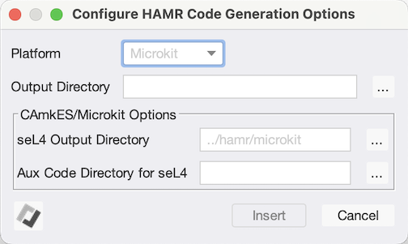

# Rust/Verus support for Isolette SysMLv2/AADL 

- [SysMLv2/AADL Model](./sysml/)

- System Architecture (generated from the [AADL](./aadl/) version of the Isolette)

    

## Installation

1. Install Sireum and CodeIVE (ie. VS Codium + extensions to support SysMLv2/AADL) by following the SysMLv2-Models [toolchain installation instructions](https://github.com/santoslab/sysmlv2-models?tab=readme-ov-file#toolchain-installation).

1. **Recommended:** Set the ``SIREUM_HOME`` environment variable to point to the location where you installed Sireum.  For e.g. on Linux/MacOS

    ``` bash
    export SIREUM_HOME=<path-to-sireum>
    export PATH=$SIREUM_HOME/bin:$PATH
    ```

    Running ``sireum`` from the command line should show Sireum's build date and command line options.

1. Install Rust 1.82.0

    Verus requires Rust 1.82.0.  One installation options is to use Sireum's install script as follows

    ```
    $SIREUM_HOME/bin/install/rust.cmd 1.82.0
    ```

    If you install it via this method then you'll need to add it to your path which will allow tools like the Rust Analyzer VS Code extension to locate/run it.  For e.g., on MacOS

    ```
    export PATH=$SIREUM_HOME/bin/mac/rust/cargo/bin/:$PATH
    ```

1. Install Verus, Rust-Analyzer, and Verus-Analyzer

    Verus-Analyzer is not available via VS Codium's extension store but can be installed by downloading the appropriate vsix file from https://github.com/verus-lang/verus-analyzer/releases.  Now run the following to install the Rust-Analyzer and Verus-Analyzer extensions into CodeIVE, replacing ``verus-analyzer-darwin-arm64.vsix`` with the vsix file you downloaded

    ```bash
    sireum setup vscode --extensions rust-lang.rust-analyzer,verus-analyzer-darwin-arm64.vsix
    
    # OR, if you don't have SIREUM_HOME/bin in your path,

    $SIREUM_HOME/bin/sireum setup vscode --extensions rust-lang.rust-analyzer,verus-analyzer-darwin-arm64.vsix
    ```

1. Clone this repo and cd into it

   ```
   git clone https://github.com/loonwerks/INSPECTA-models.git
   cd INSPECTA-models
   ```

1. Clone the [SysMLv2 AADL Libraries](https://github.com/santoslab/sysml-aadl-libraries.git) into the Isolette's [sysml](sysml) directory

    ```
    git clone https://github.com/santoslab/sysml-aadl-libraries.git isolette/sysml/sysml-aadl-libraries
    ```

## Running Codegen targeting Microkit from CodeIVE

1. Open the Isolette's [SysMLV2 directory](./sysml/) in CodeIVE so that it's the root of a Workspace.  E.g. ``File`` >> ``Open Folder`` or from the command line on Mac

    ```
    $SIREUM_HOME/bin/mac/vscodium/CodeIVE.app/Contents/Resources/app/bin/codium ./isolette/sysml/
    ```

1. Open [Isolette.sysml](./sysml/Isolette.sysml) and specify code generation options.

    A file option at the top of the file has already been added that will regenerate Microkit code to the [hamr/microkit](./hamr/microkit/) directory. You can manually edit that entry or use the option form to edit or insert entries.  That can be launched by opening the Command Palette and typing ``HAMR SysML Codegen Configurator``

    
    
1. Run codegen

    Open the Command Pallette and type ``HAMR SysML Codegen``.  Select ``Microkit`` from the list of target platforms.

1. Open the Manage Heat Source (MHS) Rust crate in Codium.

    Threads that should be implemented in Rust are specified using the ``HAMR::Microkit_Language`` property (e.g. for the [MHS](./sysml/Regulate.sysml#L441)).

    Add the MHS crate as a Workspace.  Go to ``File`` >> ``Open Folder to Workspace`` and choose [hamr/microkit/crates/thermostat_rt_mhs_mhs/](./hamr/microkit/crates/thermostat_rt_mhs_mhs/).

    Open the [MHS app](./hamr/microkit/crates/thermostat_rt_mhs_mhs/src/component/thermostat_rt_mhs_mhs_app.rs) whose API and Verus contracts were generated from the [MHS SysMLv2 Thread](./sysml/Regulate.sysml#L437-L517).

1. Verify MHS behavior code using Verus

    Seed the bug at [line 144](./hamr/microkit/crates/thermostat_rt_mhs_mhs/src/component/thermostat_rt_mhs_mhs_app.rs#L144).  Saving the file will trigger Verus which should report that it was not able to discharge REQ-MHS-2.

    

    Alternatively you can run ``make verus`` from the command line (see [Makefile target requirements](#makefile-target-requirements))

1. Run GUMBOX-based MHS Unit Tests

    Open [tests.rs](./hamr/microkit/crates/thermostat_rt_mhs_mhs/src/tests.rs) and choose ``Run Tests``. These use the GUMBOX generated executable contracts in [thermostat_rt_mhs_mhs_GUMBOX](./hamr/microkit/crates/thermostat_rt_mhs_mhs/src/bridge/thermostat_rt_mhs_mhs_GUMBOX.rs).  Alternatively you can run ``make test`` from the command line  (see [Makefile target requirements](#makefile-target-requirements)). 

## Running the Microkit system

Follow the instructions in the top-level [readme](./readme.md)

## Verification Status

The following components have been successfully verified via Verus 

- Manage Regulator Mode (MRM)
  - [SysMLv2/AADL Thread](./sysml/Regulate.sysml#L297)
  - [Generated Rust entrypoints with developer supplied behavior code and Verus contracts](./hamr/microkit/crates/thermostat_rt_mrm_mrm/src/component/thermostat_rt_mrm_mrm_app.rs)
  - [GUMBOX generated executable contracts](./hamr/microkit/crates/thermostat_rt_mrm_mrm/src/bridge/thermostat_rt_mrm_mrm_GUMBOX.rs)
  - [Developer supplied unit tests using GUMBOX generated executable contracts](./hamr/microkit/crates/thermostat_rt_mrm_mrm/src/tests.rs)

- Manage Regulator Interface (MRI)
  - [SysMLv2/AADL Thread](./sysml/Regulate.sysml#L149)
  - [Generated Rust entrypoints with developer supplied behavior code and Verus contracts](./hamr/microkit/crates/thermostat_rt_mri_mri/src/component/thermostat_rt_mri_mri_app.rs)
  - [GUMBOX generated executable contracts](./hamr/microkit/crates/thermostat_rt_mri_mri/src/bridge/thermostat_rt_mri_mri_GUMBOX.rs)
  - [Developer supplied unit tests using GUMBOX generated executable contracts](./hamr/microkit/crates/thermostat_rt_mri_mri/src/tests.rs)

- Manage Heat Source (MHS)
  
  - [SysMLv2/AADL Thread](./sysml/Regulate.sysml#L437)
  - [Generated Rust entrypoints with developer supplied behavior code and Verus contracts](./hamr/microkit/crates/thermostat_rt_mhs_mhs/src/component/thermostat_rt_mhs_mhs_app.rs)
  - [GUMBOX generated executable contracts](./hamr/microkit/crates/thermostat_rt_mrm_mrm/src/bridge/thermostat_rt_mrm_mrm_GUMBOX.rs)  
  - [Developer supplied unit tests using GUMBOX generated executable contracts](./hamr/microkit/crates/thermostat_rt_mhs_mhs/src/tests.rs)


## Makefile target requirements

- Download and install the latest Verus release from https://github.com/verus-lang/verus/releases

- You'll need to have both Rust and Verus in your ``PATH``.  For e.g., on MacOS

    ```bash
    export PATH=$SIREUM_HOME/bin/mac/rust/cargo/bin:<path-to-verus>/verus-arm64-macos/:$PATH
    ```

