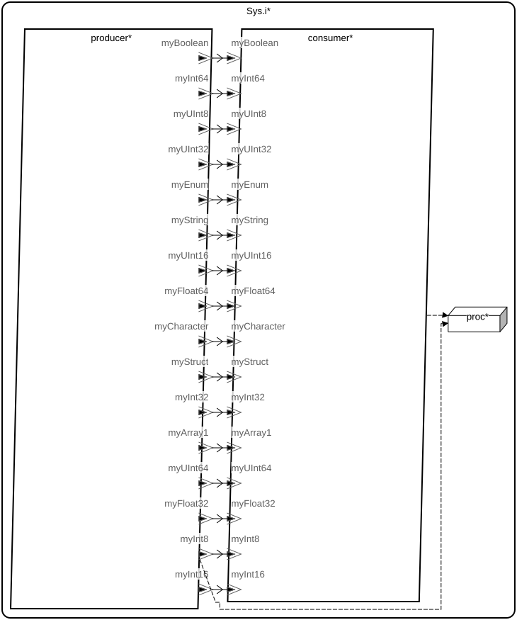

# Aadl_Datatypes_System::Sys.i

## AADL Architecture

|System: [Aadl_Datatypes_System::Sys.i]()|
|:--|

|Thread: Aadl_Datatypes_System::ProducerThr.i |
|:--|
|Type: [ProducerThr](../../aadl/Aadl_Datatypes_System.aadl#L279) Implementation: [ProducerThr.i](../../aadl/Aadl_Datatypes_System.aadl#L320)|
|Periodic |

|Thread: Aadl_Datatypes_System::ConsumerThr.i |
|:--|
|Type: [ConsumerThr](../../aadl/Aadl_Datatypes_System.aadl#L323) Implementation: [ConsumerThr.i](../../aadl/Aadl_Datatypes_System.aadl#L365)|
|Periodic |

## Rust Code

### Behavior Code
#### producer: Aadl_Datatypes_System::ProducerThr.i

 - **Entry Points**

- **APIs**

    <table>
    <tr><th>Port Name</th><th>Direction</th><th>Kind</th><th>Payload</th><th>Realizations</th></tr>
    <tr><td><a title='Model' href='../../aadl/Aadl_Datatypes_System.aadl#L283'>myBoolean</a></td>
        <td>Out</td><td>Event Data</td>
        <td>Base_Types::Boolean</td><td><a title='C Interface: Lines 28-32' href='components/producer_producer/src/producer_producer.c#L28'>C Interface</a> → <a title='C Shared Memory Variable: Line 9' href='components/producer_producer/src/producer_producer.c#L9'>C var_addr</a> → <a title='Memory Map: Lines 14-18' href='microkit.system#L14'>Memory Map</a></td></tr>
    <tr><td><a title='Model' href='../../aadl/Aadl_Datatypes_System.aadl#L287'>myCharacter</a></td>
        <td>Out</td><td>Event Data</td>
        <td>Base_Types::Character</td><td><a title='C Interface: Lines 34-38' href='components/producer_producer/src/producer_producer.c#L34'>C Interface</a> → <a title='C Shared Memory Variable: Line 10' href='components/producer_producer/src/producer_producer.c#L10'>C var_addr</a> → <a title='Memory Map: Lines 19-23' href='microkit.system#L19'>Memory Map</a></td></tr>
    <tr><td><a title='Model' href='../../aadl/Aadl_Datatypes_System.aadl#L288'>myString</a></td>
        <td>Out</td><td>Event Data</td>
        <td>Base_Types::String</td><td><a title='C Interface: Lines 40-44' href='components/producer_producer/src/producer_producer.c#L40'>C Interface</a> → <a title='C Shared Memory Variable: Line 11' href='components/producer_producer/src/producer_producer.c#L11'>C var_addr</a> → <a title='Memory Map: Lines 24-28' href='microkit.system#L24'>Memory Map</a></td></tr>
    <tr><td><a title='Model' href='../../aadl/Aadl_Datatypes_System.aadl#L292'>myInt8</a></td>
        <td>Out</td><td>Event Data</td>
        <td>Base_Types::Integer_8</td><td><a title='C Interface: Lines 46-50' href='components/producer_producer/src/producer_producer.c#L46'>C Interface</a> → <a title='C Shared Memory Variable: Line 12' href='components/producer_producer/src/producer_producer.c#L12'>C var_addr</a> → <a title='Memory Map: Lines 29-33' href='microkit.system#L29'>Memory Map</a></td></tr>
    <tr><td><a title='Model' href='../../aadl/Aadl_Datatypes_System.aadl#L293'>myInt16</a></td>
        <td>Out</td><td>Event Data</td>
        <td>Base_Types::Integer_16</td><td><a title='C Interface: Lines 52-56' href='components/producer_producer/src/producer_producer.c#L52'>C Interface</a> → <a title='C Shared Memory Variable: Line 13' href='components/producer_producer/src/producer_producer.c#L13'>C var_addr</a> → <a title='Memory Map: Lines 34-38' href='microkit.system#L34'>Memory Map</a></td></tr>
    <tr><td><a title='Model' href='../../aadl/Aadl_Datatypes_System.aadl#L294'>myInt32</a></td>
        <td>Out</td><td>Event Data</td>
        <td>Base_Types::Integer_32</td><td><a title='C Interface: Lines 58-62' href='components/producer_producer/src/producer_producer.c#L58'>C Interface</a> → <a title='C Shared Memory Variable: Line 14' href='components/producer_producer/src/producer_producer.c#L14'>C var_addr</a> → <a title='Memory Map: Lines 39-43' href='microkit.system#L39'>Memory Map</a></td></tr>
    <tr><td><a title='Model' href='../../aadl/Aadl_Datatypes_System.aadl#L295'>myInt64</a></td>
        <td>Out</td><td>Event Data</td>
        <td>Base_Types::Integer_64</td><td><a title='C Interface: Lines 64-68' href='components/producer_producer/src/producer_producer.c#L64'>C Interface</a> → <a title='C Shared Memory Variable: Line 15' href='components/producer_producer/src/producer_producer.c#L15'>C var_addr</a> → <a title='Memory Map: Lines 44-48' href='microkit.system#L44'>Memory Map</a></td></tr>
    <tr><td><a title='Model' href='../../aadl/Aadl_Datatypes_System.aadl#L299'>myUInt8</a></td>
        <td>Out</td><td>Event Data</td>
        <td>Base_Types::Unsigned_8</td><td><a title='C Interface: Lines 70-74' href='components/producer_producer/src/producer_producer.c#L70'>C Interface</a> → <a title='C Shared Memory Variable: Line 16' href='components/producer_producer/src/producer_producer.c#L16'>C var_addr</a> → <a title='Memory Map: Lines 49-53' href='microkit.system#L49'>Memory Map</a></td></tr>
    <tr><td><a title='Model' href='../../aadl/Aadl_Datatypes_System.aadl#L300'>myUInt16</a></td>
        <td>Out</td><td>Event Data</td>
        <td>Base_Types::Unsigned_16</td><td><a title='C Interface: Lines 76-80' href='components/producer_producer/src/producer_producer.c#L76'>C Interface</a> → <a title='C Shared Memory Variable: Line 17' href='components/producer_producer/src/producer_producer.c#L17'>C var_addr</a> → <a title='Memory Map: Lines 54-58' href='microkit.system#L54'>Memory Map</a></td></tr>
    <tr><td><a title='Model' href='../../aadl/Aadl_Datatypes_System.aadl#L301'>myUInt32</a></td>
        <td>Out</td><td>Event Data</td>
        <td>Base_Types::Unsigned_32</td><td><a title='C Interface: Lines 82-86' href='components/producer_producer/src/producer_producer.c#L82'>C Interface</a> → <a title='C Shared Memory Variable: Line 18' href='components/producer_producer/src/producer_producer.c#L18'>C var_addr</a> → <a title='Memory Map: Lines 59-63' href='microkit.system#L59'>Memory Map</a></td></tr>
    <tr><td><a title='Model' href='../../aadl/Aadl_Datatypes_System.aadl#L302'>myUInt64</a></td>
        <td>Out</td><td>Event Data</td>
        <td>Base_Types::Unsigned_64</td><td><a title='C Interface: Lines 88-92' href='components/producer_producer/src/producer_producer.c#L88'>C Interface</a> → <a title='C Shared Memory Variable: Line 19' href='components/producer_producer/src/producer_producer.c#L19'>C var_addr</a> → <a title='Memory Map: Lines 64-68' href='microkit.system#L64'>Memory Map</a></td></tr>
    <tr><td><a title='Model' href='../../aadl/Aadl_Datatypes_System.aadl#L306'>myFloat32</a></td>
        <td>Out</td><td>Event Data</td>
        <td>Base_Types::Float_32</td><td><a title='C Interface: Lines 94-98' href='components/producer_producer/src/producer_producer.c#L94'>C Interface</a> → <a title='C Shared Memory Variable: Line 20' href='components/producer_producer/src/producer_producer.c#L20'>C var_addr</a> → <a title='Memory Map: Lines 69-73' href='microkit.system#L69'>Memory Map</a></td></tr>
    <tr><td><a title='Model' href='../../aadl/Aadl_Datatypes_System.aadl#L307'>myFloat64</a></td>
        <td>Out</td><td>Event Data</td>
        <td>Base_Types::Float_64</td><td><a title='C Interface: Lines 100-104' href='components/producer_producer/src/producer_producer.c#L100'>C Interface</a> → <a title='C Shared Memory Variable: Line 21' href='components/producer_producer/src/producer_producer.c#L21'>C var_addr</a> → <a title='Memory Map: Lines 74-78' href='microkit.system#L74'>Memory Map</a></td></tr>
    <tr><td><a title='Model' href='../../aadl/Aadl_Datatypes_System.aadl#L311'>myEnum</a></td>
        <td>Out</td><td>Event Data</td>
        <td>Aadl_Datatypes::MyEnum</td><td><a title='C Interface: Lines 106-110' href='components/producer_producer/src/producer_producer.c#L106'>C Interface</a> → <a title='C Shared Memory Variable: Line 22' href='components/producer_producer/src/producer_producer.c#L22'>C var_addr</a> → <a title='Memory Map: Lines 79-83' href='microkit.system#L79'>Memory Map</a></td></tr>
    <tr><td><a title='Model' href='../../aadl/Aadl_Datatypes_System.aadl#L312'>myStruct</a></td>
        <td>Out</td><td>Event Data</td>
        <td>Aadl_Datatypes::MyStruct.i</td><td><a title='C Interface: Lines 112-116' href='components/producer_producer/src/producer_producer.c#L112'>C Interface</a> → <a title='C Shared Memory Variable: Line 23' href='components/producer_producer/src/producer_producer.c#L23'>C var_addr</a> → <a title='Memory Map: Lines 84-88' href='microkit.system#L84'>Memory Map</a></td></tr>
    <tr><td><a title='Model' href='../../aadl/Aadl_Datatypes_System.aadl#L313'>myArray1</a></td>
        <td>Out</td><td>Event Data</td>
        <td>Aadl_Datatypes::MyArrayOneDim</td><td><a title='C Interface: Lines 118-122' href='components/producer_producer/src/producer_producer.c#L118'>C Interface</a> → <a title='C Shared Memory Variable: Line 24' href='components/producer_producer/src/producer_producer.c#L24'>C var_addr</a> → <a title='Memory Map: Lines 89-93' href='microkit.system#L89'>Memory Map</a></td></tr>
    </table>

#### consumer: Aadl_Datatypes_System::ConsumerThr.i

 - **Entry Points**

    Initialize: [Rust](crates/consumer_consumer/src/component/consumer_consumer_app.rs#L20)

    TimeTriggered: [Rust](crates/consumer_consumer/src/component/consumer_consumer_app.rs#L30)

- **APIs**

    <table>
    <tr><th>Port Name</th><th>Direction</th><th>Kind</th><th>Payload</th><th>Realizations</th></tr>
    <tr><td><a title='Model' href='../../aadl/Aadl_Datatypes_System.aadl#L327'>myBoolean</a></td>
        <td>In</td><td>Event Data</td>
        <td>Base_Types::Boolean</td><td><a title='Memory Map: Lines 107-111' href='microkit.system#L107'>Memory Map</a> → <a title='C Shared Memory Variable: Line 9' href='components/consumer_consumer/src/consumer_consumer.c#L9'>C var_addr</a> → <a title='C Interface: Lines 52-55' href='components/consumer_consumer/src/consumer_consumer.c#L52'>C Interface</a> → <a title='C Extern: Line 14' href='crates/consumer_consumer/src/bridge/extern_c_api.rs#L14'>C Extern</a> → <a title='Rust/C Interface: Lines 48-58' href='crates/consumer_consumer/src/bridge/extern_c_api.rs#L48'>Rust/C Interface</a> → <a title='Unverified Rust Interface: Lines 16-23' href='crates/consumer_consumer/src/bridge/consumer_consumer_api.rs#L16'>Unverified Rust Interface</a> → <a title='Rust/Verus API: Lines 299-320' href='crates/consumer_consumer/src/bridge/consumer_consumer_api.rs#L299'>Rust/Verus API</a></td></tr>
    <tr><td><a title='Model' href='../../aadl/Aadl_Datatypes_System.aadl#L331'>myCharacter</a></td>
        <td>In</td><td>Event Data</td>
        <td>Base_Types::Character</td><td><a title='Memory Map: Lines 112-116' href='microkit.system#L112'>Memory Map</a> → <a title='C Shared Memory Variable: Line 11' href='components/consumer_consumer/src/consumer_consumer.c#L11'>C var_addr</a> → <a title='C Interface: Lines 69-72' href='components/consumer_consumer/src/consumer_consumer.c#L69'>C Interface</a> → <a title='C Extern: Line 16' href='crates/consumer_consumer/src/bridge/extern_c_api.rs#L16'>C Extern</a> → <a title='Rust/C Interface: Lines 67-77' href='crates/consumer_consumer/src/bridge/extern_c_api.rs#L67'>Rust/C Interface</a> → <a title='Unverified Rust Interface: Lines 32-39' href='crates/consumer_consumer/src/bridge/consumer_consumer_api.rs#L32'>Unverified Rust Interface</a> → <a title='Rust/Verus API: Lines 327-348' href='crates/consumer_consumer/src/bridge/consumer_consumer_api.rs#L327'>Rust/Verus API</a></td></tr>
    <tr><td><a title='Model' href='../../aadl/Aadl_Datatypes_System.aadl#L332'>myString</a></td>
        <td>In</td><td>Event Data</td>
        <td>Base_Types::String</td><td><a title='Memory Map: Lines 117-121' href='microkit.system#L117'>Memory Map</a> → <a title='C Shared Memory Variable: Line 13' href='components/consumer_consumer/src/consumer_consumer.c#L13'>C var_addr</a> → <a title='C Interface: Lines 86-89' href='components/consumer_consumer/src/consumer_consumer.c#L86'>C Interface</a> → <a title='C Extern: Line 18' href='crates/consumer_consumer/src/bridge/extern_c_api.rs#L18'>C Extern</a> → <a title='Rust/C Interface: Lines 86-96' href='crates/consumer_consumer/src/bridge/extern_c_api.rs#L86'>Rust/C Interface</a> → <a title='Unverified Rust Interface: Lines 48-55' href='crates/consumer_consumer/src/bridge/consumer_consumer_api.rs#L48'>Unverified Rust Interface</a> → <a title='Rust/Verus API: Lines 355-376' href='crates/consumer_consumer/src/bridge/consumer_consumer_api.rs#L355'>Rust/Verus API</a></td></tr>
    <tr><td><a title='Model' href='../../aadl/Aadl_Datatypes_System.aadl#L336'>myInt8</a></td>
        <td>In</td><td>Event Data</td>
        <td>Base_Types::Integer_8</td><td><a title='Memory Map: Lines 122-126' href='microkit.system#L122'>Memory Map</a> → <a title='C Shared Memory Variable: Line 15' href='components/consumer_consumer/src/consumer_consumer.c#L15'>C var_addr</a> → <a title='C Interface: Lines 103-106' href='components/consumer_consumer/src/consumer_consumer.c#L103'>C Interface</a> → <a title='C Extern: Line 20' href='crates/consumer_consumer/src/bridge/extern_c_api.rs#L20'>C Extern</a> → <a title='Rust/C Interface: Lines 105-115' href='crates/consumer_consumer/src/bridge/extern_c_api.rs#L105'>Rust/C Interface</a> → <a title='Unverified Rust Interface: Lines 64-71' href='crates/consumer_consumer/src/bridge/consumer_consumer_api.rs#L64'>Unverified Rust Interface</a> → <a title='Rust/Verus API: Lines 383-404' href='crates/consumer_consumer/src/bridge/consumer_consumer_api.rs#L383'>Rust/Verus API</a></td></tr>
    <tr><td><a title='Model' href='../../aadl/Aadl_Datatypes_System.aadl#L337'>myInt16</a></td>
        <td>In</td><td>Event Data</td>
        <td>Base_Types::Integer_16</td><td><a title='Memory Map: Lines 127-131' href='microkit.system#L127'>Memory Map</a> → <a title='C Shared Memory Variable: Line 17' href='components/consumer_consumer/src/consumer_consumer.c#L17'>C var_addr</a> → <a title='C Interface: Lines 120-123' href='components/consumer_consumer/src/consumer_consumer.c#L120'>C Interface</a> → <a title='C Extern: Line 22' href='crates/consumer_consumer/src/bridge/extern_c_api.rs#L22'>C Extern</a> → <a title='Rust/C Interface: Lines 124-134' href='crates/consumer_consumer/src/bridge/extern_c_api.rs#L124'>Rust/C Interface</a> → <a title='Unverified Rust Interface: Lines 80-87' href='crates/consumer_consumer/src/bridge/consumer_consumer_api.rs#L80'>Unverified Rust Interface</a> → <a title='Rust/Verus API: Lines 411-432' href='crates/consumer_consumer/src/bridge/consumer_consumer_api.rs#L411'>Rust/Verus API</a></td></tr>
    <tr><td><a title='Model' href='../../aadl/Aadl_Datatypes_System.aadl#L338'>myInt32</a></td>
        <td>In</td><td>Event Data</td>
        <td>Base_Types::Integer_32</td><td><a title='Memory Map: Lines 132-136' href='microkit.system#L132'>Memory Map</a> → <a title='C Shared Memory Variable: Line 19' href='components/consumer_consumer/src/consumer_consumer.c#L19'>C var_addr</a> → <a title='C Interface: Lines 137-140' href='components/consumer_consumer/src/consumer_consumer.c#L137'>C Interface</a> → <a title='C Extern: Line 24' href='crates/consumer_consumer/src/bridge/extern_c_api.rs#L24'>C Extern</a> → <a title='Rust/C Interface: Lines 143-153' href='crates/consumer_consumer/src/bridge/extern_c_api.rs#L143'>Rust/C Interface</a> → <a title='Unverified Rust Interface: Lines 96-103' href='crates/consumer_consumer/src/bridge/consumer_consumer_api.rs#L96'>Unverified Rust Interface</a> → <a title='Rust/Verus API: Lines 439-460' href='crates/consumer_consumer/src/bridge/consumer_consumer_api.rs#L439'>Rust/Verus API</a></td></tr>
    <tr><td><a title='Model' href='../../aadl/Aadl_Datatypes_System.aadl#L339'>myInt64</a></td>
        <td>In</td><td>Event Data</td>
        <td>Base_Types::Integer_64</td><td><a title='Memory Map: Lines 137-141' href='microkit.system#L137'>Memory Map</a> → <a title='C Shared Memory Variable: Line 21' href='components/consumer_consumer/src/consumer_consumer.c#L21'>C var_addr</a> → <a title='C Interface: Lines 154-157' href='components/consumer_consumer/src/consumer_consumer.c#L154'>C Interface</a> → <a title='C Extern: Line 26' href='crates/consumer_consumer/src/bridge/extern_c_api.rs#L26'>C Extern</a> → <a title='Rust/C Interface: Lines 162-172' href='crates/consumer_consumer/src/bridge/extern_c_api.rs#L162'>Rust/C Interface</a> → <a title='Unverified Rust Interface: Lines 112-119' href='crates/consumer_consumer/src/bridge/consumer_consumer_api.rs#L112'>Unverified Rust Interface</a> → <a title='Rust/Verus API: Lines 467-488' href='crates/consumer_consumer/src/bridge/consumer_consumer_api.rs#L467'>Rust/Verus API</a></td></tr>
    <tr><td><a title='Model' href='../../aadl/Aadl_Datatypes_System.aadl#L343'>myUInt8</a></td>
        <td>In</td><td>Event Data</td>
        <td>Base_Types::Unsigned_8</td><td><a title='Memory Map: Lines 142-146' href='microkit.system#L142'>Memory Map</a> → <a title='C Shared Memory Variable: Line 23' href='components/consumer_consumer/src/consumer_consumer.c#L23'>C var_addr</a> → <a title='C Interface: Lines 171-174' href='components/consumer_consumer/src/consumer_consumer.c#L171'>C Interface</a> → <a title='C Extern: Line 28' href='crates/consumer_consumer/src/bridge/extern_c_api.rs#L28'>C Extern</a> → <a title='Rust/C Interface: Lines 181-191' href='crates/consumer_consumer/src/bridge/extern_c_api.rs#L181'>Rust/C Interface</a> → <a title='Unverified Rust Interface: Lines 128-135' href='crates/consumer_consumer/src/bridge/consumer_consumer_api.rs#L128'>Unverified Rust Interface</a> → <a title='Rust/Verus API: Lines 495-516' href='crates/consumer_consumer/src/bridge/consumer_consumer_api.rs#L495'>Rust/Verus API</a></td></tr>
    <tr><td><a title='Model' href='../../aadl/Aadl_Datatypes_System.aadl#L344'>myUInt16</a></td>
        <td>In</td><td>Event Data</td>
        <td>Base_Types::Unsigned_16</td><td><a title='Memory Map: Lines 147-151' href='microkit.system#L147'>Memory Map</a> → <a title='C Shared Memory Variable: Line 25' href='components/consumer_consumer/src/consumer_consumer.c#L25'>C var_addr</a> → <a title='C Interface: Lines 188-191' href='components/consumer_consumer/src/consumer_consumer.c#L188'>C Interface</a> → <a title='C Extern: Line 30' href='crates/consumer_consumer/src/bridge/extern_c_api.rs#L30'>C Extern</a> → <a title='Rust/C Interface: Lines 200-210' href='crates/consumer_consumer/src/bridge/extern_c_api.rs#L200'>Rust/C Interface</a> → <a title='Unverified Rust Interface: Lines 144-151' href='crates/consumer_consumer/src/bridge/consumer_consumer_api.rs#L144'>Unverified Rust Interface</a> → <a title='Rust/Verus API: Lines 523-544' href='crates/consumer_consumer/src/bridge/consumer_consumer_api.rs#L523'>Rust/Verus API</a></td></tr>
    <tr><td><a title='Model' href='../../aadl/Aadl_Datatypes_System.aadl#L345'>myUInt32</a></td>
        <td>In</td><td>Event Data</td>
        <td>Base_Types::Unsigned_32</td><td><a title='Memory Map: Lines 152-156' href='microkit.system#L152'>Memory Map</a> → <a title='C Shared Memory Variable: Line 27' href='components/consumer_consumer/src/consumer_consumer.c#L27'>C var_addr</a> → <a title='C Interface: Lines 205-208' href='components/consumer_consumer/src/consumer_consumer.c#L205'>C Interface</a> → <a title='C Extern: Line 32' href='crates/consumer_consumer/src/bridge/extern_c_api.rs#L32'>C Extern</a> → <a title='Rust/C Interface: Lines 219-229' href='crates/consumer_consumer/src/bridge/extern_c_api.rs#L219'>Rust/C Interface</a> → <a title='Unverified Rust Interface: Lines 160-167' href='crates/consumer_consumer/src/bridge/consumer_consumer_api.rs#L160'>Unverified Rust Interface</a> → <a title='Rust/Verus API: Lines 551-572' href='crates/consumer_consumer/src/bridge/consumer_consumer_api.rs#L551'>Rust/Verus API</a></td></tr>
    <tr><td><a title='Model' href='../../aadl/Aadl_Datatypes_System.aadl#L346'>myUInt64</a></td>
        <td>In</td><td>Event Data</td>
        <td>Base_Types::Unsigned_64</td><td><a title='Memory Map: Lines 157-161' href='microkit.system#L157'>Memory Map</a> → <a title='C Shared Memory Variable: Line 29' href='components/consumer_consumer/src/consumer_consumer.c#L29'>C var_addr</a> → <a title='C Interface: Lines 222-225' href='components/consumer_consumer/src/consumer_consumer.c#L222'>C Interface</a> → <a title='C Extern: Line 34' href='crates/consumer_consumer/src/bridge/extern_c_api.rs#L34'>C Extern</a> → <a title='Rust/C Interface: Lines 238-248' href='crates/consumer_consumer/src/bridge/extern_c_api.rs#L238'>Rust/C Interface</a> → <a title='Unverified Rust Interface: Lines 176-183' href='crates/consumer_consumer/src/bridge/consumer_consumer_api.rs#L176'>Unverified Rust Interface</a> → <a title='Rust/Verus API: Lines 579-600' href='crates/consumer_consumer/src/bridge/consumer_consumer_api.rs#L579'>Rust/Verus API</a></td></tr>
    <tr><td><a title='Model' href='../../aadl/Aadl_Datatypes_System.aadl#L350'>myFloat32</a></td>
        <td>In</td><td>Event Data</td>
        <td>Base_Types::Float_32</td><td><a title='Memory Map: Lines 162-166' href='microkit.system#L162'>Memory Map</a> → <a title='C Shared Memory Variable: Line 31' href='components/consumer_consumer/src/consumer_consumer.c#L31'>C var_addr</a> → <a title='C Interface: Lines 239-242' href='components/consumer_consumer/src/consumer_consumer.c#L239'>C Interface</a> → <a title='C Extern: Line 36' href='crates/consumer_consumer/src/bridge/extern_c_api.rs#L36'>C Extern</a> → <a title='Rust/C Interface: Lines 257-267' href='crates/consumer_consumer/src/bridge/extern_c_api.rs#L257'>Rust/C Interface</a> → <a title='Unverified Rust Interface: Lines 192-199' href='crates/consumer_consumer/src/bridge/consumer_consumer_api.rs#L192'>Unverified Rust Interface</a> → <a title='Rust/Verus API: Lines 607-628' href='crates/consumer_consumer/src/bridge/consumer_consumer_api.rs#L607'>Rust/Verus API</a></td></tr>
    <tr><td><a title='Model' href='../../aadl/Aadl_Datatypes_System.aadl#L351'>myFloat64</a></td>
        <td>In</td><td>Event Data</td>
        <td>Base_Types::Float_64</td><td><a title='Memory Map: Lines 167-171' href='microkit.system#L167'>Memory Map</a> → <a title='C Shared Memory Variable: Line 33' href='components/consumer_consumer/src/consumer_consumer.c#L33'>C var_addr</a> → <a title='C Interface: Lines 256-259' href='components/consumer_consumer/src/consumer_consumer.c#L256'>C Interface</a> → <a title='C Extern: Line 38' href='crates/consumer_consumer/src/bridge/extern_c_api.rs#L38'>C Extern</a> → <a title='Rust/C Interface: Lines 276-286' href='crates/consumer_consumer/src/bridge/extern_c_api.rs#L276'>Rust/C Interface</a> → <a title='Unverified Rust Interface: Lines 208-215' href='crates/consumer_consumer/src/bridge/consumer_consumer_api.rs#L208'>Unverified Rust Interface</a> → <a title='Rust/Verus API: Lines 635-656' href='crates/consumer_consumer/src/bridge/consumer_consumer_api.rs#L635'>Rust/Verus API</a></td></tr>
    <tr><td><a title='Model' href='../../aadl/Aadl_Datatypes_System.aadl#L355'>myEnum</a></td>
        <td>In</td><td>Event Data</td>
        <td>Aadl_Datatypes::MyEnum</td><td><a title='Memory Map: Lines 172-176' href='microkit.system#L172'>Memory Map</a> → <a title='C Shared Memory Variable: Line 35' href='components/consumer_consumer/src/consumer_consumer.c#L35'>C var_addr</a> → <a title='C Interface: Lines 273-276' href='components/consumer_consumer/src/consumer_consumer.c#L273'>C Interface</a> → <a title='C Extern: Line 40' href='crates/consumer_consumer/src/bridge/extern_c_api.rs#L40'>C Extern</a> → <a title='Rust/C Interface: Lines 295-305' href='crates/consumer_consumer/src/bridge/extern_c_api.rs#L295'>Rust/C Interface</a> → <a title='Unverified Rust Interface: Lines 224-231' href='crates/consumer_consumer/src/bridge/consumer_consumer_api.rs#L224'>Unverified Rust Interface</a> → <a title='Rust/Verus API: Lines 663-684' href='crates/consumer_consumer/src/bridge/consumer_consumer_api.rs#L663'>Rust/Verus API</a></td></tr>
    <tr><td><a title='Model' href='../../aadl/Aadl_Datatypes_System.aadl#L356'>myStruct</a></td>
        <td>In</td><td>Event Data</td>
        <td>Aadl_Datatypes::MyStruct.i</td><td><a title='Memory Map: Lines 177-181' href='microkit.system#L177'>Memory Map</a> → <a title='C Shared Memory Variable: Line 37' href='components/consumer_consumer/src/consumer_consumer.c#L37'>C var_addr</a> → <a title='C Interface: Lines 290-293' href='components/consumer_consumer/src/consumer_consumer.c#L290'>C Interface</a> → <a title='C Extern: Line 42' href='crates/consumer_consumer/src/bridge/extern_c_api.rs#L42'>C Extern</a> → <a title='Rust/C Interface: Lines 314-324' href='crates/consumer_consumer/src/bridge/extern_c_api.rs#L314'>Rust/C Interface</a> → <a title='Unverified Rust Interface: Lines 240-247' href='crates/consumer_consumer/src/bridge/consumer_consumer_api.rs#L240'>Unverified Rust Interface</a> → <a title='Rust/Verus API: Lines 691-712' href='crates/consumer_consumer/src/bridge/consumer_consumer_api.rs#L691'>Rust/Verus API</a></td></tr>
    <tr><td><a title='Model' href='../../aadl/Aadl_Datatypes_System.aadl#L357'>myArray1</a></td>
        <td>In</td><td>Event Data</td>
        <td>Aadl_Datatypes::MyArrayOneDim</td><td><a title='Memory Map: Lines 182-186' href='microkit.system#L182'>Memory Map</a> → <a title='C Shared Memory Variable: Line 39' href='components/consumer_consumer/src/consumer_consumer.c#L39'>C var_addr</a> → <a title='C Interface: Lines 307-310' href='components/consumer_consumer/src/consumer_consumer.c#L307'>C Interface</a> → <a title='C Extern: Line 44' href='crates/consumer_consumer/src/bridge/extern_c_api.rs#L44'>C Extern</a> → <a title='Rust/C Interface: Lines 333-343' href='crates/consumer_consumer/src/bridge/extern_c_api.rs#L333'>Rust/C Interface</a> → <a title='Unverified Rust Interface: Lines 256-263' href='crates/consumer_consumer/src/bridge/consumer_consumer_api.rs#L256'>Unverified Rust Interface</a> → <a title='Rust/Verus API: Lines 719-740' href='crates/consumer_consumer/src/bridge/consumer_consumer_api.rs#L719'>Rust/Verus API</a></td></tr>
    </table>

