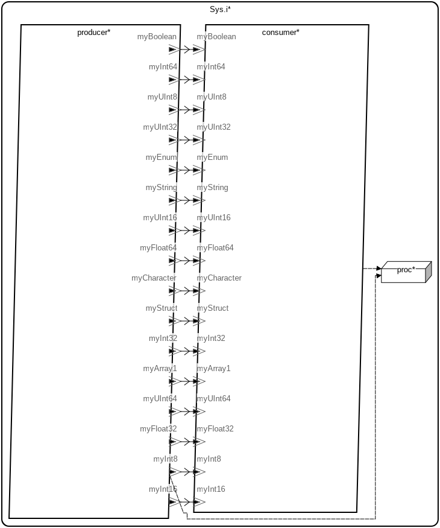

# AADL Datatypes Supported for the Microkit Target

This micro-example is a reference for the AADL data types that HAMR supports
when targeting the seL4 Microkit platform.  All supported base types and
user-defined type categories (enum, struct, fixed-size array) are demonstrated
with a simple producer/consumer system: a periodic C producer sends values on
one event data port per type, and a periodic Rust consumer receives them.
All event data ports use the default queue size of 1.
Unsupported types — unbounded integers, unbounded floats, unbounded arrays,
multi-dimensional arrays, and unions — are listed but commented out in the
model.  Two model representations and two corresponding sets of generated code
are included.

**Note:** HAMR currently only supports queue sizes of 1 for Rust components that contain GUMBO contracts.

 Table of Contents
  * [Models](#models)
    * [AADL Model](#aadl-model)
    * [SysML Model](#sysml-model)
  * [Supported Data Types](#supported-data-types)
  * [Declaring User-Defined Types](#declaring-user-defined-types)
    * [In AADL](#in-aadl)
    * [In SysML](#in-sysml)
  * [Generated C Type Definitions](#generated-c-type-definitions)
  * [Generated API](#generated-api)
    * [Sender API (C) — `put_<port>()`](#sender-api-c--put_port)
    * [Receiver API (Rust) — `get_<port>()`](#receiver-api-rust--get_port)

---

## Models

### Arch


---

### AADL Metrics
| | |
|--|--|
|Threads|2|
|Ports|32|
|Connections|16|

---

### AADL Model

The primary model is written in AADL and lives under [`aadl/`](aadl/).  All
supported data types are defined in
[`aadl/Aadl_Datatypes.aadl`](aadl/Aadl_Datatypes.aadl) and the system
architecture is in
[`aadl/Aadl_Datatypes_System.aadl`](aadl/Aadl_Datatypes_System.aadl).  The
producer thread (`ProducerThr.i`) is periodic and implemented in C; the
consumer thread (`ConsumerThr.i`) is periodic and implemented in Rust
(`HAMR::Microkit_Language => Rust`).  When no explicit scheduling property is
specified, the default scheduling strategy for the HAMR Microkit platform is
**seL4 domain scheduling**.  HAMR codegen targeting the **Microkit** platform
produces C code and Rust crates in [`hamr/microkit/`](hamr/microkit/).

### SysML Model

The SysML model in [`sysml/`](sysml/) was **derived/converted from the AADL
model**.  The structure (threads, port types, and connections) is identical to
the AADL model, but expressed in SysML v2 syntax using the
[santoslab AADL SysML libraries](https://github.com/santoslab/sysml-aadl-libraries).
The key modeling difference is the explicit scheduling strategy: the SysML
model sets `attribute :>> Scheduling = MCS` to use **MCS (Mixed-Criticality
Scheduling) user-land scheduling**.  HAMR codegen targeting the **Microkit**
platform produces C code and Rust crates in
[`hamr/microkit_mcs/`](hamr/microkit_mcs/).

For installation, codegen, and simulation instructions see:
- [aadl_readme.md](aadl_readme.md) — AADL model, seL4 domain scheduling, generated code in `hamr/microkit/`
- [sysml_readme.md](sysml_readme.md) — SysML model, MCS user-land scheduling, generated code in `hamr/microkit_mcs/`

---

## Supported Data Types

The table below shows every AADL base type from the `Base_Types` package
together with the corresponding C and Rust types that HAMR generates for the
Microkit target.

| AADL base type | C type | Rust type | Notes |
|---|---|---|---|
| `Boolean` | `bool` | `bool` | |
| `Character` | `char` | `u8` | |
| `String` | `Base_Types_String` (`char[]`) | `Base_Types::String` | Fixed-size `char` array; dimension set by codegen `--max-string-size` |
| `Integer_8` | `int8_t` | `i8` | |
| `Integer_16` | `int16_t` | `i16` | |
| `Integer_32` | `int32_t` | `i32` | |
| `Integer_64` | `int64_t` | `i64` | |
| `Unsigned_8` | `uint8_t` | `u8` | |
| `Unsigned_16` | `uint16_t` | `u16` | |
| `Unsigned_32` | `uint32_t` | `u32` | |
| `Unsigned_64` | `uint64_t` | `u64` | |
| `Float_32` | `float` | `f32` | |
| `Float_64` | `double` | `f64` | |
| `Integer` | — | — | **Not supported for Microkit** |
| `Natural` | — | — | **Not supported** |
| `Float` | — | — | **Not supported for Microkit** |

User-defined types from the AADL Data Model annex are also supported:

| AADL type category | C type | Rust type | Notes |
|---|---|---|---|
| `Enum` | C `enum` typedef | Rust `enum` | Enumerators map to C/Rust identifiers |
| `Struct` | C `struct` typedef | Rust `struct` | Fields declared as AADL subcomponents |
| Fixed-size `Array` | C array typedef | Rust array | Dimension and element type set in properties |
| `Union` | — | — | **Not supported** |
| Multi-dimensional array | — | — | **Not supported** |
| Unbounded array | — | — | **Not supported** |

---

## Declaring User-Defined Types

### In AADL

User-defined types are declared in a separate package (here `Aadl_Datatypes`)
following the AADL Data Modeling Annex.

**Enum** — uses `Data_Model::Data_Representation => Enum` and
`Data_Model::Enumerators`:

```aadl
data MyEnum
properties
  Data_Model::Data_Representation => Enum;
  Data_Model::Enumerators => ("On", "Off");
end MyEnum;
```

**Struct** — the type declaration is empty except for the `Struct`
representation property; fields are subcomponents of an accompanying data
implementation:

```aadl
data MyStruct
properties
  Data_Model::Data_Representation => Struct;
end MyStruct;

data implementation MyStruct.i
subcomponents
  fieldInt64 : data Base_Types::Integer_64;
  fieldStr: data Base_Types::String {
      Data_Model::Dimension => (42);
    };
  fieldEnum: data MyEnum;
  fieldRec : data MyStruct2.i;
  fieldArray: data MyArrayOneDim;
end MyStruct.i;
```

Nested struct types must be referenced by their *implementation* name (e.g.,
`MyStruct2.i`), not the bare type name.

**Fixed-size array** — uses `Data_Model::Base_Type`, `Data_Model::Dimension`,
and `HAMR::Array_Size_Kind => Fixed`:

```aadl
data MyArrayOneDim
properties
  Data_Model::Data_Representation => Array;
  Data_Model::Base_Type => (classifier (Base_Types::Integer_32));
  Data_Model::Dimension => (10);
  Data_Size => 40 Bytes;
  HAMR::Array_Size_Kind => Fixed;
end MyArrayOneDim;
```

### In SysML

The same types expressed in SysML v2:

**Enum**:

```sysml
enum def MyEnum { On; Off; }
```

**Struct** — extend `Struct`; fields are `part` (or `attribute` for enum
fields) members:

```sysml
part def MyStruct2_i :> Struct {
    part fieldSChar : Character;
}

part def MyStruct_i :> Struct {
    part fieldInt64  : Integer_64;
    part fieldStr    : String;
    attribute fieldEnum  : MyEnum;
    part fieldRec    : MyStruct2_i;
    part fieldArray  : MyArrayOneDim;
}
```

**Fixed-size array** — extend `Array`:

```sysml
part def MyArrayOneDim :> Array {
    part :>> Base_Type : Integer_32;
    attribute :>> Dimensions = 10;
    attribute :>> Array_Size_Kind = Fixed;
    attribute :>> Data_Size = 40 [byte];
}
```

---

## Generated C Type Definitions

HAMR generates C typedefs for user-defined types in
[`types/include/sb_aadl_types.h`](hamr/microkit/types/include/sb_aadl_types.h).
Standard C primitive types (`bool`, `int8_t`, `float`, etc.) are used directly
without any typedef.  `Base_Types::String` is the only base type that receives
a typedef because it is represented as a fixed-size `char` array:

```c
typedef
  enum {On, Off} Aadl_Datatypes_MyEnum;

typedef struct Aadl_Datatypes_MyStruct2_i {
  char fieldSChar;
} Aadl_Datatypes_MyStruct2_i;

#define Base_Types_String_BYTE_SIZE 43
#define Base_Types_String_DIM_0 43

typedef char Base_Types_String [Base_Types_String_DIM_0];

#define Aadl_Datatypes_MyArrayOneDim_BYTE_SIZE 40
#define Aadl_Datatypes_MyArrayOneDim_DIM_0 10

typedef int32_t Aadl_Datatypes_MyArrayOneDim [Aadl_Datatypes_MyArrayOneDim_DIM_0];

typedef struct Aadl_Datatypes_MyStruct_i {
  int64_t fieldInt64;
  Base_Types_String fieldStr;
  Aadl_Datatypes_MyEnum fieldEnum;
  Aadl_Datatypes_MyStruct2_i fieldRec;
  Aadl_Datatypes_MyArrayOneDim fieldArray;
} Aadl_Datatypes_MyStruct_i;
```

---

## Generated API

### Sender API (C) — `put_<port>()`

HAMR generates one `put_<portName>()` function per output port in the
**non-user-editable**
[`producer_producer.c`](hamr/microkit/components/producer_producer/src/producer_producer.c).
The C argument type for each port reflects the mapping in the
[Supported Data Types](#supported-data-types) table:

```c
bool put_myBoolean  (const bool                          *data);
bool put_myCharacter(const char                          *data);
bool put_myString   (const Base_Types_String             *data);
bool put_myInt8     (const int8_t                        *data);
bool put_myInt16    (const int16_t                       *data);
bool put_myInt32    (const int32_t                       *data);
bool put_myInt64    (const int64_t                       *data);
bool put_myUInt8    (const uint8_t                       *data);
bool put_myUInt16   (const uint16_t                      *data);
bool put_myUInt32   (const uint32_t                      *data);
bool put_myUInt64   (const uint64_t                      *data);
bool put_myFloat32  (const float                         *data);
bool put_myFloat64  (const double                        *data);
bool put_myEnum     (const Aadl_Datatypes_MyEnum         *data);
bool put_myStruct   (const Aadl_Datatypes_MyStruct_i     *data);
bool put_myArray1   (const Aadl_Datatypes_MyArrayOneDim  *data);
```

Each function enqueues its value into shared memory and always returns `true`.

### Receiver API (Rust) — `get_<port>()`

HAMR generates one `get_<portName>()` method per input port in the
**non-user-editable**
[`consumer_consumer_api.rs`](hamr/microkit/crates/consumer_consumer/src/bridge/consumer_consumer_api.rs).
Each method returns `Option<T>` — `Some(value)` when an event is available,
`None` when the port is empty:

```rust
fn get_myBoolean  (&mut self) -> Option<bool>
fn get_myCharacter(&mut self) -> Option<u8>
fn get_myString   (&mut self) -> Option<Base_Types::String>
fn get_myInt8     (&mut self) -> Option<i8>
fn get_myInt16    (&mut self) -> Option<i16>
fn get_myInt32    (&mut self) -> Option<i32>
fn get_myInt64    (&mut self) -> Option<i64>
fn get_myUInt8    (&mut self) -> Option<u8>
fn get_myUInt16   (&mut self) -> Option<u16>
fn get_myUInt32   (&mut self) -> Option<u32>
fn get_myUInt64   (&mut self) -> Option<u64>
fn get_myFloat32  (&mut self) -> Option<f32>
fn get_myFloat64  (&mut self) -> Option<f64>
fn get_myEnum     (&mut self) -> Option<Aadl_Datatypes::MyEnum>
fn get_myStruct   (&mut self) -> Option<Aadl_Datatypes::MyStruct_i>
fn get_myArray1   (&mut self) -> Option<Aadl_Datatypes::MyArrayOneDim>
```
