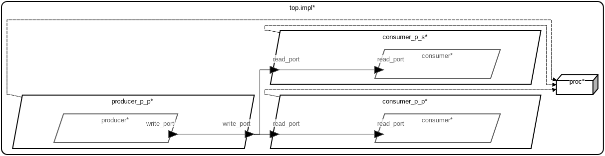

# AADL Data Ports — Array

This micro-example demonstrates how connections involving AADL **data ports**
carrying an array-of-struct payload are handled for both periodic and sporadic
consumer threads.  The example contains two model representations and two
corresponding sets of generated code.

 Table of Contents
  * [Models](#models)
    * [AADL Model](#aadl-model)
    * [SysML Model](#sysml-model)
  * [AADL Data Port Semantics](#aadl-data-port-semantics)
  * [How `get_read_port` Realizes Data Port Semantics](#how-get_read_port-realizes-data-port-semantics)
    * [Periodic Consumer](#periodic-consumer)
    * [Sporadic Consumer](#sporadic-consumer)

---

## Models

### Arch


---

### AADL Metrics
| | |
|--|--|
|Threads|3|
|Ports|3|
|Connections|2|

---

### AADL Model

The primary model is written in AADL and lives under [`aadl/`](aadl/).  It
describes a single periodic **producer** process that writes an
`ArrayOfStruct` value to an output data port, and two **consumer** processes
that each read from an input data port connected to that producer — one
periodic and one sporadic.

When no explicit scheduling property is specified, the default scheduling
strategy for the HAMR Microkit platform is **seL4 domain scheduling**, which
statically partitions execution time across the processes.  HAMR codegen
targeting the **Microkit** platform produces the generated platform code in
[`hamr/microkit/`](hamr/microkit/).

### SysML Model

The SysML model in [`sysml/data_1_prod_2_cons_array.sysml`](sysml/data_1_prod_2_cons_array.sysml)
was **derived/converted from the AADL model**.  The structure (processes,
threads, port types, connections, and domain assignments) is identical to the
AADL model, but expressed in SysML v2 syntax using the
[santoslab AADL SysML libraries](https://github.com/santoslab/sysml-aadl-libraries).
Those libraries define AADL component, port, connection, and property-set
concepts in SysML v2, based on the SAE AS-5506D AADL standard.  The HAMR
contributions extend those definitions to support code-generation-relevant
properties: array sizing semantics (Fixed, Bounded, Unbounded), implementation
language selection (Slang, C, Rust), platform-specific Microkit properties
(Passive, SMC), and scheduling strategy selection for the Microkit platform.

The key modeling difference from the AADL model is the scheduling strategy:
where the AADL model defaults to seL4's kernel-enforced domain scheduler, the
SysML model explicitly sets `attribute :>> Scheduling = MCS` to use **MCS
(Mixed-Criticality Scheduling) user-land scheduling**.  HAMR codegen run
against the SysML model produces the generated platform code in
[`hamr/microkit_mcs/`](hamr/microkit_mcs/).

For installation, codegen, and simulation instructions see:
- [aadl_readme.md](aadl_readme.md) — AADL model, seL4 domain scheduling, generated code in `hamr/microkit/`
- [sysml_readme.md](sysml_readme.md) — SysML model, MCS user-land scheduling, generated code in `hamr/microkit_mcs/`

---

## AADL Data Port Semantics

An AADL **data port** models a unidirectional, single-value communication
channel.  Its semantics differ from event ports and event-data ports in the
following key ways:

- **Latest-value only.**  A data port holds exactly one value — the most
  recently written value from the producer.  There is no queue; new writes
  overwrite the previous value.

- **Always readable.**  A consumer can always read from a data port.  If the
  producer has not written a new value since the last dispatch of the
  consumer, the port returns the *last* value that was written (i.e., it is
  *stale*).  If the producer has written at least one new value since the
  consumer last executed, the returned value is *fresh*.

- **No dispatch for data ports on sporadic threads.**  A sporadic thread is
  only dispatched (triggered to execute) by *event* or *event-data* port
  arrivals.  A pure data port connection to a sporadic consumer does **not**
  trigger the sporadic thread's dispatch — the consumer must be dispatched by
  some other event source and can then optionally read the data port.

- **Freshness indication.**  The HAMR-generated API exposes whether the value
  returned by a read is fresh (written since the last read) or stale (the
  previously cached value), allowing the application to distinguish whether
  new data arrived in the current frame.

---

## How `get_read_port` Realizes Data Port Semantics

HAMR codegen generates a `get_read_port` function for each data-port input.
The implementation is in the **non-user-editable** generated file for each
consumer component (e.g.,
[`hamr/microkit/components/consumer_p_p_consumer/src/consumer_p_p_consumer.c`](hamr/microkit/components/consumer_p_p_consumer/src/consumer_p_p_consumer.c)).

```c
data_1_prod_2_cons_array_ArrayOfStruct last_read_port_payload;  // persistent cache

bool get_read_port(data_1_prod_2_cons_array_ArrayOfStruct *data) {
  sb_event_counter_t numDropped;
  data_1_prod_2_cons_array_ArrayOfStruct fresh_data;
  bool isFresh = sb_queue_data_1_prod_2_cons_array_ArrayOfStruct_1_dequeue(
                     &read_port_recv_queue, &numDropped, &fresh_data);
  if (isFresh) {
    memcpy(&last_read_port_payload, &fresh_data,
           data_1_prod_2_cons_array_ArrayOfStruct_BYTE_SIZE);
  }
  memcpy(data, &last_read_port_payload,
         data_1_prod_2_cons_array_ArrayOfStruct_BYTE_SIZE);
  return isFresh;
}
```

The implementation realizes AADL data port semantics as follows:

1. **Single-slot cache (`last_read_port_payload`).**  A component-level
   persistent variable holds the most recently received value.  This
   corresponds to the AADL notion that a data port always holds the last
   written value.

2. **Dequeue from the shared-memory queue.**  The underlying transport is a
   single-element (capacity-1) lock-free queue in shared memory between the
   producer's monitor and the consumer.  `dequeue` returns `true` (fresh) if
   a new value was present, or `false` (stale) if no new value has arrived
   since the last call.

3. **Conditional cache update.**  If and only if the dequeue succeeded
   (`isFresh == true`), the cache is updated with the new value.  This
   preserves the last good value across frames where no new data arrives.

4. **Unconditional copy to caller.**  Regardless of freshness, the cached
   value (which is either the newly received value or the previously cached
   one) is copied into the caller-supplied buffer.  The boolean return value
   tells the application whether the data is fresh or stale — matching the
   sample output seen at runtime:
   ```
   consumer_p_p_con: retrieved [(0, 2), (1, 2)] which is fresh
   consumer_p_p_con: retrieved [(0, 2), (1, 2)] which is stale
   ```

### Periodic Consumer

The periodic consumer (`consumer_p_p_consumer`) calls `get_read_port` inside
its `timeTriggered` callback, which is invoked once per period by the
monitor.  Each period it reads the latest value and logs whether it is fresh
or stale.  The user code in
[`hamr/microkit/components/consumer_p_p_consumer/src/consumer_p_p_consumer_user.c`](hamr/microkit/components/consumer_p_p_consumer/src/consumer_p_p_consumer_user.c)
calls `get_read_port` and prints the result accordingly.

### Sporadic Consumer

The sporadic consumer (`consumer_p_s_consumer`) has no event port to trigger
its dispatch.  Consistent with AADL data port semantics, receiving a new
value on a data port does **not** dispatch a sporadic thread — the
`consumer_p_s_consumer_timeTriggered` entrypoint is never called, and the
component prints "I'm sporadic so you'll never hear from me again :(" at
initialization and remains idle thereafter.  The `get_read_port` function is
still generated for the sporadic consumer (to provide a complete and correct
API), but the user code in
[`hamr/microkit/components/consumer_p_s_consumer/src/consumer_p_s_consumer_user.c`](hamr/microkit/components/consumer_p_s_consumer/src/consumer_p_s_consumer_user.c)
marks the corresponding handler as infeasible.

