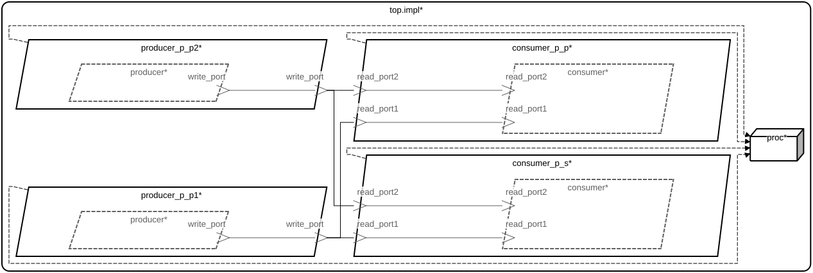

# event_2_prod_2_cons::top.impl

## AADL Architecture

|System: [event_2_prod_2_cons::top.impl]()|
|:--|

|Thread: event_2_prod_2_cons::producer_t.p1 |
|:--|
|Type: [producer_t](../../aadl/event_2_prod_2_cons.aadl#L17) Implementation: [producer_t.p1](../../aadl/event_2_prod_2_cons.aadl#L24)|
|Periodic : 100 ms|

|Thread: event_2_prod_2_cons::producer_t.p2 |
|:--|
|Type: [producer_t](../../aadl/event_2_prod_2_cons.aadl#L17) Implementation: [producer_t.p2](../../aadl/event_2_prod_2_cons.aadl#L43)|
|Periodic : 100 ms|

|Thread: event_2_prod_2_cons::consumer_t.p |
|:--|
|Type: [consumer_t](../../aadl/event_2_prod_2_cons.aadl#L62) Implementation: [consumer_t.p](../../aadl/event_2_prod_2_cons.aadl#L78)|
|Periodic : 100 ms|

|Thread: event_2_prod_2_cons::consumer_t.s |
|:--|
|Type: [consumer_t](../../aadl/event_2_prod_2_cons.aadl#L62) Implementation: [consumer_t.s](../../aadl/event_2_prod_2_cons.aadl#L97)|
|Sporadic : 100 ms|

## Rust Code

### Behavior Code
#### producer: event_2_prod_2_cons::producer_t.p1

 - **Entry Points**

- **APIs**

    <table>
    <tr><th>Port Name</th><th>Direction</th><th>Kind</th><th>Payload</th><th>Realizations</th></tr>
    <tr><td><a title='Model' href='../../aadl/event_2_prod_2_cons.aadl#L20'>write_port</a></td>
        <td>Out</td><td>Event</td>
        <td></td><td><a title='C Interface: Lines 13-19' href='components/producer_p_p1_producer/src/producer_p_p1_producer.c#L13'>C Interface</a> → <a title='C Shared Memory Variable: Line 9' href='components/producer_p_p1_producer/src/producer_p_p1_producer.c#L9'>C var_addr</a> → <a title='Memory Map: Lines 14-18' href='microkit.system#L14'>Memory Map</a></td></tr>
    </table>

#### producer: event_2_prod_2_cons::producer_t.p2

 - **Entry Points**

- **APIs**

    <table>
    <tr><th>Port Name</th><th>Direction</th><th>Kind</th><th>Payload</th><th>Realizations</th></tr>
    <tr><td><a title='Model' href='../../aadl/event_2_prod_2_cons.aadl#L20'>write_port</a></td>
        <td>Out</td><td>Event</td>
        <td></td><td><a title='C Interface: Lines 13-19' href='components/producer_p_p2_producer/src/producer_p_p2_producer.c#L13'>C Interface</a> → <a title='C Shared Memory Variable: Line 9' href='components/producer_p_p2_producer/src/producer_p_p2_producer.c#L9'>C var_addr</a> → <a title='Memory Map: Lines 32-36' href='microkit.system#L32'>Memory Map</a></td></tr>
    </table>

#### consumer: event_2_prod_2_cons::consumer_t.p

 - **Entry Points**

- **APIs**

    <table>
    <tr><th>Port Name</th><th>Direction</th><th>Kind</th><th>Payload</th><th>Realizations</th></tr>
    <tr><td><a title='Model' href='../../aadl/event_2_prod_2_cons.aadl#L65'>read_port1</a></td>
        <td>In</td><td>Event</td>
        <td></td><td><a title='Memory Map: Lines 50-54' href='microkit.system#L50'>Memory Map</a> → <a title='C Shared Memory Variable: Line 9' href='components/consumer_p_p_consumer/src/consumer_p_p_consumer.c#L9'>C var_addr</a> → <a title='C Interface: Lines 26-29' href='components/consumer_p_p_consumer/src/consumer_p_p_consumer.c#L26'>C Interface</a></td></tr>
    <tr><td><a title='Model' href='../../aadl/event_2_prod_2_cons.aadl#L66'>read_port2</a></td>
        <td>In</td><td>Event</td>
        <td></td><td><a title='Memory Map: Lines 55-59' href='microkit.system#L55'>Memory Map</a> → <a title='C Shared Memory Variable: Line 11' href='components/consumer_p_p_consumer/src/consumer_p_p_consumer.c#L11'>C var_addr</a> → <a title='C Interface: Lines 41-44' href='components/consumer_p_p_consumer/src/consumer_p_p_consumer.c#L41'>C Interface</a></td></tr>
    </table>

#### consumer: event_2_prod_2_cons::consumer_t.s

 - **Entry Points**

- **APIs**

    <table>
    <tr><th>Port Name</th><th>Direction</th><th>Kind</th><th>Payload</th><th>Realizations</th></tr>
    <tr><td><a title='Model' href='../../aadl/event_2_prod_2_cons.aadl#L65'>read_port1</a></td>
        <td>In</td><td>Event</td>
        <td></td><td><a title='Memory Map: Lines 73-77' href='microkit.system#L73'>Memory Map</a> → <a title='C Shared Memory Variable: Line 10' href='components/consumer_p_s_consumer/src/consumer_p_s_consumer.c#L10'>C var_addr</a> → <a title='C Interface: Lines 27-30' href='components/consumer_p_s_consumer/src/consumer_p_s_consumer.c#L27'>C Interface</a></td></tr>
    <tr><td><a title='Model' href='../../aadl/event_2_prod_2_cons.aadl#L66'>read_port2</a></td>
        <td>In</td><td>Event</td>
        <td></td><td><a title='Memory Map: Lines 78-82' href='microkit.system#L78'>Memory Map</a> → <a title='C Shared Memory Variable: Line 12' href='components/consumer_p_s_consumer/src/consumer_p_s_consumer.c#L12'>C var_addr</a> → <a title='C Interface: Lines 42-45' href='components/consumer_p_s_consumer/src/consumer_p_s_consumer.c#L42'>C Interface</a></td></tr>
    </table>

