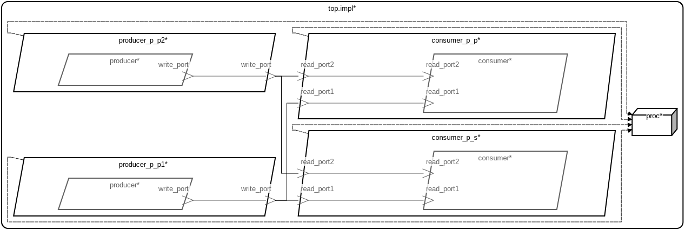

# AADL Event Ports

This micro-example demonstrates how connections involving AADL **event ports**
are handled for both periodic and sporadic consumer threads.  The example
contains two model representations and two corresponding sets of generated
code.

 Table of Contents
  * [Models](#models)
    * [AADL Model](#aadl-model)
    * [SysML Model](#sysml-model)
  * [AADL Event Port Semantics](#aadl-event-port-semantics)
  * [How the Generated API Realizes Event Port Semantics](#how-the-generated-api-realizes-event-port-semantics)
    * [Sender API — `put_write_port()`](#sender-api--put_write_port)
    * [Receiver API — `get_read_portN()`](#receiver-api--get_read_portn)
      * [Periodic Consumer](#periodic-consumer)
      * [Sporadic Consumer](#sporadic-consumer)

---

## Models

### Arch


---

### AADL Metrics
| | |
|--|--|
|Threads|4|
|Ports|6|
|Connections|4|

---

### AADL Model

The primary model is written in AADL and lives under [`aadl/`](aadl/).  It
describes two periodic **producer** threads (`producer_p_p1_producer`,
`producer_p_p2_producer`), each with one output event port, and two
**consumer** threads that each receive from both producers — one periodic
(`consumer_p_p_consumer`) and one sporadic (`consumer_p_s_consumer`).

When no explicit scheduling property is specified, the default scheduling
strategy for the HAMR Microkit platform is **seL4 domain scheduling**, which
statically partitions execution time across the threads.  HAMR codegen
targeting the **Microkit** platform produces C code in
[`hamr/microkit/`](hamr/microkit/).

### SysML Model

The SysML model in
[`sysml/event_2_prod_2_cons.sysml`](sysml/event_2_prod_2_cons.sysml) was
**derived/converted from the AADL model**.  The structure (threads, port
types, and connections) is identical to the AADL model, but expressed in
SysML v2 syntax using the
[santoslab AADL SysML libraries](https://github.com/santoslab/sysml-aadl-libraries).
The key modeling difference is the explicit scheduling strategy: the SysML
model sets `attribute :>> Scheduling = MCS` to use **MCS (Mixed-Criticality
Scheduling) user-land scheduling**.  HAMR codegen targeting the **Microkit**
platform produces C code in [`hamr/microkit_mcs/`](hamr/microkit_mcs/).

For installation, codegen, and simulation instructions see:
- [aadl_readme.md](aadl_readme.md) — AADL model, seL4 domain scheduling, generated code in `hamr/microkit/`
- [sysml_readme.md](sysml_readme.md) — SysML model, MCS user-land scheduling, generated code in `hamr/microkit_mcs/`

---

## AADL Event Port Semantics

An AADL **event port** models a unidirectional signal channel with **no
payload** — it carries only the presence or absence of an event.  Its
semantics differ from data ports and event-data ports in the following key
ways:

- **No data, just a signal.**  The event is a pure occurrence with no
  associated value.  The generated code uses a dummy `uint8_t` payload of `0`
  purely to satisfy the queue implementation's type requirements — the value
  itself is meaningless.

- **Queued, not latest-value.**  Unlike a data port (which holds only the most
  recently written value), events accumulate.  Each `put_write_port()` call
  increments an atomic `numSent` counter; each `get_read_portN()` call
  increments the receiver's own `numRecv` counter.  An event is "present"
  whenever `numSent > numRecv`.  This lets the receiver detect every distinct
  send without losing counts, even if events arrive faster than the receiver
  drains them.

- **Consumed once.**  Each `get_read_portN()` call that returns `true`
  consumes exactly one event.  Unlike a data port, a successful read does not
  leave the value available for the next read — the event is gone.

- **Dispatch for sporadic threads.**  An event port arrival is the canonical
  trigger for sporadic thread dispatch (as opposed to data ports, which never
  trigger dispatch).  The generated code reflects this: the sporadic
  consumer's `notified` handler checks `is_empty()` before calling the
  user-supplied handler, and the user handler drains the queue with a `while`
  loop.

---

## How the Generated API Realizes Event Port Semantics

### Sender API — `put_write_port()`

Generated in the **non-user-editable**
[`producer_p_p1_producer.c`](hamr/microkit/components/producer_p_p1_producer/src/producer_p_p1_producer.c):

```c
bool put_write_port() {
  uint8_t eventPayload = 0; // always send 0 as the event payload
  uint8_t *data = &eventPayload;
  sb_queue_uint8_t_1_enqueue((sb_queue_uint8_t_1_t *) write_port_queue_1, (uint8_t *) data);

  return true;
}
```

`enqueue` increments `numSent` atomically and writes the dummy byte into the
shared-memory ring buffer.  There is no blocking and no back-pressure — the
sender always succeeds.

---

### Receiver API — `get_read_portN()`

Generated in the **non-user-editable** consumer `.c` files (e.g.
[`consumer_p_p_consumer.c`](hamr/microkit/components/consumer_p_p_consumer/src/consumer_p_p_consumer.c)):

```c
bool get_read_port1() {
  sb_event_counter_t numDropped;
  return get_read_port1_poll (&numDropped);
}

bool get_read_port1_poll(sb_event_counter_t *numDropped) {
  uint8_t eventPortPayload;
  uint8_t *data = &eventPortPayload;
  return sb_queue_uint8_t_1_dequeue((sb_queue_uint8_t_1_Recv_t *) &read_port1_recv_queue, numDropped, data);
}
```

`dequeue` compares `numRecv` to `numSent`.  If `numSent > numRecv` it
increments `numRecv` and returns `true` (event consumed).  If
`numSent == numRecv` the queue is empty and returns `false`.

`*numDropped` reports how many events were overwritten and lost since the previous dequeue — events will be lost if the senders send more events than the receiver's queue can hold before it is dispatched.  `get_read_port1()` silently discards this value; `get_read_port1_poll()` exposes it for callers that need to detect missed events.

---

#### Periodic Consumer

The generated `notified()` in
[`consumer_p_p_consumer.c`](hamr/microkit/components/consumer_p_p_consumer/src/consumer_p_p_consumer.c)
unconditionally calls `timeTriggered()` on every dispatch from the monitor:

```c
void notified(microkit_channel channel) {
  switch (channel) {
    case PORT_FROM_MON:
      consumer_p_p_consumer_timeTriggered();
      break;
    default:
      consumer_p_p_consumer_notify(channel);
  }
}
```

The periodic consumer runs every period regardless of whether events arrived.
It is the application code's responsibility to call `get_read_portN()` and
decide what to do based on the result.

---

#### Sporadic Consumer

The generated `notified()` in
[`consumer_p_s_consumer.c`](hamr/microkit/components/consumer_p_s_consumer/src/consumer_p_s_consumer.c)
checks each port queue before dispatching to its handler:

```c
void notified(microkit_channel channel) {
  switch (channel) {
    case PORT_FROM_MON:
      if (!read_port1_is_empty()) {
        handle_read_port1();
      }
      if (!read_port2_is_empty()) {
        handle_read_port2();
      }
      break;
    default:
      consumer_p_s_consumer_notify(channel);
  }
}
```

The key difference from the periodic consumer is the `is_empty()` guard —
the sporadic consumer's per-port handler is only called when at least one
event is actually present in that port's queue.  This approximates AADL
sporadic dispatch semantics under the domain scheduler.
