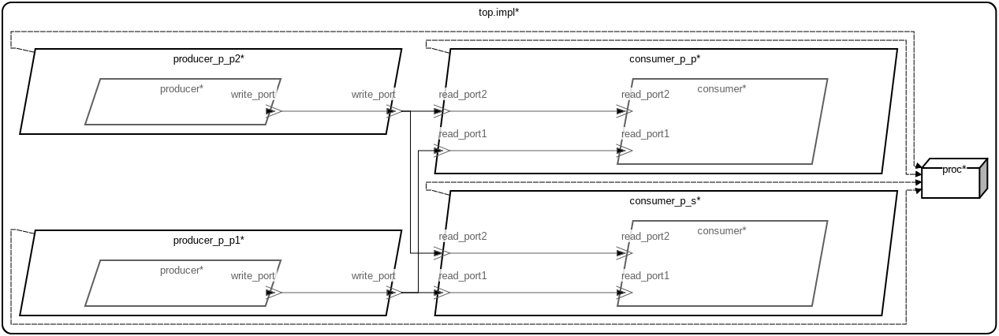

# AADL Event Data Ports — Base Type Payload

This micro-example demonstrates how connections involving AADL **event data
ports** with a **base type payload** are handled for both periodic and sporadic
consumer threads.  The example contains two model representations and two
corresponding sets of generated code.

 Table of Contents
  * [Models](#models)
    * [AADL Model](#aadl-model)
    * [SysML Model](#sysml-model)
  * [AADL Event Data Port Semantics](#aadl-event-data-port-semantics)
  * [How the Generated API Realizes Event Data Port Semantics](#how-the-generated-api-realizes-event-data-port-semantics)
    * [Payload Type](#payload-type)
    * [Sender API — `put_write_port()`](#sender-api--put_write_port)
    * [Receiver API — `get_read_portN()` and `get_read_portN_poll()`](#receiver-api--get_read_portn-and-get_read_portn_poll)
      * [Periodic Consumer](#periodic-consumer)
      * [Sporadic Consumer](#sporadic-consumer)

---

## Models

### Arch


---

### AADL Metrics
| | |
|--|--|
|Threads|4|
|Ports|6|
|Connections|4|

---

### AADL Model

The primary model is written in AADL and lives under [`aadl/`](aadl/).  It
describes two periodic **producer** threads (`producer_p_p1_producer`,
`producer_p_p2_producer`), each with one output event data port, and two
**consumer** threads that each receive from both producers — one periodic
(`consumer_p_p_consumer`) and one sporadic (`consumer_p_s_consumer`).

The port payload type is `Base_Types::Integer_8`, an AADL base type that maps
directly to C's `int8_t`.

When no explicit scheduling property is specified, the default scheduling
strategy for the HAMR Microkit platform is **seL4 domain scheduling**, which
statically partitions execution time across the threads.  HAMR codegen
targeting the **Microkit** platform produces C code in
[`hamr/microkit/`](hamr/microkit/).

### SysML Model

The SysML model in
[`sysml/event_data_2_prod_2_cons_base_type.sysml`](sysml/event_data_2_prod_2_cons_base_type.sysml) was
**derived/converted from the AADL model**.  The structure (threads, port
types, and connections) is identical to the AADL model, but expressed in
SysML v2 syntax using the
[santoslab AADL SysML libraries](https://github.com/santoslab/sysml-aadl-libraries).
The key modeling difference is the explicit scheduling strategy: the SysML
model sets `attribute :>> Scheduling = MCS` to use **MCS (Mixed-Criticality
Scheduling) user-land scheduling**.  HAMR codegen targeting the **Microkit**
platform produces C code in [`hamr/microkit_mcs/`](hamr/microkit_mcs/).

For installation, codegen, and simulation instructions see:
- [aadl_readme.md](aadl_readme.md) — AADL model, seL4 domain scheduling, generated code in `hamr/microkit/`
- [sysml_readme.md](sysml_readme.md) — SysML model, MCS user-land scheduling, generated code in `hamr/microkit_mcs/`

---

## AADL Event Data Port Semantics

An AADL **event data port** models a unidirectional channel that carries both
an **event signal** and a **typed data payload**.  Its semantics combine
aspects of event ports and data ports, but are distinct from both:

- **Typed payload.**  Unlike an event port (which carries only a signal with
  no associated value), each event data port transmission includes a full copy
  of the declared data type.  The sender fills the payload before calling
  `put_write_port()` and the receiver gets a copy on a successful
  `get_read_portN()`.

- **Queued, not latest-value.**  Unlike a data port (which holds only the
  most recently written value), event data ports accumulate.  Each
  `put_write_port(data)` enqueues a complete copy of the payload into the
  shared-memory ring buffer, incrementing an atomic `numSent` counter; each
  `get_read_portN(data)` increments the receiver's own `numRecv` counter.  An
  event+data pair is "present" whenever `numSent > numRecv`.

- **Consumed once.**  Each `get_read_portN(data)` call that returns `true`
  copies exactly one enqueued payload into `*data` and removes it from the
  queue.  Unlike a data port, a successful read does not leave the value
  available for the next read — the event is gone.

- **Dispatch for sporadic threads.**  Like event ports, an event data port
  arrival is the canonical trigger for sporadic thread dispatch.  The sporadic
  consumer's `notified` handler checks `is_empty()` before calling the
  user-supplied handler.

---

## How the Generated API Realizes Event Data Port Semantics

### Payload Type

The AADL port type `Base_Types::Integer_8` maps directly to C's standard
`int8_t`.  No additional typedef is generated in `sb_aadl_types.h` — the
queue is instantiated directly over `int8_t`.

---

### Sender API — `put_write_port()`

Generated in the **non-user-editable**
[`producer_p_p1_producer.c`](hamr/microkit/components/producer_p_p1_producer/src/producer_p_p1_producer.c):

```c
bool put_write_port(const int8_t *data) {
  sb_queue_int8_t_1_enqueue((sb_queue_int8_t_1_t *) write_port_queue_1, (int8_t *) data);

  return true;
}
```

`enqueue` copies the `int8_t` value into the next ring-buffer slot and
increments `numSent` atomically.  There is no blocking and no back-pressure —
the sender always succeeds.

---

### Receiver API — `get_read_portN()` and `get_read_portN_poll()`

Generated in the **non-user-editable** consumer `.c` files (e.g.
[`consumer_p_p_consumer.c`](hamr/microkit/components/consumer_p_p_consumer/src/consumer_p_p_consumer.c)):

```c
bool get_read_port1(int8_t *data) {
  sb_event_counter_t numDropped;
  return get_read_port1_poll (&numDropped, data);
}

bool get_read_port1_poll(sb_event_counter_t *numDropped, int8_t *data) {
  return sb_queue_int8_t_1_dequeue((sb_queue_int8_t_1_Recv_t *) &read_port1_recv_queue, numDropped, data);
}
```

`dequeue` compares `numRecv` to `numSent`.  If `numSent > numRecv` it copies
the next enqueued `int8_t` into `*data`, increments `numRecv`, and returns
`true`.  If `numSent == numRecv` the queue is empty and returns `false`
without touching `*data`.

`*numDropped` reports how many events were overwritten and lost since the previous dequeue — events will be lost if the senders send more events than the receiver's queue can hold before it is dispatched.  `get_read_port1()` silently discards this value; `get_read_port1_poll()` exposes it for callers that need to detect missed events.

---

#### Periodic Consumer

The generated `notified()` in
[`consumer_p_p_consumer.c`](hamr/microkit/components/consumer_p_p_consumer/src/consumer_p_p_consumer.c)
unconditionally calls `timeTriggered()` on every dispatch from the monitor:

```c
void notified(microkit_channel channel) {
  switch (channel) {
    case PORT_FROM_MON:
      consumer_p_p_consumer_timeTriggered();
      break;
    default:
      consumer_p_p_consumer_notify(channel);
  }
}
```

The periodic consumer runs every period regardless of whether events arrived.
It is the application code's responsibility to call `get_read_portN()` and
decide what to do based on the result.

---

#### Sporadic Consumer

The generated `notified()` in
[`consumer_p_s_consumer.c`](hamr/microkit/components/consumer_p_s_consumer/src/consumer_p_s_consumer.c)
checks each port queue before dispatching to its handler:

```c
void notified(microkit_channel channel) {
  switch (channel) {
    case PORT_FROM_MON:
      if (!read_port1_is_empty()) {
        handle_read_port1();
      }

      if (!read_port2_is_empty()) {
        handle_read_port2();
      }
      break;
    default:
      consumer_p_s_consumer_notify(channel);
  }
}
```

The key difference from the periodic consumer is the `is_empty()` guard —
the sporadic consumer's per-port handler is only called when at least one
event+data pair is actually present in that port's queue.  This approximates
AADL sporadic dispatch semantics under the domain scheduler.
