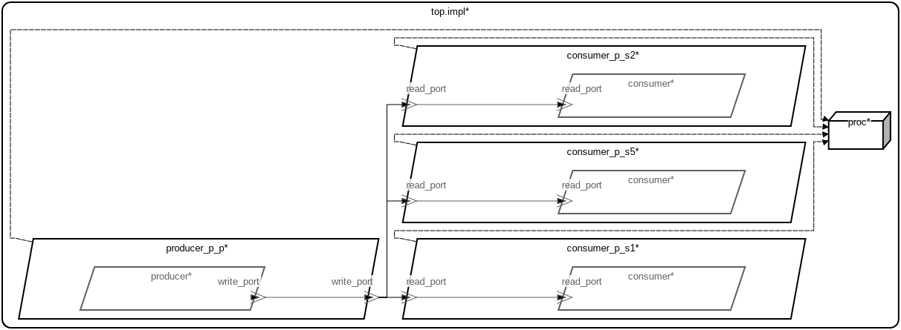

# AADL Event Data Port Queue Sizes

This micro-example demonstrates how **queue size** is specified on AADL
**event data ports** and how HAMR codegen realizes those sizes in the generated
C API.  The example contains one periodic producer and three sporadic consumers
— each consumer declares a different queue size (1, 2, and 5) on its input
port.  Two model representations and two corresponding sets of generated code
are included.  All consumer components are implemented in C; HAMR currently
only supports queue sizes of 1 for Rust components that contain GUMBO
contracts.

 Table of Contents
  * [Models](#models)
    * [AADL Model](#aadl-model)
    * [SysML Model](#sysml-model)
  * [AADL Event Data Port Semantics](#aadl-event-data-port-semantics)
  * [Specifying Queue Size](#specifying-queue-size)
    * [In AADL](#in-aadl)
    * [In SysML](#in-sysml)
  * [How the Generated API Realizes Event Data Port Semantics](#how-the-generated-api-realizes-event-data-port-semantics)
    * [Payload Type](#payload-type)
    * [Sender API — `put_write_port()`](#sender-api--put_write_port)
    * [Receiver API — `get_read_port()` and `get_read_port_poll()`](#receiver-api--get_read_port-and-get_read_port_poll)
    * [Queue Size in the Generated Code](#queue-size-in-the-generated-code)
    * [Sporadic Consumer](#sporadic-consumer)

---

## Models

### Arch


---

### AADL Metrics
| | |
|--|--|
|Threads|4|
|Ports|4|
|Connections|3|

---

### AADL Model

The primary model is written in AADL and lives under [`aadl/`](aadl/).  It
describes one periodic **producer** thread (`producer_p_p_producer`) with one
output event data port, and three sporadic **consumer** threads that each
receive from the producer with different input queue sizes:

- `consumer_p_s1_consumer` — default queue size (1)
- `consumer_p_s2_consumer` — `Queue_Size => 2`
- `consumer_p_s5_consumer` — `Queue_Size => 5`

When no explicit scheduling property is specified, the default scheduling
strategy for the HAMR Microkit platform is **seL4 domain scheduling**, which
statically partitions execution time across the threads.  HAMR codegen
targeting the **Microkit** platform produces C code in
[`hamr/microkit/`](hamr/microkit/).

### SysML Model

The SysML model in
[`sysml/event_data_array_port_queues.sysml`](sysml/event_data_array_port_queues.sysml)
was **derived/converted from the AADL model**.  The structure (threads, port
types, connections, and queue sizes) is identical to the AADL model, but
expressed in SysML v2 syntax using the
[santoslab AADL SysML libraries](https://github.com/santoslab/sysml-aadl-libraries).
The key modeling difference is the explicit scheduling strategy: the SysML
model sets `attribute :>> Scheduling = MCS` to use **MCS (Mixed-Criticality
Scheduling) user-land scheduling**.  HAMR codegen targeting the **Microkit**
platform produces C code in [`hamr/microkit_mcs/`](hamr/microkit_mcs/).

For installation, codegen, and simulation instructions see:
- [aadl_readme.md](aadl_readme.md) — AADL model, seL4 domain scheduling, generated code in `hamr/microkit/`
- [sysml_readme.md](sysml_readme.md) — SysML model, MCS user-land scheduling, generated code in `hamr/microkit_mcs/`

---

## AADL Event Data Port Semantics

An AADL **event data port** combines event port queueing semantics with a
typed payload.  Its semantics differ from data ports and event-only ports in
the following key ways:

- **Typed payload.**  Each event carries a value of the declared data type.
  The receiver obtains a copy of that value when it dequeues the event.

- **Queued, not latest-value.**  Unlike a data port (which holds only the most
  recently written value), events accumulate up to the declared queue size.
  Each `put_write_port()` call appends one event; each successful
  `get_read_port()` call removes exactly one event from the front of the queue.

- **Consumed once.**  A successful dequeue removes the event.  The value is
  not available on the next read.

- **Queue overflow.**  When the queue is full and a new event arrives, the
  oldest unread event is overwritten and lost.  `*numDropped` reflects how many
  events were lost in this way since the previous dequeue.

- **Broadcast to independent per-receiver queues.**  The single
  `put_write_port()` call enqueues into a separate shared-memory queue for
  each connected receiver.  Each receiver's queue is sized to its own declared
  `Queue_Size` and is drained independently — one receiver's consumption rate
  does not affect any other.

- **Dispatch for sporadic threads.**  An event data port arrival is a valid
  trigger for sporadic thread dispatch.  The generated `notified()` handler
  checks `read_port_is_empty()` before calling the user-supplied handler, and
  the user handler drains the queue with a `while` loop.

---

## Specifying Queue Size

### In AADL

Queue size is declared as a property on the port feature.  Omitting
`Queue_Size` gives the AADL default of 1.

```aadl
thread consumer_queue_1
    features
        read_port: in event data port ArrayOfStruct;
    properties
        Dispatch_Protocol => Sporadic;
        Compute_Execution_Time => 100ms .. 100ms;
end consumer_queue_1;

thread consumer_queue_2
    features
        read_port: in event data port ArrayOfStruct {
            Queue_Size => 2;
        };
    properties
        Dispatch_Protocol => Sporadic;
        Compute_Execution_Time => 100ms .. 100ms;
end consumer_queue_2;

thread consumer_queue_5
    features
        read_port: in event data port ArrayOfStruct {
            Queue_Size => 5;
        };
    properties
        Dispatch_Protocol => Sporadic;
        Compute_Execution_Time => 100ms .. 100ms;
end consumer_queue_5;
```

### In SysML

Queue size is declared as an attribute inside the `EventDataPort` block.
Omitting `Queue_Size` gives the default of 1.

```sysml
part def consumer_queue_1_t_s :> Sporadic_Thread {
    port read_port : EventDataPort { in :>> type : ArrayOfStruct; }
}

part def consumer_queue_2_t_s :> Sporadic_Thread {
    port read_port : EventDataPort {
        in :>> type : ArrayOfStruct;
        attribute :>> Queue_Size = 2;
    }
}

part def consumer_queue_5_t_s :> Sporadic_Thread {
    port read_port : EventDataPort {
        in :>> type : ArrayOfStruct;
        attribute :>> Queue_Size = 5;
    }
}
```

---

## How the Generated API Realizes Event Data Port Semantics

### Payload Type

Generated in the **non-user-editable**
[`types/include/sb_aadl_types.h`](hamr/microkit/types/include/sb_aadl_types.h):

```c
typedef struct event_data_array_port_queues_struct_i {
  int32_t currentEvent;
  int32_t totalEventsSent;
} event_data_array_port_queues_struct_i;

#define event_data_array_port_queues_ArrayOfStruct_BYTE_SIZE 80
#define event_data_array_port_queues_ArrayOfStruct_DIM_0 10

typedef event_data_array_port_queues_struct_i event_data_array_port_queues_ArrayOfStruct [event_data_array_port_queues_ArrayOfStruct_DIM_0];
```

`ArrayOfStruct` is a fixed-size array of 10 `struct_i` elements, totalling 80
bytes.

---

### Sender API — `put_write_port()`

Generated in the **non-user-editable**
[`producer_p_p_producer.c`](hamr/microkit/components/producer_p_p_producer/src/producer_p_p_producer.c):

```c
bool put_write_port(const event_data_array_port_queues_ArrayOfStruct *data) {
  sb_queue_event_data_array_port_queues_ArrayOfStruct_1_enqueue((sb_queue_event_data_array_port_queues_ArrayOfStruct_1_t *) write_port_queue_1, (event_data_array_port_queues_ArrayOfStruct *) data);

  sb_queue_event_data_array_port_queues_ArrayOfStruct_2_enqueue((sb_queue_event_data_array_port_queues_ArrayOfStruct_2_t *) write_port_queue_2, (event_data_array_port_queues_ArrayOfStruct *) data);

  sb_queue_event_data_array_port_queues_ArrayOfStruct_5_enqueue((sb_queue_event_data_array_port_queues_ArrayOfStruct_5_t *) write_port_queue_5, (event_data_array_port_queues_ArrayOfStruct *) data);

  return true;
}
```

A single `put_write_port()` call enqueues the payload into all three connected
receiver queues independently.  Each enqueue always succeeds and never blocks
— there is no back-pressure from any receiver.  The three queue variables
(`write_port_queue_1`, `write_port_queue_2`, `write_port_queue_5`) are
separate regions of shared memory, one per receiver, each sized to its
receiver's declared `Queue_Size`.

---

### Receiver API — `get_read_port()` and `get_read_port_poll()`

Generated in the **non-user-editable** consumer `.c` files.  The shape is
identical for all three consumers; only the queue type suffix differs.  Shown
here for `consumer_p_s1_consumer` (queue size 1) from
[`consumer_p_s1_consumer.c`](hamr/microkit/components/consumer_p_s1_consumer/src/consumer_p_s1_consumer.c):

```c
bool read_port_is_empty(void) {
  return sb_queue_event_data_array_port_queues_ArrayOfStruct_1_is_empty(&read_port_recv_queue);
}

bool get_read_port_poll(sb_event_counter_t *numDropped, event_data_array_port_queues_ArrayOfStruct *data) {
  return sb_queue_event_data_array_port_queues_ArrayOfStruct_1_dequeue((sb_queue_event_data_array_port_queues_ArrayOfStruct_1_Recv_t *) &read_port_recv_queue, numDropped, data);
}

bool get_read_port(event_data_array_port_queues_ArrayOfStruct *data) {
  sb_event_counter_t numDropped;
  return get_read_port_poll (&numDropped, data);
}
```

`dequeue` compares the receiver's `numRecv` counter to the sender's `numSent`
counter.  If `numSent > numRecv` it copies the next enqueued 80-byte array
into `*data`, increments `numRecv`, and returns `true`.  If
`numSent == numRecv` the queue is empty and returns `false` without touching
`*data`.

`*numDropped` reports how many events were overwritten and lost since the previous dequeue — events will be lost if the senders send more events than the receiver's queue can hold before it is dispatched.  `get_read_port()` silently discards this value; `get_read_port_poll()` exposes it for callers that need to detect missed events.

Consumers with queue sizes 2 and 5 use the `_2` and `_5` suffixed queue types
respectively
([`consumer_p_s2_consumer.c`](hamr/microkit/components/consumer_p_s2_consumer/src/consumer_p_s2_consumer.c),
[`consumer_p_s5_consumer.c`](hamr/microkit/components/consumer_p_s5_consumer/src/consumer_p_s5_consumer.c));
the API shape is identical.

---

### Queue Size in the Generated Code

HAMR generates a distinct queue type for each unique `Queue_Size` value used
in the model.  The queue size appears as a numeric suffix in the type name and
in the `#define` for the ring buffer capacity.  Because one slot is always
held as the next-to-write (dirty) slot, the allocated ring buffer has
`Queue_Size + 1` slots:

| AADL `Queue_Size` | Generated type suffix | Ring buffer `_SIZE` |
|---|---|---|
| 1 (default) | `_1` | 2 |
| 2 | `_2` | 3 |
| 5 | `_5` | 6 |

From the generated queue headers:

```c
// sb_queue_event_data_array_port_queues_ArrayOfStruct_1.h
#define SB_QUEUE_EVENT_DATA_ARRAY_PORT_QUEUES_ARRAYOFSTRUCT_1_SIZE 2

// sb_queue_event_data_array_port_queues_ArrayOfStruct_2.h
#define SB_QUEUE_EVENT_DATA_ARRAY_PORT_QUEUES_ARRAYOFSTRUCT_2_SIZE 3

// sb_queue_event_data_array_port_queues_ArrayOfStruct_5.h
#define SB_QUEUE_EVENT_DATA_ARRAY_PORT_QUEUES_ARRAYOFSTRUCT_5_SIZE 6
```

Each queue struct holds an `_Atomic sb_event_counter_t numSent` (written by
the sender) and a ring buffer of `_SIZE` elements:

```c
typedef struct sb_queue_event_data_array_port_queues_ArrayOfStruct_1 {
  _Atomic sb_event_counter_t numSent;
  event_data_array_port_queues_ArrayOfStruct elt[SB_QUEUE_EVENT_DATA_ARRAY_PORT_QUEUES_ARRAYOFSTRUCT_1_SIZE];
} sb_queue_event_data_array_port_queues_ArrayOfStruct_1_t;
```

Each receiver maintains its own `numRecv` counter in a private `_Recv_t`
struct that it owns (not shared memory).

---

### Sporadic Consumer

The generated `notified()` in all three consumer `.c` files follows the same
pattern — shown here for
[`consumer_p_s1_consumer.c`](hamr/microkit/components/consumer_p_s1_consumer/src/consumer_p_s1_consumer.c):

```c
void notified(microkit_channel channel) {
  switch (channel) {
    case PORT_FROM_MON:
      if (!read_port_is_empty()) {
        handle_read_port();
      }
      break;
    default:
      consumer_p_s1_consumer_notify(channel);
  }
}
```

The `!read_port_is_empty()` guard ensures `handle_read_port()` is only called
when at least one event is present.  The user-supplied `handle_read_port()`
implementation in
[`consumer_p_s1_consumer_user.c`](hamr/microkit/components/consumer_p_s1_consumer/src/consumer_p_s1_consumer_user.c)
drains the entire queue in a `while` loop:

```c
void handle_read_port(void) {
  event_data_array_port_queues_ArrayOfStruct value;
  while(get_read_port(&value)) {
    printf("%s: received ", microkit_name);
    printArray(value);
    printf("\n");
  }
}
```

Each consumer drains all queued events on every dispatch, so the number of
`received` lines per dispatch reflects how many events accumulated in that
consumer's queue since its last dispatch.
