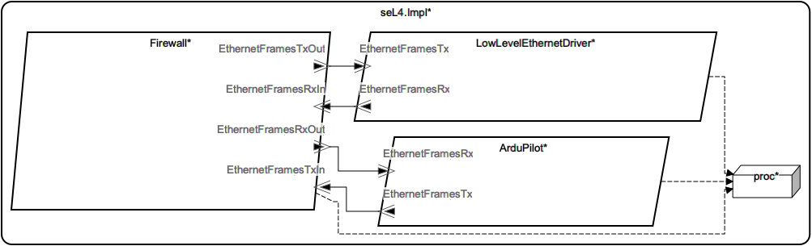

# SW::seL4.Impl

## AADL Architecture

|System: [SW::seL4.Impl]()|
|:--|

|Thread: SW::ArduPilot.Impl |
|:--|
|Type: [ArduPilot](../../aadl/SW.aadl#L277) Implementation: [ArduPilot.Impl](../../aadl/SW.aadl#L283)|
|Periodic : 100 ms|

|Thread: SW::Firewall.Impl |
|:--|
|Type: [Firewall](../../aadl/SW.aadl#L63) Implementation: [Firewall.Impl](../../aadl/SW.aadl#L72) 
GUMBO: [Subclause](../../aadl/SW.aadl#L79)|
|Periodic : 100 ms|

|Thread: SW::LowLevelEthernetDriver.Impl |
|:--|
|Type: [LowLevelEthernetDriver](../../aadl/SW.aadl#L28) Implementation: [LowLevelEthernetDriver.Impl](../../aadl/SW.aadl#L35)|
|Periodic : 100 ms|

## Rust Code

### Behavior Code
#### ArduPilot: SW::ArduPilot.Impl

 - **Entry Points**

    Initialize: [Rust](crates/ArduPilot_ArduPilot/src/component/ArduPilot_ArduPilot_app.rs#L22)

    TimeTriggered: [Rust](crates/ArduPilot_ArduPilot/src/component/ArduPilot_ArduPilot_app.rs#L30)

- **APIs**

    <table>
    <tr><th>Port Name</th><th>Direction</th><th>Kind</th><th>Payload</th><th>Realizations</th></tr>
    <tr><td><a title='Model' href='../../aadl/SW.aadl#L280'>EthernetFramesRx</a></td>
        <td>In</td><td>Event Data</td>
        <td>SW::RawEthernetMessage</td><td><a title='Memory Map: Lines 16-20' href='microkit.system#L16'>Memory Map</a> → <a title='C Shared Memory Variable: Line 10' href='components/ArduPilot_ArduPilot/src/ArduPilot_ArduPilot.c#L10'>C var_addr</a> → <a title='C Interface: Lines 29-32' href='components/ArduPilot_ArduPilot/src/ArduPilot_ArduPilot.c#L29'>C Interface</a> → <a title='C Extern: Line 14' href='crates/ArduPilot_ArduPilot/src/bridge/extern_c_api.rs#L14'>C Extern</a> → <a title='Rust/C Interface: Lines 18-28' href='crates/ArduPilot_ArduPilot/src/bridge/extern_c_api.rs#L18'>Rust/C Interface</a> → <a title='Unverified Rust Interface: Lines 22-29' href='crates/ArduPilot_ArduPilot/src/bridge/ArduPilot_ArduPilot_api.rs#L22'>Unverified Rust Interface</a> → <a title='Rust/Verus API: Lines 55-62' href='crates/ArduPilot_ArduPilot/src/bridge/ArduPilot_ArduPilot_api.rs#L55'>Rust/Verus API</a></td></tr>
    <tr><td><a title='Model' href='../../aadl/SW.aadl#L281'>EthernetFramesTx</a></td>
        <td>Out</td><td>Event Data</td>
        <td>SW::RawEthernetMessage</td><td><a title='Rust/Verus API: Lines 42-51' href='crates/ArduPilot_ArduPilot/src/bridge/ArduPilot_ArduPilot_api.rs#L42'>Rust/Verus API</a> → <a title='Unverified Rust Interface: Lines 12-17' href='crates/ArduPilot_ArduPilot/src/bridge/ArduPilot_ArduPilot_api.rs#L12'>Unverified Rust Interface</a> → <a title='Rust/C Interface: Lines 30-35' href='crates/ArduPilot_ArduPilot/src/bridge/extern_c_api.rs#L30'>Rust/C Interface</a> → <a title='C Extern: Line 15' href='crates/ArduPilot_ArduPilot/src/bridge/extern_c_api.rs#L15'>C Extern</a> → <a title='C Interface: Lines 15-19' href='components/ArduPilot_ArduPilot/src/ArduPilot_ArduPilot.c#L15'>C Interface</a> → <a title='C Shared Memory Variable: Line 9' href='components/ArduPilot_ArduPilot/src/ArduPilot_ArduPilot.c#L9'>C var_addr</a> → <a title='Memory Map: Lines 11-15' href='microkit.system#L11'>Memory Map</a></td></tr>
    </table>

#### Firewall: SW::Firewall.Impl

 - **Entry Points**

    Initialize: [Rust](crates/Firewall_Firewall/src/component/Firewall_Firewall_app.rs#L21)

    TimeTriggered: [Rust](crates/Firewall_Firewall/src/component/Firewall_Firewall_app.rs#L28)

- **APIs**

    <table>
    <tr><th>Port Name</th><th>Direction</th><th>Kind</th><th>Payload</th><th>Realizations</th></tr>
    <tr><td><a title='Model' href='../../aadl/SW.aadl#L66'>EthernetFramesRxIn</a></td>
        <td>In</td><td>Event Data</td>
        <td>SW::RawEthernetMessage</td><td><a title='Memory Map: Lines 49-53' href='microkit.system#L49'>Memory Map</a> → <a title='C Shared Memory Variable: Line 13' href='components/Firewall_Firewall/src/Firewall_Firewall.c#L13'>C var_addr</a> → <a title='C Interface: Lines 51-54' href='components/Firewall_Firewall/src/Firewall_Firewall.c#L51'>C Interface</a> → <a title='C Extern: Line 14' href='crates/Firewall_Firewall/src/bridge/extern_c_api.rs#L14'>C Extern</a> → <a title='Rust/C Interface: Lines 20-30' href='crates/Firewall_Firewall/src/bridge/extern_c_api.rs#L20'>Rust/C Interface</a> → <a title='Unverified Rust Interface: Lines 30-37' href='crates/Firewall_Firewall/src/bridge/Firewall_Firewall_api.rs#L30'>Unverified Rust Interface</a> → <a title='Rust/Verus API: Lines 89-98' href='crates/Firewall_Firewall/src/bridge/Firewall_Firewall_api.rs#L89'>Rust/Verus API</a></td></tr>
    <tr><td><a title='Model' href='../../aadl/SW.aadl#L69'>EthernetFramesTxIn</a></td>
        <td>In</td><td>Event Data</td>
        <td>SW::RawEthernetMessage</td><td><a title='Memory Map: Lines 34-38' href='microkit.system#L34'>Memory Map</a> → <a title='C Shared Memory Variable: Line 9' href='components/Firewall_Firewall/src/Firewall_Firewall.c#L9'>C var_addr</a> → <a title='C Interface: Lines 26-29' href='components/Firewall_Firewall/src/Firewall_Firewall.c#L26'>C Interface</a> → <a title='C Extern: Line 15' href='crates/Firewall_Firewall/src/bridge/extern_c_api.rs#L15'>C Extern</a> → <a title='Rust/C Interface: Lines 32-42' href='crates/Firewall_Firewall/src/bridge/extern_c_api.rs#L32'>Rust/C Interface</a> → <a title='Unverified Rust Interface: Lines 40-47' href='crates/Firewall_Firewall/src/bridge/Firewall_Firewall_api.rs#L40'>Unverified Rust Interface</a> → <a title='Rust/Verus API: Lines 99-108' href='crates/Firewall_Firewall/src/bridge/Firewall_Firewall_api.rs#L99'>Rust/Verus API</a></td></tr>
    <tr><td><a title='Model' href='../../aadl/SW.aadl#L67'>EthernetFramesRxOut</a></td>
        <td>Out</td><td>Event Data</td>
        <td>SW::RawEthernetMessage</td><td><a title='Rust/Verus API: Lines 62-73' href='crates/Firewall_Firewall/src/bridge/Firewall_Firewall_api.rs#L62'>Rust/Verus API</a> → <a title='Unverified Rust Interface: Lines 12-17' href='crates/Firewall_Firewall/src/bridge/Firewall_Firewall_api.rs#L12'>Unverified Rust Interface</a> → <a title='Rust/C Interface: Lines 44-49' href='crates/Firewall_Firewall/src/bridge/extern_c_api.rs#L44'>Rust/C Interface</a> → <a title='C Extern: Line 16' href='crates/Firewall_Firewall/src/bridge/extern_c_api.rs#L16'>C Extern</a> → <a title='C Interface: Lines 31-35' href='components/Firewall_Firewall/src/Firewall_Firewall.c#L31'>C Interface</a> → <a title='C Shared Memory Variable: Line 11' href='components/Firewall_Firewall/src/Firewall_Firewall.c#L11'>C var_addr</a> → <a title='Memory Map: Lines 39-43' href='microkit.system#L39'>Memory Map</a></td></tr>
    <tr><td><a title='Model' href='../../aadl/SW.aadl#L70'>EthernetFramesTxOut</a></td>
        <td>Out</td><td>Event Data</td>
        <td>SW::RawEthernetMessage</td><td><a title='Rust/Verus API: Lines 74-85' href='crates/Firewall_Firewall/src/bridge/Firewall_Firewall_api.rs#L74'>Rust/Verus API</a> → <a title='Unverified Rust Interface: Lines 20-25' href='crates/Firewall_Firewall/src/bridge/Firewall_Firewall_api.rs#L20'>Unverified Rust Interface</a> → <a title='Rust/C Interface: Lines 51-56' href='crates/Firewall_Firewall/src/bridge/extern_c_api.rs#L51'>Rust/C Interface</a> → <a title='C Extern: Line 17' href='crates/Firewall_Firewall/src/bridge/extern_c_api.rs#L17'>C Extern</a> → <a title='C Interface: Lines 37-41' href='components/Firewall_Firewall/src/Firewall_Firewall.c#L37'>C Interface</a> → <a title='C Shared Memory Variable: Line 12' href='components/Firewall_Firewall/src/Firewall_Firewall.c#L12'>C var_addr</a> → <a title='Memory Map: Lines 44-48' href='microkit.system#L44'>Memory Map</a></td></tr>
    </table>
- **GUMBO**

    <table>
    <tr><th colspan=4>Compute</th></tr>
    <tr><td>guarantee rx</td>
    <td><a href=../../aadl/SW.aadl#L238>GUMBO</a></td>
    <td><a href=crates/Firewall_Firewall/src/component/Firewall_Firewall_app.rs#L40>Verus</a></td>
    <td><a href=crates/Firewall_Firewall/src/bridge/Firewall_Firewall_GUMBOX.rs#L297>GUMBOX</a></td>
    </tr>
    <tr><td>guarantee tx</td>
    <td><a href=../../aadl/SW.aadl#L244>GUMBO</a></td>
    <td><a href=crates/Firewall_Firewall/src/component/Firewall_Firewall_app.rs#L47>Verus</a></td>
    <td><a href=crates/Firewall_Firewall/src/bridge/Firewall_Firewall_GUMBOX.rs#L321>GUMBOX</a></td>
    </tr></table>
    <table>
    <tr><th colspan=4>GUMBO Methods</th></tr>
    <tr><td>TCP_ALLOWED_PORTS</td>
    <td><a href=../../aadl/SW.aadl#L89>GUMBO</a></td>
    <td><a href=crates/Firewall_Firewall/src/component/Firewall_Firewall_app.rs#L444>Verus</a></td>
    <td><a href=crates/Firewall_Firewall/src/bridge/Firewall_Firewall_GUMBOX.rs#L17>GUMBOX</a></td>
    </tr>
    <tr><td>UDP_ALLOWED_PORTS</td>
    <td><a href=../../aadl/SW.aadl#L91>GUMBO</a></td>
    <td><a href=crates/Firewall_Firewall/src/component/Firewall_Firewall_app.rs#L449>Verus</a></td>
    <td><a href=crates/Firewall_Firewall/src/bridge/Firewall_Firewall_GUMBOX.rs#L22>GUMBOX</a></td>
    </tr>
    <tr><td>two_bytes_to_u16</td>
    <td><a href=../../aadl/SW.aadl#L94>GUMBO</a></td>
    <td><a href=crates/Firewall_Firewall/src/component/Firewall_Firewall_app.rs#L454>Verus</a></td>
    <td><a href=crates/Firewall_Firewall/src/bridge/Firewall_Firewall_GUMBOX.rs#L27>GUMBOX</a></td>
    </tr>
    <tr><td>frame_is_wellformed_eth2</td>
    <td><a href=../../aadl/SW.aadl#L97>GUMBO</a></td>
    <td><a href=crates/Firewall_Firewall/src/component/Firewall_Firewall_app.rs#L461>Verus</a></td>
    <td><a href=crates/Firewall_Firewall/src/bridge/Firewall_Firewall_GUMBOX.rs#L34>GUMBOX</a></td>
    </tr>
    <tr><td>frame_has_ipv4</td>
    <td><a href=../../aadl/SW.aadl#L103>GUMBO</a></td>
    <td><a href=crates/Firewall_Firewall/src/component/Firewall_Firewall_app.rs#L471>Verus</a></td>
    <td><a href=crates/Firewall_Firewall/src/bridge/Firewall_Firewall_GUMBOX.rs#L44>GUMBOX</a></td>
    </tr>
    <tr><td>frame_has_ipv4_tcp</td>
    <td><a href=../../aadl/SW.aadl#L108>GUMBO</a></td>
    <td><a href=crates/Firewall_Firewall/src/component/Firewall_Firewall_app.rs#L482>Verus</a></td>
    <td><a href=crates/Firewall_Firewall/src/bridge/Firewall_Firewall_GUMBOX.rs#L56>GUMBOX</a></td>
    </tr>
    <tr><td>frame_has_ipv4_udp</td>
    <td><a href=../../aadl/SW.aadl#L113>GUMBO</a></td>
    <td><a href=crates/Firewall_Firewall/src/component/Firewall_Firewall_app.rs#L492>Verus</a></td>
    <td><a href=crates/Firewall_Firewall/src/bridge/Firewall_Firewall_GUMBOX.rs#L67>GUMBOX</a></td>
    </tr>
    <tr><td>frame_has_ipv4_tcp_on_allowed_port</td>
    <td><a href=../../aadl/SW.aadl#L118>GUMBO</a></td>
    <td><a href=crates/Firewall_Firewall/src/component/Firewall_Firewall_app.rs#L502>Verus</a></td>
    <td><a href=crates/Firewall_Firewall/src/bridge/Firewall_Firewall_GUMBOX.rs#L78>GUMBOX</a></td>
    </tr>
    <tr><td>frame_has_ipv4_tcp_on_allowed_port_quant</td>
    <td><a href=../../aadl/SW.aadl#L124>GUMBO</a></td>
    <td><a href=crates/Firewall_Firewall/src/component/Firewall_Firewall_app.rs#L509>Verus</a></td>
    <td><a href=crates/Firewall_Firewall/src/bridge/Firewall_Firewall_GUMBOX.rs#L86>GUMBOX</a></td>
    </tr>
    <tr><td>frame_has_ipv4_udp_on_allowed_port</td>
    <td><a href=../../aadl/SW.aadl#L128>GUMBO</a></td>
    <td><a href=crates/Firewall_Firewall/src/component/Firewall_Firewall_app.rs#L514>Verus</a></td>
    <td><a href=crates/Firewall_Firewall/src/bridge/Firewall_Firewall_GUMBOX.rs#L91>GUMBOX</a></td>
    </tr>
    <tr><td>frame_has_ipv4_udp_on_allowed_port_quant</td>
    <td><a href=../../aadl/SW.aadl#L134>GUMBO</a></td>
    <td><a href=crates/Firewall_Firewall/src/component/Firewall_Firewall_app.rs#L521>Verus</a></td>
    <td><a href=crates/Firewall_Firewall/src/bridge/Firewall_Firewall_GUMBOX.rs#L99>GUMBOX</a></td>
    </tr>
    <tr><td>frame_has_ipv6</td>
    <td><a href=../../aadl/SW.aadl#L138>GUMBO</a></td>
    <td><a href=crates/Firewall_Firewall/src/component/Firewall_Firewall_app.rs#L526>Verus</a></td>
    <td><a href=crates/Firewall_Firewall/src/bridge/Firewall_Firewall_GUMBOX.rs#L104>GUMBOX</a></td>
    </tr>
    <tr><td>frame_has_arp</td>
    <td><a href=../../aadl/SW.aadl#L143>GUMBO</a></td>
    <td><a href=crates/Firewall_Firewall/src/component/Firewall_Firewall_app.rs#L537>Verus</a></td>
    <td><a href=crates/Firewall_Firewall/src/bridge/Firewall_Firewall_GUMBOX.rs#L116>GUMBOX</a></td>
    </tr>
    <tr><td>hlr_1_1</td>
    <td><a href=../../aadl/SW.aadl#L153>GUMBO</a></td>
    <td><a href=crates/Firewall_Firewall/src/component/Firewall_Firewall_app.rs#L548>Verus</a></td>
    <td><a href=crates/Firewall_Firewall/src/bridge/Firewall_Firewall_GUMBOX.rs#L128>GUMBOX</a></td>
    </tr>
    <tr><td>hlr_1_2</td>
    <td><a href=../../aadl/SW.aadl#L157>GUMBO</a></td>
    <td><a href=crates/Firewall_Firewall/src/component/Firewall_Firewall_app.rs#L559>Verus</a></td>
    <td><a href=crates/Firewall_Firewall/src/bridge/Firewall_Firewall_GUMBOX.rs#L139>GUMBOX</a></td>
    </tr>
    <tr><td>hlr_1_3</td>
    <td><a href=../../aadl/SW.aadl#L161>GUMBO</a></td>
    <td><a href=crates/Firewall_Firewall/src/component/Firewall_Firewall_app.rs#L570>Verus</a></td>
    <td><a href=crates/Firewall_Firewall/src/bridge/Firewall_Firewall_GUMBOX.rs#L150>GUMBOX</a></td>
    </tr>
    <tr><td>hlr_1_4</td>
    <td><a href=../../aadl/SW.aadl#L167>GUMBO</a></td>
    <td><a href=crates/Firewall_Firewall/src/component/Firewall_Firewall_app.rs#L582>Verus</a></td>
    <td><a href=crates/Firewall_Firewall/src/bridge/Firewall_Firewall_GUMBOX.rs#L162>GUMBOX</a></td>
    </tr>
    <tr><td>hlr_1_5</td>
    <td><a href=../../aadl/SW.aadl#L174>GUMBO</a></td>
    <td><a href=crates/Firewall_Firewall/src/component/Firewall_Firewall_app.rs#L595>Verus</a></td>
    <td><a href=crates/Firewall_Firewall/src/bridge/Firewall_Firewall_GUMBOX.rs#L175>GUMBOX</a></td>
    </tr>
    <tr><td>hlr_1_6</td>
    <td><a href=../../aadl/SW.aadl#L181>GUMBO</a></td>
    <td><a href=crates/Firewall_Firewall/src/component/Firewall_Firewall_app.rs#L608>Verus</a></td>
    <td><a href=crates/Firewall_Firewall/src/bridge/Firewall_Firewall_GUMBOX.rs#L188>GUMBOX</a></td>
    </tr>
    <tr><td>hlr_1_7</td>
    <td><a href=../../aadl/SW.aadl#L186>GUMBO</a></td>
    <td><a href=crates/Firewall_Firewall/src/component/Firewall_Firewall_app.rs#L619>Verus</a></td>
    <td><a href=crates/Firewall_Firewall/src/bridge/Firewall_Firewall_GUMBOX.rs#L199>GUMBOX</a></td>
    </tr>
    <tr><td>hlr_1_8</td>
    <td><a href=../../aadl/SW.aadl#L193>GUMBO</a></td>
    <td><a href=crates/Firewall_Firewall/src/component/Firewall_Firewall_app.rs#L632>Verus</a></td>
    <td><a href=crates/Firewall_Firewall/src/bridge/Firewall_Firewall_GUMBOX.rs#L212>GUMBOX</a></td>
    </tr>
    <tr><td>should_allow_inbound_frame_rx</td>
    <td><a href=../../aadl/SW.aadl#L200>GUMBO</a></td>
    <td><a href=crates/Firewall_Firewall/src/component/Firewall_Firewall_app.rs#L645>Verus</a></td>
    <td><a href=crates/Firewall_Firewall/src/bridge/Firewall_Firewall_GUMBOX.rs#L225>GUMBOX</a></td>
    </tr>
    <tr><td>hlr_2_1</td>
    <td><a href=../../aadl/SW.aadl#L214>GUMBO</a></td>
    <td><a href=crates/Firewall_Firewall/src/component/Firewall_Firewall_app.rs#L658>Verus</a></td>
    <td><a href=crates/Firewall_Firewall/src/bridge/Firewall_Firewall_GUMBOX.rs#L238>GUMBOX</a></td>
    </tr>
    <tr><td>hlr_2_2</td>
    <td><a href=../../aadl/SW.aadl#L218>GUMBO</a></td>
    <td><a href=crates/Firewall_Firewall/src/component/Firewall_Firewall_app.rs#L669>Verus</a></td>
    <td><a href=crates/Firewall_Firewall/src/bridge/Firewall_Firewall_GUMBOX.rs#L249>GUMBOX</a></td>
    </tr>
    <tr><td>hlr_2_3</td>
    <td><a href=../../aadl/SW.aadl#L222>GUMBO</a></td>
    <td><a href=crates/Firewall_Firewall/src/component/Firewall_Firewall_app.rs#L680>Verus</a></td>
    <td><a href=crates/Firewall_Firewall/src/bridge/Firewall_Firewall_GUMBOX.rs#L260>GUMBOX</a></td>
    </tr>
    <tr><td>hlr_2_4</td>
    <td><a href=../../aadl/SW.aadl#L226>GUMBO</a></td>
    <td><a href=crates/Firewall_Firewall/src/component/Firewall_Firewall_app.rs#L691>Verus</a></td>
    <td><a href=crates/Firewall_Firewall/src/bridge/Firewall_Firewall_GUMBOX.rs#L271>GUMBOX</a></td>
    </tr>
    <tr><td>should_allow_outbound_frame_tx</td>
    <td><a href=../../aadl/SW.aadl#L230>GUMBO</a></td>
    <td><a href=crates/Firewall_Firewall/src/component/Firewall_Firewall_app.rs#L702>Verus</a></td>
    <td><a href=crates/Firewall_Firewall/src/bridge/Firewall_Firewall_GUMBOX.rs#L282>GUMBOX</a></td>
    </tr></table>

#### LowLevelEthernetDriver: SW::LowLevelEthernetDriver.Impl

 - **Entry Points**

    Initialize: [Rust](crates/LowLevelEthernetDriver_LowLevelEthernetDriver/src/component/LowLevelEthernetDriver_LowLevelEthernetDriver_app.rs#L22)

    TimeTriggered: [Rust](crates/LowLevelEthernetDriver_LowLevelEthernetDriver/src/component/LowLevelEthernetDriver_LowLevelEthernetDriver_app.rs#L30)

- **APIs**

    <table>
    <tr><th>Port Name</th><th>Direction</th><th>Kind</th><th>Payload</th><th>Realizations</th></tr>
    <tr><td><a title='Model' href='../../aadl/SW.aadl#L33'>EthernetFramesTx</a></td>
        <td>In</td><td>Event Data</td>
        <td>SW::RawEthernetMessage</td><td><a title='Memory Map: Lines 67-71' href='microkit.system#L67'>Memory Map</a> → <a title='C Shared Memory Variable: Line 9' href='components/LowLevelEthernetDriver_LowLevelEthernetDriver/src/LowLevelEthernetDriver_LowLevelEthernetDriver.c#L9'>C var_addr</a> → <a title='C Interface: Lines 23-26' href='components/LowLevelEthernetDriver_LowLevelEthernetDriver/src/LowLevelEthernetDriver_LowLevelEthernetDriver.c#L23'>C Interface</a> → <a title='C Extern: Line 14' href='crates/LowLevelEthernetDriver_LowLevelEthernetDriver/src/bridge/extern_c_api.rs#L14'>C Extern</a> → <a title='Rust/C Interface: Lines 18-28' href='crates/LowLevelEthernetDriver_LowLevelEthernetDriver/src/bridge/extern_c_api.rs#L18'>Rust/C Interface</a> → <a title='Unverified Rust Interface: Lines 22-29' href='crates/LowLevelEthernetDriver_LowLevelEthernetDriver/src/bridge/LowLevelEthernetDriver_LowLevelEthernetDriver_api.rs#L22'>Unverified Rust Interface</a> → <a title='Rust/Verus API: Lines 55-62' href='crates/LowLevelEthernetDriver_LowLevelEthernetDriver/src/bridge/LowLevelEthernetDriver_LowLevelEthernetDriver_api.rs#L55'>Rust/Verus API</a></td></tr>
    <tr><td><a title='Model' href='../../aadl/SW.aadl#L32'>EthernetFramesRx</a></td>
        <td>Out</td><td>Event Data</td>
        <td>SW::RawEthernetMessage</td><td><a title='Rust/Verus API: Lines 42-51' href='crates/LowLevelEthernetDriver_LowLevelEthernetDriver/src/bridge/LowLevelEthernetDriver_LowLevelEthernetDriver_api.rs#L42'>Rust/Verus API</a> → <a title='Unverified Rust Interface: Lines 12-17' href='crates/LowLevelEthernetDriver_LowLevelEthernetDriver/src/bridge/LowLevelEthernetDriver_LowLevelEthernetDriver_api.rs#L12'>Unverified Rust Interface</a> → <a title='Rust/C Interface: Lines 30-35' href='crates/LowLevelEthernetDriver_LowLevelEthernetDriver/src/bridge/extern_c_api.rs#L30'>Rust/C Interface</a> → <a title='C Extern: Line 15' href='crates/LowLevelEthernetDriver_LowLevelEthernetDriver/src/bridge/extern_c_api.rs#L15'>C Extern</a> → <a title='C Interface: Lines 28-32' href='components/LowLevelEthernetDriver_LowLevelEthernetDriver/src/LowLevelEthernetDriver_LowLevelEthernetDriver.c#L28'>C Interface</a> → <a title='C Shared Memory Variable: Line 11' href='components/LowLevelEthernetDriver_LowLevelEthernetDriver/src/LowLevelEthernetDriver_LowLevelEthernetDriver.c#L11'>C var_addr</a> → <a title='Memory Map: Lines 72-76' href='microkit.system#L72'>Memory Map</a></td></tr>
    </table>

