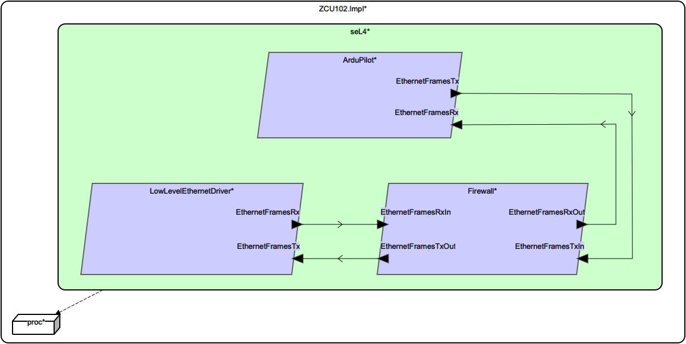

# platform::ZCU102.Impl

## AADL Architecture

|System: [platform::ZCU102.Impl]()|
|:--|

|Thread: SW::ArduPilot.Impl |
|:--|
|Type: [ArduPilot](../../aadl/SW.aadl#L189) Implementation: [ArduPilot.Impl](../../aadl/SW.aadl#L195)|
|Periodic : 100 ms|

|Thread: SW::Firewall.Impl |
|:--|
|Type: [Firewall](../../aadl/SW.aadl#L93) Implementation: [Firewall.Impl](../../aadl/SW.aadl#L159) GUMBO: [Subclause](../../aadl/SW.aadl#L101)|
|Periodic : 100 ms|

|Thread: SW::LowLevelEthernetDriver.Impl |
|:--|
|Type: [LowLevelEthernetDriver](../../aadl/SW.aadl#L59) Implementation: [LowLevelEthernetDriver.Impl](../../aadl/SW.aadl#L66)|
|Periodic : 100 ms|

## Rust Code

### Behavior Code
#### ArduPilot: SW::ArduPilot.Impl

 - **Entry Points**

    Initialize: [Rust](crates/seL4_ArduPilot_ArduPilot/src/component/seL4_ArduPilot_ArduPilot_app.rs#L22)

    TimeTriggered: [Rust](crates/seL4_ArduPilot_ArduPilot/src/component/seL4_ArduPilot_ArduPilot_app.rs#L30)

- **APIs**

    <table>
    <tr><th>Port Name</th><th>Direction</th><th>Kind</th><th>Payload</th><th>Realizations</th></tr>
    <tr><td><a title='Model' href='../../aadl/SW.aadl#L192'>EthernetFramesRx</a></td>
        <td>In</td><td>Event Data</td>
        <td>SW::StructuredEthernetMessage.i</td><td><a title='Memory Map: Lines 19-23' href='microkit.system#L19'>Memory Map</a> → <a title='C Shared Memory Variable: Line 10' href='components/seL4_ArduPilot_ArduPilot/src/seL4_ArduPilot_ArduPilot.c#L10'>C var_addr</a> → <a title='C Interface: Lines 29-32' href='components/seL4_ArduPilot_ArduPilot/src/seL4_ArduPilot_ArduPilot.c#L29'>C Interface</a> → <a title='C Extern: Line 14' href='crates/seL4_ArduPilot_ArduPilot/src/bridge/extern_c_api.rs#L14'>C Extern</a> → <a title='Rust/C Interface: Lines 19-29' href='crates/seL4_ArduPilot_ArduPilot/src/bridge/extern_c_api.rs#L19'>Rust/C Interface</a> → <a title='Unverified Rust Interface: Lines 23-30' href='crates/seL4_ArduPilot_ArduPilot/src/bridge/seL4_ArduPilot_ArduPilot_api.rs#L23'>Unverified Rust Interface</a> → <a title='Rust/Verus API: Lines 62-69' href='crates/seL4_ArduPilot_ArduPilot/src/bridge/seL4_ArduPilot_ArduPilot_api.rs#L62'>Rust/Verus API</a></td></tr>
    <tr><td><a title='Model' href='../../aadl/SW.aadl#L193'>EthernetFramesTx</a></td>
        <td>Out</td><td>Event Data</td>
        <td>SW::StructuredEthernetMessage.i</td><td><a title='Rust/Verus API: Lines 49-58' href='crates/seL4_ArduPilot_ArduPilot/src/bridge/seL4_ArduPilot_ArduPilot_api.rs#L49'>Rust/Verus API</a> → <a title='Unverified Rust Interface: Lines 13-18' href='crates/seL4_ArduPilot_ArduPilot/src/bridge/seL4_ArduPilot_ArduPilot_api.rs#L13'>Unverified Rust Interface</a> → <a title='Rust/C Interface: Lines 38-43' href='crates/seL4_ArduPilot_ArduPilot/src/bridge/extern_c_api.rs#L38'>Rust/C Interface</a> → <a title='C Extern: Line 16' href='crates/seL4_ArduPilot_ArduPilot/src/bridge/extern_c_api.rs#L16'>C Extern</a> → <a title='C Interface: Lines 15-19' href='components/seL4_ArduPilot_ArduPilot/src/seL4_ArduPilot_ArduPilot.c#L15'>C Interface</a> → <a title='C Shared Memory Variable: Line 9' href='components/seL4_ArduPilot_ArduPilot/src/seL4_ArduPilot_ArduPilot.c#L9'>C var_addr</a> → <a title='Memory Map: Lines 14-18' href='microkit.system#L14'>Memory Map</a></td></tr>
    </table>

#### Firewall: SW::Firewall.Impl

 - **Entry Points**

    Initialize: [Rust](crates/seL4_Firewall_Firewall/src/component/seL4_Firewall_Firewall_app.rs#L19)

    TimeTriggered: [Rust](crates/seL4_Firewall_Firewall/src/component/seL4_Firewall_Firewall_app.rs#L26)

- **APIs**

    <table>
    <tr><th>Port Name</th><th>Direction</th><th>Kind</th><th>Payload</th><th>Realizations</th></tr>
    <tr><td><a title='Model' href='../../aadl/SW.aadl#L96'>EthernetFramesRxIn</a></td>
        <td>In</td><td>Event Data</td>
        <td>SW::StructuredEthernetMessage.i</td><td><a title='Memory Map: Lines 52-56' href='microkit.system#L52'>Memory Map</a> → <a title='C Shared Memory Variable: Line 13' href='components/seL4_Firewall_Firewall/src/seL4_Firewall_Firewall.c#L13'>C var_addr</a> → <a title='C Interface: Lines 55-58' href='components/seL4_Firewall_Firewall/src/seL4_Firewall_Firewall.c#L55'>C Interface</a> → <a title='C Extern: Line 14' href='crates/seL4_Firewall_Firewall/src/bridge/extern_c_api.rs#L14'>C Extern</a> → <a title='Rust/C Interface: Lines 22-32' href='crates/seL4_Firewall_Firewall/src/bridge/extern_c_api.rs#L22'>Rust/C Interface</a> → <a title='Unverified Rust Interface: Lines 31-38' href='crates/seL4_Firewall_Firewall/src/bridge/seL4_Firewall_Firewall_api.rs#L31'>Unverified Rust Interface</a> → <a title='Rust/Verus API: Lines 102-111' href='crates/seL4_Firewall_Firewall/src/bridge/seL4_Firewall_Firewall_api.rs#L102'>Rust/Verus API</a></td></tr>
    <tr><td><a title='Model' href='../../aadl/SW.aadl#L97'>EthernetFramesTxIn</a></td>
        <td>In</td><td>Event Data</td>
        <td>SW::StructuredEthernetMessage.i</td><td><a title='Memory Map: Lines 37-41' href='microkit.system#L37'>Memory Map</a> → <a title='C Shared Memory Variable: Line 9' href='components/seL4_Firewall_Firewall/src/seL4_Firewall_Firewall.c#L9'>C var_addr</a> → <a title='C Interface: Lines 26-29' href='components/seL4_Firewall_Firewall/src/seL4_Firewall_Firewall.c#L26'>C Interface</a> → <a title='C Extern: Line 16' href='crates/seL4_Firewall_Firewall/src/bridge/extern_c_api.rs#L16'>C Extern</a> → <a title='Rust/C Interface: Lines 41-51' href='crates/seL4_Firewall_Firewall/src/bridge/extern_c_api.rs#L41'>Rust/C Interface</a> → <a title='Unverified Rust Interface: Lines 47-54' href='crates/seL4_Firewall_Firewall/src/bridge/seL4_Firewall_Firewall_api.rs#L47'>Unverified Rust Interface</a> → <a title='Rust/Verus API: Lines 118-127' href='crates/seL4_Firewall_Firewall/src/bridge/seL4_Firewall_Firewall_api.rs#L118'>Rust/Verus API</a></td></tr>
    <tr><td><a title='Model' href='../../aadl/SW.aadl#L98'>EthernetFramesRxOut</a></td>
        <td>Out</td><td>Event Data</td>
        <td>SW::StructuredEthernetMessage.i</td><td><a title='Rust/Verus API: Lines 75-86' href='crates/seL4_Firewall_Firewall/src/bridge/seL4_Firewall_Firewall_api.rs#L75'>Rust/Verus API</a> → <a title='Unverified Rust Interface: Lines 13-18' href='crates/seL4_Firewall_Firewall/src/bridge/seL4_Firewall_Firewall_api.rs#L13'>Unverified Rust Interface</a> → <a title='Rust/C Interface: Lines 60-65' href='crates/seL4_Firewall_Firewall/src/bridge/extern_c_api.rs#L60'>Rust/C Interface</a> → <a title='C Extern: Line 18' href='crates/seL4_Firewall_Firewall/src/bridge/extern_c_api.rs#L18'>C Extern</a> → <a title='C Interface: Lines 35-39' href='components/seL4_Firewall_Firewall/src/seL4_Firewall_Firewall.c#L35'>C Interface</a> → <a title='C Shared Memory Variable: Line 11' href='components/seL4_Firewall_Firewall/src/seL4_Firewall_Firewall.c#L11'>C var_addr</a> → <a title='Memory Map: Lines 42-46' href='microkit.system#L42'>Memory Map</a></td></tr>
    <tr><td><a title='Model' href='../../aadl/SW.aadl#L99'>EthernetFramesTxOut</a></td>
        <td>Out</td><td>Event Data</td>
        <td>SW::StructuredEthernetMessage.i</td><td><a title='Rust/Verus API: Lines 87-98' href='crates/seL4_Firewall_Firewall/src/bridge/seL4_Firewall_Firewall_api.rs#L87'>Rust/Verus API</a> → <a title='Unverified Rust Interface: Lines 21-26' href='crates/seL4_Firewall_Firewall/src/bridge/seL4_Firewall_Firewall_api.rs#L21'>Unverified Rust Interface</a> → <a title='Rust/C Interface: Lines 67-72' href='crates/seL4_Firewall_Firewall/src/bridge/extern_c_api.rs#L67'>Rust/C Interface</a> → <a title='C Extern: Line 19' href='crates/seL4_Firewall_Firewall/src/bridge/extern_c_api.rs#L19'>C Extern</a> → <a title='C Interface: Lines 41-45' href='components/seL4_Firewall_Firewall/src/seL4_Firewall_Firewall.c#L41'>C Interface</a> → <a title='C Shared Memory Variable: Line 12' href='components/seL4_Firewall_Firewall/src/seL4_Firewall_Firewall.c#L12'>C var_addr</a> → <a title='Memory Map: Lines 47-51' href='microkit.system#L47'>Memory Map</a></td></tr>
    </table>
- **GUMBO**

    <table>
    <tr><th colspan=4>Compute</th></tr>
    <tr><td>assume onlyOneInEvent</td>
    <td><a href=../../aadl/SW.aadl#L120>GUMBO</a></td>
    <td><a href=crates/seL4_Firewall_Firewall/src/component/seL4_Firewall_Firewall_app.rs#L35>Verus</a></td>
    <td><a href=crates/seL4_Firewall_Firewall/src/bridge/seL4_Firewall_Firewall_GUMBOX.rs#L79>GUMBOX</a></td>
    </tr>
    <tr><td>guarantee RC_INSPECTA_00_HLR_2</td>
    <td><a href=../../aadl/SW.aadl#L124>GUMBO</a></td>
    <td><a href=crates/seL4_Firewall_Firewall/src/component/seL4_Firewall_Firewall_app.rs#L42>Verus</a></td>
    <td><a href=crates/seL4_Firewall_Firewall/src/bridge/seL4_Firewall_Firewall_GUMBOX.rs#L123>GUMBOX</a></td>
    </tr>
    <tr><td>guarantee RC_INSPECTA_00_HLR_4</td>
    <td><a href=../../aadl/SW.aadl#L129>GUMBO</a></td>
    <td><a href=crates/seL4_Firewall_Firewall/src/component/seL4_Firewall_Firewall_app.rs#L47>Verus</a></td>
    <td><a href=crates/seL4_Firewall_Firewall/src/bridge/seL4_Firewall_Firewall_GUMBOX.rs#L142>GUMBOX</a></td>
    </tr>
    <tr><td>guarantee RC_INSPECTA_00_HLR_5</td>
    <td><a href=../../aadl/SW.aadl#L138>GUMBO</a></td>
    <td><a href=crates/seL4_Firewall_Firewall/src/component/seL4_Firewall_Firewall_app.rs#L56>Verus</a></td>
    <td><a href=crates/seL4_Firewall_Firewall/src/bridge/seL4_Firewall_Firewall_GUMBOX.rs#L164>GUMBOX</a></td>
    </tr>
    <tr><td>guarantee RC_INSPECTA_00_HLR_6</td>
    <td><a href=../../aadl/SW.aadl#L144>GUMBO</a></td>
    <td><a href=crates/seL4_Firewall_Firewall/src/component/seL4_Firewall_Firewall_app.rs#L62>Verus</a></td>
    <td><a href=crates/seL4_Firewall_Firewall/src/bridge/seL4_Firewall_Firewall_GUMBOX.rs#L183>GUMBOX</a></td>
    </tr>
    <tr><td>guarantee RC_INSPECTA_00_HLR_7</td>
    <td><a href=../../aadl/SW.aadl#L151>GUMBO</a></td>
    <td><a href=crates/seL4_Firewall_Firewall/src/component/seL4_Firewall_Firewall_app.rs#L71>Verus</a></td>
    <td><a href=crates/seL4_Firewall_Firewall/src/bridge/seL4_Firewall_Firewall_GUMBOX.rs#L205>GUMBOX</a></td>
    </tr></table>
    <table>
    <tr><th colspan=4>GUMBO Methods</th></tr>
    <tr><td>isMalformedFrame</td>
    <td><a href=../../aadl/SW.aadl#L103>GUMBO</a></td>
    <td><a href=crates/seL4_Firewall_Firewall/src/component/seL4_Firewall_Firewall_app.rs#L108>Verus</a></td>
    <td><a href=crates/seL4_Firewall_Firewall/src/bridge/seL4_Firewall_Firewall_GUMBOX.rs#L17>GUMBOX</a></td>
    </tr>
    <tr><td>getInternetProtocol</td>
    <td><a href=../../aadl/SW.aadl#L105>GUMBO</a></td>
    <td><a href=crates/seL4_Firewall_Firewall/src/component/seL4_Firewall_Firewall_app.rs#L113>Verus</a></td>
    <td><a href=crates/seL4_Firewall_Firewall/src/bridge/seL4_Firewall_Firewall_GUMBOX.rs#L22>GUMBOX</a></td>
    </tr>
    <tr><td>isIPV4</td>
    <td><a href=../../aadl/SW.aadl#L106>GUMBO</a></td>
    <td><a href=crates/seL4_Firewall_Firewall/src/component/seL4_Firewall_Firewall_app.rs#L118>Verus</a></td>
    <td><a href=crates/seL4_Firewall_Firewall/src/bridge/seL4_Firewall_Firewall_GUMBOX.rs#L27>GUMBOX</a></td>
    </tr>
    <tr><td>isIPV6</td>
    <td><a href=../../aadl/SW.aadl#L107>GUMBO</a></td>
    <td><a href=crates/seL4_Firewall_Firewall/src/component/seL4_Firewall_Firewall_app.rs#L123>Verus</a></td>
    <td><a href=crates/seL4_Firewall_Firewall/src/bridge/seL4_Firewall_Firewall_GUMBOX.rs#L32>GUMBOX</a></td>
    </tr>
    <tr><td>getFrameProtocol</td>
    <td><a href=../../aadl/SW.aadl#L109>GUMBO</a></td>
    <td><a href=crates/seL4_Firewall_Firewall/src/component/seL4_Firewall_Firewall_app.rs#L128>Verus</a></td>
    <td><a href=crates/seL4_Firewall_Firewall/src/bridge/seL4_Firewall_Firewall_GUMBOX.rs#L37>GUMBOX</a></td>
    </tr>
    <tr><td>isTCP</td>
    <td><a href=../../aadl/SW.aadl#L110>GUMBO</a></td>
    <td><a href=crates/seL4_Firewall_Firewall/src/component/seL4_Firewall_Firewall_app.rs#L133>Verus</a></td>
    <td><a href=crates/seL4_Firewall_Firewall/src/bridge/seL4_Firewall_Firewall_GUMBOX.rs#L42>GUMBOX</a></td>
    </tr>
    <tr><td>isARP</td>
    <td><a href=../../aadl/SW.aadl#L111>GUMBO</a></td>
    <td><a href=crates/seL4_Firewall_Firewall/src/component/seL4_Firewall_Firewall_app.rs#L138>Verus</a></td>
    <td><a href=crates/seL4_Firewall_Firewall/src/bridge/seL4_Firewall_Firewall_GUMBOX.rs#L47>GUMBOX</a></td>
    </tr>
    <tr><td>isPortWhitelisted</td>
    <td><a href=../../aadl/SW.aadl#L113>GUMBO</a></td>
    <td><a href=crates/seL4_Firewall_Firewall/src/component/seL4_Firewall_Firewall_app.rs#L143>Verus</a></td>
    <td><a href=crates/seL4_Firewall_Firewall/src/bridge/seL4_Firewall_Firewall_GUMBOX.rs#L52>GUMBOX</a></td>
    </tr>
    <tr><td>getARP_Type</td>
    <td><a href=../../aadl/SW.aadl#L115>GUMBO</a></td>
    <td><a href=crates/seL4_Firewall_Firewall/src/component/seL4_Firewall_Firewall_app.rs#L148>Verus</a></td>
    <td><a href=crates/seL4_Firewall_Firewall/src/bridge/seL4_Firewall_Firewall_GUMBOX.rs#L57>GUMBOX</a></td>
    </tr>
    <tr><td>isARP_Request</td>
    <td><a href=../../aadl/SW.aadl#L116>GUMBO</a></td>
    <td><a href=crates/seL4_Firewall_Firewall/src/component/seL4_Firewall_Firewall_app.rs#L153>Verus</a></td>
    <td><a href=crates/seL4_Firewall_Firewall/src/bridge/seL4_Firewall_Firewall_GUMBOX.rs#L62>GUMBOX</a></td>
    </tr>
    <tr><td>isARP_Reply</td>
    <td><a href=../../aadl/SW.aadl#L117>GUMBO</a></td>
    <td><a href=crates/seL4_Firewall_Firewall/src/component/seL4_Firewall_Firewall_app.rs#L158>Verus</a></td>
    <td><a href=crates/seL4_Firewall_Firewall/src/bridge/seL4_Firewall_Firewall_GUMBOX.rs#L67>GUMBOX</a></td>
    </tr></table>

#### LowLevelEthernetDriver: SW::LowLevelEthernetDriver.Impl

 - **Entry Points**

    Initialize: [Rust](crates/seL4_LowLevelEthernetDriver_LowLevelEthernetDriver/src/component/seL4_LowLevelEthernetDriver_LowLevelEthernetDriver_app.rs#L22)

    TimeTriggered: [Rust](crates/seL4_LowLevelEthernetDriver_LowLevelEthernetDriver/src/component/seL4_LowLevelEthernetDriver_LowLevelEthernetDriver_app.rs#L30)

- **APIs**

    <table>
    <tr><th>Port Name</th><th>Direction</th><th>Kind</th><th>Payload</th><th>Realizations</th></tr>
    <tr><td><a title='Model' href='../../aadl/SW.aadl#L64'>EthernetFramesTx</a></td>
        <td>In</td><td>Event Data</td>
        <td>SW::StructuredEthernetMessage.i</td><td><a title='Memory Map: Lines 70-74' href='microkit.system#L70'>Memory Map</a> → <a title='C Shared Memory Variable: Line 9' href='components/seL4_LowLevelEthernetDriver_LowLevelEthernetDriver/src/seL4_LowLevelEthernetDriver_LowLevelEthernetDriver.c#L9'>C var_addr</a> → <a title='C Interface: Lines 23-26' href='components/seL4_LowLevelEthernetDriver_LowLevelEthernetDriver/src/seL4_LowLevelEthernetDriver_LowLevelEthernetDriver.c#L23'>C Interface</a> → <a title='C Extern: Line 14' href='crates/seL4_LowLevelEthernetDriver_LowLevelEthernetDriver/src/bridge/extern_c_api.rs#L14'>C Extern</a> → <a title='Rust/C Interface: Lines 19-29' href='crates/seL4_LowLevelEthernetDriver_LowLevelEthernetDriver/src/bridge/extern_c_api.rs#L19'>Rust/C Interface</a> → <a title='Unverified Rust Interface: Lines 23-30' href='crates/seL4_LowLevelEthernetDriver_LowLevelEthernetDriver/src/bridge/seL4_LowLevelEthernetDriver_LowLevelEthernetDriver_api.rs#L23'>Unverified Rust Interface</a> → <a title='Rust/Verus API: Lines 62-69' href='crates/seL4_LowLevelEthernetDriver_LowLevelEthernetDriver/src/bridge/seL4_LowLevelEthernetDriver_LowLevelEthernetDriver_api.rs#L62'>Rust/Verus API</a></td></tr>
    <tr><td><a title='Model' href='../../aadl/SW.aadl#L63'>EthernetFramesRx</a></td>
        <td>Out</td><td>Event Data</td>
        <td>SW::StructuredEthernetMessage.i</td><td><a title='Rust/Verus API: Lines 49-58' href='crates/seL4_LowLevelEthernetDriver_LowLevelEthernetDriver/src/bridge/seL4_LowLevelEthernetDriver_LowLevelEthernetDriver_api.rs#L49'>Rust/Verus API</a> → <a title='Unverified Rust Interface: Lines 13-18' href='crates/seL4_LowLevelEthernetDriver_LowLevelEthernetDriver/src/bridge/seL4_LowLevelEthernetDriver_LowLevelEthernetDriver_api.rs#L13'>Unverified Rust Interface</a> → <a title='Rust/C Interface: Lines 38-43' href='crates/seL4_LowLevelEthernetDriver_LowLevelEthernetDriver/src/bridge/extern_c_api.rs#L38'>Rust/C Interface</a> → <a title='C Extern: Line 16' href='crates/seL4_LowLevelEthernetDriver_LowLevelEthernetDriver/src/bridge/extern_c_api.rs#L16'>C Extern</a> → <a title='C Interface: Lines 32-36' href='components/seL4_LowLevelEthernetDriver_LowLevelEthernetDriver/src/seL4_LowLevelEthernetDriver_LowLevelEthernetDriver.c#L32'>C Interface</a> → <a title='C Shared Memory Variable: Line 11' href='components/seL4_LowLevelEthernetDriver_LowLevelEthernetDriver/src/seL4_LowLevelEthernetDriver_LowLevelEthernetDriver.c#L11'>C var_addr</a> → <a title='Memory Map: Lines 75-79' href='microkit.system#L75'>Memory Map</a></td></tr>
    </table>

